https://www.nowcoder.com/discuss/592706

作者：搓泥大师
链接：https://www.nowcoder.com/discuss/592706
来源：牛客网


# 一面

## 1. 问我是哪里人，什么学校，放假了么 

## 2. 根据简历介绍一下自己 

## 3. 问项目，验证码是怎么实现的，怎么保证下单的幂等性，mysql集群如果写请求先于读请求然后将内容放入redis中后，redis将脏数据返回给用户怎么办？mybatis的优点，mybatis分页查询底层原理，如果数据量很大怎么办？ 

## 4. 说一下Redis主从复制？完整重同步，部分重同步 

### （一）主从复制概述
主从复制，是指将一台Redis服务器的数据，复制到其他的Redis服务器。前者称为主节点(master)，后者称为从节点(slave)；数据的复制是单向的，只能由主节点到从节点。

默认情况下，每台Redis服务器都是主节点；且一个主节点可以有多个从节点(或没有从节点)，但一个从节点只能有一个主节点。

### （二）主从复制的实现原理

主从复制过程大体可以分为3个阶段：**连接建立阶段（即准备阶段）、数据同步阶段、命令传播阶段**；

#### 1. 连接建立阶段

##### 步骤1：保存主节点信息

从节点服务器内部维护了两个字段，即masterhost和masterport字段，用于存储主节点的ip和port信息。

需要注意的是，**slaveof**是异步命令，从节点完成主节点ip和port的保存后，向发送slaveof命令的客户端直接返回OK，实际的复制操作在这之后才开始进行。

##### 步骤2：建立socket连接

从节点每秒1次调用复制定时函数replicationCron()，如果发现了有主节点可以连接，便会根据主节点的ip和port，创建socket连接。如果连接成功，则：

从节点：为该socket建立一个专门处理复制工作的文件事件处理器，负责后续的复制工作，如接收RDB文件、接收命令传播等。

主节点：接收到从节点的socket连接后（即accept之后），为该socket创建相应的客户端状态，**并将从节点看做是连接到主节点的一个客户端，后面的步骤会以从节点向主节点发送命令请求的形式来进行。**

##### 步骤3：发送ping命令

从节点成为主节点的客户端之后，发送ping命令进行首次请求，目的是：检查socket连接是否可用，以及主节点当前是否能够处理请求。
##### 步骤4：身份验证
如果从节点中设置了masterauth选项，则从节点需要向主节点进行身份验证；
##### 步骤5：发送从节点端口信息
身份验证之后，从节点会向主节点发送其监听的端口号

#### 2. 数据同步阶段

* 主从节点之间的连接建立以后，便可以开始进行数据同步，该阶段可以理解为从节点数据的初始化。具体执行的方式是：从节点向主节点发送psync命令（Redis2.8以前是sync命令），开始同步。

* 数据同步阶段是主从复制最核心的阶段，根**据主从节点当前状态的不同，可以分为全量复制和部分复制**，下面会有一章专门讲解这两种复制方式以及psync命令的执行过程，这里不再详述。

* 需**要注意的是，在数据同步阶段之前，从节点是主节点的客户端，主节点不是从节点的客户端；而到了这一阶段及以后，主从节点互为客户端。**原因在于：在此之前，主节点只需要响应从节点的请求即可，不需要主动发请求，而在数据同步阶段和后面的命令传播阶段，主节点需要主动向从节点发送请求（如推送缓冲区中的写命令），才能完成复制。

#### 3. 命令传播阶段
  数据同步阶段完成后，主从节点进入命令传播阶段；在这个阶段主节点将自己执行的写命令发送给从节点，从节点接收命令并执行，从而保证主从节点数据的一致性。

### （四）【数据同步阶段】全量复制和部分复制以及psync命令

* 在Redis2.8以前，从节点向主节点发送sync命令请求同步数据，此时的同步方式是全量复制；

* 在Redis2.8及以后，从节点可以发送**psync**命令请求同步数据，此时根据主从节点当前状态的不同，同步方式可能是全量复制或部分复制。
	* 1. 全量复制：用于初次复制或其他无法进行部分复制的情况，将主节点中的所有数据都发送给从节点，是一个非常重型的操作。
	* 2. 部分复制：用于网络中断等情况后的复制，**只将中断期间主节点执行的写命令发送给从节点，**与全量复制相比更加高效。需要注意的是，如果网络中断时间过长，导致主节点没有能够完整地保存中断期间执行的写命令，则无法进行部分复制，仍使用全量复制。

#### 1. 全量复制

Redis通过psync命令进行全量复制的过程如下：

（1）从节点判断无法进行部分复制，向主节点发送全量复制的请求；或从节点发送部分复制的请求，但主节点判断无法进行部分复制；具体判断过程需要在讲述了部分复制原理后再介绍。

（2）主节点收到全量复制的命令后，执行bgsave，在后台生成RDB文件，并使用一个缓冲区（称为复制缓冲区）记录从现在开始执行的所有写命令

（3）主节点的bgsave执行完成后，将RDB文件发送给从节点；**从节点首先清除自己的旧数据，然后载入接收的RDB文件**，将数据库状态更新至主节点执行bgsave时的数据库状态

（4）主节点将前述复制缓冲区中的所有写命令发送给从节点，从节点执行这些写命令，将数据库状态更新至主节点的最新状态

（5）如果从节点开启了AOF，则会触发bgrewriteaof的执行，从而保证AOF文件更新至主节点的最新状态

#### 2. 部分复制

由于全量复制在主节点数据量较大时效率太低，因此Redis2.8开始提供部分复制，用于处理网络中断时的数据同步。

部分复制的实现，依赖于三个重要的概念：

#### （1）复制偏移量

主节点和从节点分别维护一个复制偏移量（offset），代表的是**主节点向从节点传递的字节数**；主节点每次向从节点传播N个字节数据时，主节点的offset增加N；从节点每次收到主节点传来的N个字节数据时，从节点的offset增加N。

offset用于判断主从节点的数据库状态是否一致：

* 如果二者offset相同，则一致；
* 如果offset不同，则不一致，此时可以根据两个offset找出从节点缺少的那部分数据。例如，如果主节点的offset是1000，而从节点的offset是500，那么部分复制就需要将offset为501-1000的数据传递给从节点。而**offset为501-1000的数据存储的位置，就是下面要介绍的复制积压缓冲区。**

#### （2）复制积压缓冲区

**复制积压缓冲区是由主节点维护的、固定长度的、先进先出(FIFO)队列，默认大小1MB；当主节点开始有从节点时创建，其作用是备份主节点最近发送给从节点的数据。注意，无论主节点有一个还是多个从节点，都只需要一个复制积压缓冲区。**

在命令传播阶段，主节点除了将写命令发送给从节点，还会发送一份给复制积压缓冲区，作为写命令的备份；除了存储写命令，复制积压缓冲区中还存储了其中的每个字节对应的复制偏移量（offset）。由于复制积压缓冲区定长且是先进先出，所以它保存的是主节点最近执行的写命令；时间较早的写命令会被挤出缓冲区。

由于该缓冲区长度固定且有限，因此可以备份的写命令也有限，当主从节点offset的差距过大超过缓冲区长度时，将无法执行部分复制，只能执行全量复制。反过来说，为了提高网络中断时部分复制执行的概率，可以根据需要增大复制积压缓冲区的大小(通过配置repl-backlog-size)；例如如果网络中断的平均时间是60s，而主节点平均每秒产生的写命令(特定协议格式)所占的字节数为100KB，则复制积压缓冲区的平均需求为6MB，保险起见，可以设置为12MB，来保证绝大多数断线情况都可以使用部分复制。

**从节点将offset发送给主节点后，主节点根据offset和缓冲区大小决定能否执行部分复制：**

- **如果offset偏移量之后的数据，仍然都在复制积压缓冲区里，则执行部分复制；**
- **如果offset偏移量之后的数据已不在复制积压缓冲区中（数据已被挤出），则执行全量复制。**

#### （3）服务器运行ID(runid)

每个Redis节点(无论主从)，在启动时都会自动生成一个随机ID(每次启动都不一样)，由40个随机的十六进制字符组成；runid用来唯一识别一个Redis节点。通过info Server命令，可以查看节点的runid：


**主从节点初次复制时，主节点将自己的runid发送给从节点，从节点将这个runid保存起来；当断线重连时，从节点会将这个runid发送给主节点；主节点根据runid判断能否进行部分复制：**

- 如果从节点保存的runid与主节点现在的runid相同，说明主从节点之前同步过，主节点会继续尝试使用部分复制(到底能不能部分复制还要看offset和复制积压缓冲区的情况)；

- 如果从节点保存的runid与主节点现在的runid不同，说明从节点在断线前同步的Redis节点并不是当前的主节点，只能进行全量复制。

 #### 3. psync命令的执行

   在了解了复制偏移量、复制积压缓冲区、节点运行id之后，本节将介绍psync命令的参数和返回值，从而说明psync命令执行过程中，**主从节点是如何确定使用全量复制还是部分复制的。**

   psync命令的执行过程可以参见下图（图片来源：《Redis设计与实现》）：

    

   （1）首先，从节点根据当前状态，决定如何调用psync命令：

   - 如果从节点之前未执行过slaveof或最近执行了slaveof no one，则从节点发送命令为psync ? -1，向主节点请求全量复制；
   - 如果从节点之前执行了slaveof，则发送命令为psync <runid> <offset>，其中runid为上次复制的主节点的runid，offset为上次复制截止时从节点保存的复制偏移量。

   （2）主节点根据收到的psync命令，及当前服务器状态，决定执行全量复制还是部分复制：

   - 如果主节点版本低于Redis2.8，则返回-ERR回复，此时从节点重新发送sync命令执行全量复制；
   - 如果主节点版本够新，且runid与从节点发送的runid相同，且从节点发送的offset之后的数据在复制积压缓冲区中都存在，则回复+CONTINUE，表示将进行部分复制，从节点等待主节点发送其缺少的数据即可；
   - 如果主节点版本够新，但是runid与从节点发送的runid不同，或从节点发送的offset之后的数据已不在复制积压缓冲区中(在队列中被挤出了)，则回复+FULLRESYNC <runid> <offset>，表示要进行全量复制，其中runid表示主节点当前的runid，offset表示主节点当前的offset，从节点保存这两个值，以备使用。

   [参考](https://www.cnblogs.com/kismetv/p/9236731.html)

## 5. Redis主从数据不一致情况？

###  **(一) 常见的数据库集群架构如何？**

**答**：一主多从，主从同步，读写分离。


如上图：

（1）一个**主库提供写服务**

（2）多个**从库提供读服务**，可以增加从库提升读性能

（3）主从之间同步数据

*画外音：任何方案不要忘了本心，加**从库的本心，是提升读性能**。*

### **（二）为什么会出现不一致？**

**答**：主从同步有时延，这个时延期间读从库，可能读到不一致的数据。


如上图：

（1）服务发起了一个写请求

（2）服务又发起了一个读请求，此时同步未完成，读到一个不一致的脏数据

（3）数据库主从同步最后才完成

*画外音：任何数据冗余，必将引发一致性问题。*

### **（三）如何避免这种主从延时导致的不一致？** 

**方案一：忽略**

任何脱离业务的架构设计都是耍流氓，绝大部分业务，例如：百度搜索，淘宝订单，QQ消息，58帖子都允许短时间不一致。

*画外音：如果业务能接受，最推崇此法。*

 

如果业务能够接受，别把系统架构搞得太复杂。

 

**方案二：强制读主**


如上图：

（1）使用一个高可用主库提供数据库服务

（2）读和写都落到主库上

（3）采用**缓存来提升系统读性能**

这是很常见的微服务架构，可以避免数据库主从一致性问题。

**方案三：选择性读主**

强制读主过于粗暴，毕竟只有少量写请求，很短时间，可能读取到脏数据。

 

有没有可能实现，只有这一段时间，**可能读到从库脏数据的读请求读主，平时读从**呢？

 

可以利用一个**缓存记录必须读主的数据（少量写请求发生的时候）**。


如上图，当写请求发生时：

（1）写主库

（2）将哪个库，哪个表，哪个主键三个信息拼装一个key设置到cache里，这条记录的超时时间，设置为“主从同步时延”

*画外音：key的格式为“db:table:PK”，假设主从延时为1s，这个key的cache超时时间也为1s。*

 


如上图，当读请求发生时：

这是要读哪个库，哪个表，哪个主键的数据呢，也将这三个信息拼装一个key，到cache里去查询，如果，

（1）**cache里有这个key**，说明1s内刚发生过写请求，数据库主从同步可能还没有完成，此时就应该去主库查询

（2）**cache里没有这个key**，说明最近没有发生过写请求，此时就可以去从库查询

以此，保证读到的一定不是不一致的脏数据。

[参考](https://blog.csdn.net/john1337/article/details/98850192)

## 6. mysql索引 
* 从存储结构上来划分
  * Btree 索引（B+tree，B-tree)
  * 哈希索引
  * full-index 全文索引
  * RTree

* 从应用层次上来划分
  * 普通索引：即一个索引只包含单个列，一个表可以有多个单列索引。
  * 唯一索引：索引列的值必须唯一，但允许有空值。
  * 复合索引：一个索引包含多个列。

* 从表记录的排列顺序和索引的排列顺序是否一致来划分

  * 聚集索引：表记录的排列顺序和索引的排列顺序一致。

    聚集索引就是以**主键创建的索引**。

    聚集索引表记录的排列顺序和索引的排列顺序一致，所以查询效率快，因为只要找到第一个索引值记录，其余的连续性的记录在物理表中也会连续存放，一起就可以查询到。

    **缺点**：新增比较慢，因为为了保证表中记录的物理顺序和索引顺序一致，在记录插入的时候，会对数据页重新排序

  * 非聚集索引：表记录的排列顺序和索引的排列顺序不一致。

    非聚集索引就是以**非主键创建的索引（也叫做二级索引）**。

    **索引的逻辑顺序与磁盘上行的物理存储顺序不同**，非聚集索引在叶子节点存储的是主键和索引列，当我们使用非聚集索引查询数据时，需要拿到叶子上的主键再去表中查到想要查找的数据。这个过程就是我们所说的**回表**。

  * 区别

    - 聚集索引在叶子节点存储的是表中的数据。
    - 非聚集索引在叶子节点存储的是主键和索引列。

    [参考](https://www.infoq.cn/article/ojkwyykjoyc2ygb0sj2c)

## 7. 为什么选择B+树？ 

* （一） **初始设计索引的数据结构（指导思想）**

  * 区域查询

    当查找到起点节点 10 后，再顺着链表进行遍历，直到链表中的节点数据大于区间的终止值为止。**所有遍历到的数据，就是符合区间值的所有数据**。

    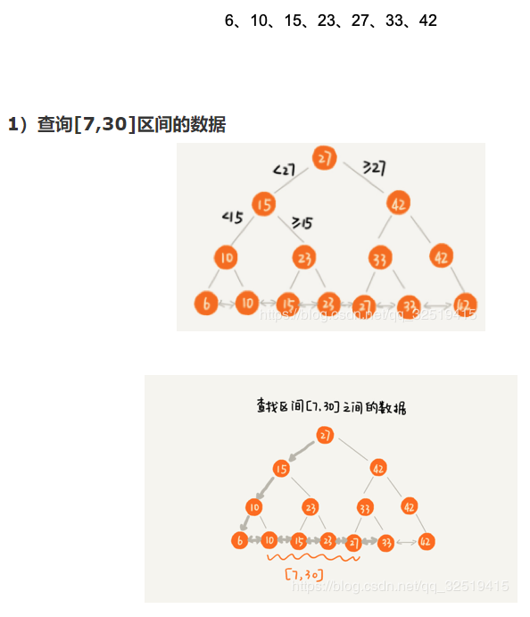

  * 优化树的高度

    为了节省内存，我们只能把树存储在硬盘中。那么，**每个节点的读取或者访问，都对应一次硬盘 IO 操作。每次查询数据时磁盘 IO 操作的次数，也叫做IO 渐进复杂度，也就是树的高度**。所以，我们要减少磁盘 IO 操作的次数，也就是 **要降低树的高度**。

    

    这里将二叉树变为了 M 叉树，降低了树的高度，那么这个 M 应该选择多少才合适呢？

    

    **关键：对于相同个数的数据构建 m 叉树索引，m 叉树中的 m 越大，那树的高度就越小，那 m 叉树中的 m 是不是越大越好呢？到底多大才合适呢？**

    不管是内存中的数据还是磁盘中的数据，操作系统都是按页（一页的大小通常是 4kb，这个值可以通过`getconfig(PAGE_SIZE)`命令查看）来读取的，一次只会读取一页的数据。

    如果要读取的数据量超过了一页的大小，就会触发多次 IO 操作。所以在选择 m 大小的时候，**要尽量让每个节点的大小等于一个页的大小。**

    **结论：一般实际应用中，出度 d（树的分叉数）是非常大的数字，通常超过 100；树的高度（h）非常小，通常不超过 3。**

* （二）B树（也就是 B-树）

  * 关键字分布在整棵树的所有节点。

  * 任何一个关键字 **出现且只出现在一个节点中。**

  * 搜索有可能在 **非叶子节点** 结束。

  * 其搜索性能等价于在关键字全集内做一次二分查找。

    

* （三）B+树

  * 非叶子节点的子树指针与关键字个数相同。

  * 非叶子节点的子树指针 P[i]，指向关键字属于 **[k[i],K[i+1])** 的子树（**注意：区间是前闭后开**)。

  * **为所有叶子节点增加一个链指针**。

  * **所有关键字都在叶子节点出现**。

    

  * 特性

    * 所有的关键字 **都出现在叶子节点的链表中**，且链表中的关键字是有序的。
    * **搜索只在叶子节点命中**。
    * 非叶子节点相当于是 **叶子节点的索引层**，叶子节点是 **存储关键字数据的数据层**。

* （四）相对 B 树，B+树做索引的优势

  - B+树的磁盘读写代价更低。**B+树的内部没有指向关键字具体信息的指针，所以其内部节点相对 B 树更小**，如果把所有关键字存放在同一块盘中，那么盘中所能容纳的关键字数量也越多，一次性读入内存的需要查找的关键字也就越多，**相应的，IO 读写次数就降低了**。
  - **树的查询效率更加稳定**。B+树所有数据都存在于叶子节点，所有关键字查询的路径长度相同，每次数据的查询效率相当。而 B 树可能在非叶子节点就停止查找了，所以查询效率不够稳定。
  - **B+树只需要去遍历叶子节点就可以实现整棵树的遍历**。
  
  [参考](https://www.infoq.cn/article/ojkwyykjoyc2ygb0sj2c)

## 8. 为什么不适用hash，hash应该很快啊?
* 定义

  哈希索引就是采用一定的哈希算法，只需一次哈希算法即可立刻定位到相应的位置，速度非常快。**本质上就是把键值换算成新的哈希值，根据这个哈希值来定位**。

  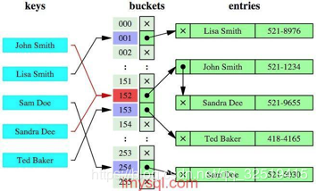
  
* 局限性 

  - 哈希索引没办法利用索引完成排序。
  - 不能进行多字段查询。
  - 在有大量重复键值的情况下，哈希索引的效率也是极低的（出现哈希碰撞问题）。
  - 不支持范围查询。

* InnoDB 引擎中

  ​	在 MySQL 常用的 InnoDB 引擎中，还是使用 B+树索引比较多。InnoDB 是自适应哈希索引的（hash 索引的创建由 **InnoDB 存储引擎自动优化创建**，我们干预不了）。

  [参考](https://www.infoq.cn/article/ojkwyykjoyc2ygb0sj2c)

## 9. 反转链表 

#### [206. 反转链表](https://leetcode-cn.com/problems/reverse-linked-list/)

>反转一个单链表。
>
>**示例:**
>
>```
>输入: 1->2->3->4->5->NULL
>输出: 5->4->3->2->1->NULL
>```

```java
class Solution {
    public ListNode reverseList(ListNode head) {
        //特例
         if (head==null|| head.next == null)
            return head;
        //1(head)->    2(head.next)-->3
        //head<--2(head.next)<---3(newhead)
        ListNode newhead = reverseList(head.next);
        head.next.next = head;
		head.next = null;
        return newhead;
    }
}
```

## 10. 反问 

一面大概50分钟，第一次比较紧张，结束之后给发了短信，说感谢参加本次面试，让我对面试做出评价...这就是感谢信么，没想到过了三天收到了hr的二面邀请，很高兴，二面的时候心态就更加放松一些，说话也比较连贯了。

------

# 二面

## 1. 项目 主要架构，用户登录态的维护，接口的整个流程 
## 2. 项目多级缓存是那几级 
## 3. 项目的压测上限是多少，有什么办法提升系统的并发数，有什么优化的空间 
## 4. 说一下RocketMQ的事务型消息 
## 5. Cookie和Session的区别 

[见8 session和cookie区别](https://github.com/xinguohua/InterviewSummary/blob/main/1.23%E7%BD%91%E6%98%93%E4%B8%A4%E9%9D%A2.md)

## 6. Redis穿透，雪崩。出现的情况和解决的办法 

### (一)  缓存雪崩

**缓存雪崩**是指缓存同一时间大面积的失效，所以，后面的请求都会落到数据库上，造成数据库短时间内承受大量请求而崩掉。

**解决方案**

1. 缓存数据的**过期时间设置随机**，防止同一时间大量数据过期现象发生。
2. 一般并发量不是特别多的时候，使用最多的解决方案是**加锁排队**。
3. 给每一个缓存数据增加相应的缓存标记，记录缓存的是否失效，如果缓存标记失效，则**更新数据缓存**。

### (二) 缓存穿透

**缓存穿透**是指缓存和数据库中都没有的数据，导致所有的请求都落到数据库上，造成数据库短时间内承受大量请求而崩掉。

**解决方案**

1. 接口层增加校验，如用户鉴权校验，id做基础校验，id<=0的**直接拦截**；
2. 从缓存取不到的数据，在数据库中也没有取到，这时也可以将**key-value对写为key-null**，缓存有效时间可以设置短点，如30秒（设置太长会导致正常情况也没法使用）。这样可以防止攻击用户反复用同一个id暴力攻击
3. 采用**布隆过滤器**，将所有可能存在的数据哈希到一个足够大的 bitmap 中，一个一定不存在的数据会被这个 bitmap 拦截掉，从而避免了对底层存储系统的查询压力

**附加**

对于空间的利用到达了一种极致，那就是Bitmap和布隆过滤器(Bloom Filter)。

* Bitmap： 典型的就是哈希表
  缺点是，Bitmap对于每个元素只能记录1bit信息，如果还想完成额外的功能，恐怕只能靠牺牲更多的空间、时间来完成了。

* 布隆过滤器（推荐）
  * 就是引入了k(k>1)个相互独立的哈希函数，保证在给定的空间、误判率下，完成元素判重的过程。
  * **优点：**是空间效率和查询时间都远远超过一般的算法，缺点是有一定的误识别率和删除困难。
  * **Bloom-Filter算法的核心思想：**就是利用多个不同的Hash函数来解决“冲突”。
    Hash存在一个冲突（碰撞）的问题，用同一个Hash得到的两个URL的值有可能相同。**为了减少冲突，我们可以多引入几个Hash，如果通过其中的一个Hash值我们得出某元素不在集合中，那么该元素肯定不在集合中。只有在所有的Hash函数告诉我们该元素在集合中时，才能确定该元素存在于集合中。这便是Bloom-Filter的基本思想。**
  * Bloom-Filter一般用于在大数据量的集合中判定某元素是否存在。

### (三)  缓存击穿

**缓存击穿**是指缓存中没有但数据库中有的数据（一般是缓存时间到期），这时由于并发用户特别多，同时读缓存没读到数据，又同时去数据库去取数据，引起数据库压力瞬间增大，造成过大压力。**和缓存雪崩不同的是，缓存击穿指并发查同一条数据，缓存雪崩是不同数据都过期了，很多数据都查不到从而查数据库。**

**解决方案**

1. 设置**热点数据**永远不过期。
2. 加互斥锁，互斥锁

### (四)  缓存预热

**缓存预热**就是系统上线后，**将相关的缓存数据直接加载到缓存系统**。这样就可以避免在用户请求的时候，先查询数据库，然后再将数据缓存的问题！用户直接查询事先被预热的缓存数据！

**解决方案**

1. 直接写个缓存刷新页面，上线时手工操作一下；
2. 数据量不大，可以在项目启动的时候自动进行加载；
3. 定时刷新缓存；

###  (五）缓存降级

当访问量剧增、服务出现问题（如响应时间慢或不响应）或非核心服务影响到核心流程的性能时，仍然需要保证服务还是可用的，即使是有损服务。系统可以根据一些关键数据进行自动降级，也可以配置开关实现人工降级。

**缓存降级**的最终目的是保证核心服务可用，即使是有损的。而且有些服务是无法降级的（如加入购物车、结算）。

在进行降级之前要对系统进行梳理，看看系统是不是可以丢卒保帅；从而梳理出哪些必须誓死保护，哪些可降级；比如可以参考日志级别设置预案：

1. 一般：比如有些服务偶尔因为网络抖动或者服务正在上线而超时，可以自动降级；
2. 警告：有些服务在一段时间内成功率有波动（如在95~100%之间），可以自动降级或人工降级，并发送告警；
3. 错误：比如可用率低于90%，或者数据库连接池被打爆了，或者访问量突然猛增到系统能承受的最大阀值，此时可以根据情况自动降级或者人工降级；
4. 严重错误：比如因为特殊原因数据错误了，此时需要紧急人工降级。

服务降级的目的，是为了防止Redis服务故障，导致数据库跟着一起发生雪崩问题。因此，对于不重要的缓存数据，**可以采取服务降级策略，例如一个比较常见的做法就是，Redis出现问题，不去数据库查询，而是直接返回默认值给用户。**

###  (六) 热点数据和冷数据

* 热点数据，缓存才有价值，**访问多**

* 对于冷数据而言，大部分数据可能还没有再次访问到就已经被挤出内存，不仅占用内存，而且价值不大。**频繁修改的数据，看情况考虑使用缓存。**

**数据更新前至少读取两次，缓存才有意义。这个是最基本的策略，如果缓存还没有起作用就失效了，那就没有太大价值了。**

那存不存在，修改频率很高，但是又不得不考虑缓存的场景呢？有！比如，这个读取接口对数据库的压力很大，但是又是热点数据，这个时候就需要考虑通过缓存手段，减少数据库的压力，比如我们的某助手产品的，点赞数，收藏数，分享数等是非常典型的热点数据，但是又不断变化，此时**就需要将数据同步保存到Redis缓存，减少数据库压力。**

### (六) 缓存热点key

缓存中的一个Key(比如一个促销商品)，**在某个时间点过期的时候**，恰好在这个时间点对这个Key有大量的并发请求过来，这些请求发现缓存过期一般都会从后端DB加载数据并回设到缓存，这个时候大并发的请求可能会瞬间把后端DB压垮。

**解决方案**

**对缓存查询加锁，如果KEY不存在，就加锁，然后查DB入缓存，然后解锁**；其他进程如果发现有锁就等待，然后等解锁后返回数据或者进入DB查询

[参考](https://blog.csdn.net/ThinkWon/article/details/103402008)

## 7. ArrayList和LinkedList的区别 

ArrayList和LinkedList的区别有以下几点：

1. ArrayList是实现了**基于动态数组**的数据结构，而LinkedList是**基于链表**的数据结构；

2. 对于**随机访问get和set，ArrayList要优于LinkedList**，因为LinkedList要移动指针；

3. 对于添加和删除操作add和remove，一般大家都会说LinkedList要比ArrayList快，因为ArrayList要移动数据。但是实际情况并非这样，对于添加或删除，LinkedList和ArrayList**并不能明确说明谁快谁慢**

   [参考](https://blog.csdn.net/eson_15/article/details/51145788)

## 8. 说一下线程安全的集合 

### 一、早期线程安全的集合

我们先从早期的线程安全的集合说起，它们是Vector和HashTable

#### 1.Vector

Vector和ArrayList类似，是长度可变的数组，与ArrayList不同的是，Vector是线程安全的，它给几乎所有的public方法都加上了synchronized关键字。由于加锁导致性能降低，在不需要并发访问同一对象时，这种强制性的同步机制就显得多余，所以现在Vector已被弃用

#### 2.HashTable

HashTable和HashMap类似，不同点是HashTable是线程安全的，它给几乎所有public方法都加上了synchronized关键字，还有一个不同点是HashTable的K，V都不能是null，但HashMap可以，它现在也因为性能原因被弃用了

### 二、Collections包装方法

Vector和HashTable被弃用后，它们被ArrayList和HashMap代替，但它们不是线程安全的，所以**Collections工具类中提供了相应的包装方法把它们包装成线程安全的集合**

```
List<E> synArrayList = Collections.synchronizedList(new ArrayList<E>());

Set<E> synHashSet = Collections.synchronizedSet(new HashSet<E>());

Map<K,V> synHashMap = Collections.synchronizedMap(new HashMap<K,V>());

...1234567
```

Collections针对每种集合都声明了一个线程安全的包装类，在原集合的基础上添加了锁对象，**集合中的每个方法都通过这个锁对象实现同步**

### 三、java.util.concurrent包中的集合

#### 1.ConcurrentHashMap

ConcurrentHashMap和HashTable都是线程安全的集合，它们的不同主要是加锁粒度上的不同。HashTable的加锁方法是给每个方法加上synchronized关键字，这样锁住的是整个Table对象。而ConcurrentHashMap是更细粒度的加锁

* 在JDK1.8之前，ConcurrentHashMap加的是分段锁，也就是Segment锁，每个Segment含有整个table的一部分，这样不同分段之间的并发操作就互不影响
*  JDK1.8对此做了进一步的改进，它取消了Segment字段，直接在table元素上加锁，实现对每一行进行加锁，进一步减小了并发冲突的概率

#### 2.CopyOnWriteArrayList和CopyOnWriteArraySet

* 它们是加了**写锁**的ArrayList和ArraySet，锁住的是整个对象，但**读操作可以并发执行**

#### 3.其他

除此之外还有ConcurrentSkipListMap、ConcurrentSkipListSet、ConcurrentLinkedQueue、ConcurrentLinkedDeque等，**至于为什么没有ConcurrentArrayList，原因是无法设计一个通用的而且可以规避ArrayList的并发瓶颈的线程安全的集合类，只能锁住整个list，这用Collections里的包装类就能办到**

[参考](https://blog.csdn.net/lixiaobuaa/article/details/79689338)

## 9. Java中的HashMap底层结构，为什么8的时候转换为红黑树具体说一下，为什么不直接用红黑树，链表和红黑树的查询效率 

HashMap是Java程序员使用频率最高的用于映射(键值对)处理的数据类型。随着JDK（Java Developmet Kit）版本的更新，JDK1.8对HashMap底层的实现进行了优化，例如**引入红黑树的数据结构和扩容的优化等。**

### （一）Map接口

Java为数据结构中的映射定义了一个接口java.util.Map，此接口主要有四个常用的实现类，分别是**HashMap、Hashtable、LinkedHashMap和TreeMap**

(1) **HashMap**：

* 它根据键的hashCode值存储数据，大多数情况下可以直接定位到它的值，因而具有很快的访问速度，但遍历顺序却是不确定的。 HashMap最多只允许一条记录的键为null，允许多条记录的值为null。
* HashMap**非线程安全**，即任一时刻可以有多个线程同时写HashMap，可能会导致数据的不一致。如果需要满足线程安全，可以用 **Collections的synchronizedMap方法**使HashMap具有线程安全的能力，或者使用**ConcurrentHashMap**。

(2) **Hashtable**：

* Hashtable是遗留类，很多映射的常用功能与HashMap类似，不同的是它承自Dictionary类，并且**是线程安全的**，任一时间只有一个线程能写Hashtable，并发性不如ConcurrentHashMap，因为ConcurrentHashMap引入了分段锁。
* Hashtable不建议在新代码中使用，不需要线程安全的场合可以用HashMap替换，需要线程安全的场合可以用ConcurrentHashMap替换。

(3) **LinkedHashMap**：LinkedHashMap是HashMap的一个子类，保存了记录的插入顺序，在用Iterator遍历LinkedHashMap时，先得到的记录肯定是先插入的，也可以在构造时带参数，按照访问次序排序。

(4) **TreeMap**：

* TreeMap实现SortedMap接口，能够把它保存的记录根据键排序，默认是按键值的升序排序，也可以指定排序的比较器，当用Iterator遍历TreeMap时，得到的记录是排过序的。
* **如果使用排序的映射，建议使用TreeMap**。在使用TreeMap时，key必须实现Comparable接口或者在构造TreeMap传入自定义的Comparator，否则会在运行时抛出java.lang.ClassCastException类型的异常。

### （二）存储结构-字段

* 存储结构

  HashMap是数组+链表+红黑树（JDK1.8增加了红黑树部分）

  

* 字段

   *   **Node[] table**，即哈希桶数组，明显它是一个Node的数组

      **Node**是HashMap的一个内部类，实现了Map.Entry接口，本质是就是一个映射(键值对)。上图中的每个黑色圆点就是一个Node对象。

      以下代码JDK1.8中Node

      ```java
      static class Node<K,V> implements Map.Entry<K,V> {
              final int hash;    //用来定位数组索引位置
              final K key;
              V value;
              Node<K,V> next;   //链表的下一个node
      
              Node(int hash, K key, V value, Node<K,V> next) { ... }
              public final K getKey(){ ... }
              public final V getValue() { ... }
              public final String toString() { ... }
              public final int hashCode() { ... }
              public final V setValue(V newValue) { ... }
              public final boolean equals(Object o) { ... }
      }
      ```

   * **HashMap如何解决地址冲突？**

     Java中HashMap采用了链地址法。链地址法，简单来说，就是数组加链表的结合。在每个数组元素上都一个链表结构，当数据被Hash后，得到数组下标，把数据放在对应下标元素的链表上。

     * map.put("美团","小美")的过程：
       * 系统将调用”美团”这个key的hashCode()方法得到其**hashCode 值**（该方法适用于每个Java对象）
       * Hash算法的后两步运算（**高位运算和取模运算）**来定位该键值对的存储位置
       * 有时两个key会定位到相同的位置，表示发生了Hash碰撞。
     * 通过什么方式来控制map使得Hash碰撞的概率又小，哈希桶数组（Node[] table）占用空间又少呢？
       * **好的Hash算法和扩容机制。**

   *   **Hash和扩容流程的相关字段**

       从HashMap的默认构造函数源码可知，构造函数就是对下面几个字段进行初始化

       ```java
       int threshold;             // 所能容纳的key-value对极限 
       final float loadFactor;    // 负载因子
       int modCount;  
       int size;  
       ```

       1) threshold&loadFactor

       * Node[] table的初始化长度length(默认值是16)，**Load factor**为负载因子(默认值是0.75)，threshold是HashMap所能容纳的最大数据量的Node(键值对)个数。**threshold = length * Load factor。**也就是说，在数组定义好长度之后，负载因子越大，所能容纳的键值对个数越多
       * **threshold**就是在此Load factor和length(数组长度)对应下允许的最大元素数目，超过这个数目就重新resize(扩容)，扩容后的HashMap容量是之前容量的两倍。

       2) size

       ​	就是HashMap中实际存在的键值对数量。

       3）modCount

          主要用来记录HashMap内部结构发生变化的次数，主要用于迭代的快速失败。

###  （三）红黑树

* 这里存在一个问题，即使负载因子和Hash算法设计的再合理，也免不了会出现拉链过长的情况，**一旦出现拉链过长，则会严重影响HashMap的性能。**

* 在JDK1.8版本中，对数据结构做了进一步的优化，引入了红黑树。**而当链表长度太长（默认超过8）时，链表就转换为红黑树，利用红黑树快速增删改查的特点提高HashMap的性能，其中会用到红黑树的插入、删除、查找等算法。**

* **为什么Map桶中个数超过8才转为红黑树？**

  * Map中桶的元素初始化是链表保存的，其查找性能是**O(n)**，而树结构能将查找性能提升到**O(log(n))**。

  * 那为什么不一开始就用红黑树，反而要经历一个转换的过程呢？

       默认是链表长度达到 8 就转成红黑树，而当长度降到 6 就转换回去，这体现了时间和空间平衡的思想，**最开始使用链表的时候，空间占用是比较少的，而且由于链表短，所以查询时间也没有太大的问题。**可是当链表越来越长，需要用红黑树的形式来保证查询的效率。

    ````java
    红黑树的平均查找长度是log(n)，如果长度为8，平均查找长度为log(8)=3，链表的平均查找长度为n/2，当长度为8时，平均查找长度为8/2=4，这才有转换成树的必要；
    链表长度如果是小于等于6，6/2=3，而log(6)=2.6，虽然速度也很快的，但是转化为树结构和生成树的时间并不会太短。
    ````

  * 为什么阈值是8?

    如果 hashCode 分布良好，也就是 hash 计算的结果离散好的话，那么红黑树这种形式是很少会被用到的，因为各个值都均匀分布，很少出现链表很长的情况。

    在理想情况下，链表长度符合泊松分布，各个长度的命中概率依次递减，当长度为 8 的时候，概率仅为 0.00000006。这是一个小于千万分之一的概率，通常我们的 Map 里面是不会存储这么多的数据的，所以通常情况下，并不会发生从链表向红黑树的转换。

    ```java
    0:    0.60653066
     1:    0.30326533
     2:    0.07581633
     3:    0.01263606
     4:    0.00157952
     5:    0.00015795
     6:    0.00001316
     7:    0.00000094
     8:    0.00000006
    ```

  * hash算法

    通常如果 hash 算法正常的话，那么链表的长度也不会很长，那么红黑树也不会带来明显的查询时间上的优势，反而会增加空间负担。所以通常情况下，并没有必要转为红黑树，所以就选择了概率非常小，小于千万分之一概率，也就是长度为 8 的概率，把长度 8 作为转化的默认阈值。

    [参考](https://www.jianshu.com/p/fdf3d24fe3e8) [参考](https://blog.csdn.net/sinat_41832255/article/details/88884586)

### （四）方法实现

#### 1. 确定哈希桶数组索引位置

HashMap定位数组索引位置，直接决定了hash方法的离散性能。

这里的Hash算法本质上就是三步：**取key的hashCode值、高位运算、取模运算**。

```java
方法一：方法一所计算得到的Hash码值
static final int hash(Object key) {   //jdk1.8 & jdk1.7
     int h;
     // 1 h = key.hashCode() 为第一步 取hashCode值
     // 2 h ^ (h >>> 16)  为第二步 高位参与运算
     return (key == null) ? 0 : (h = key.hashCode()) ^ (h >>> 16);
}
方法二：调用方法二来计算该对象应该保存在table数组的哪个索引处。
static int indexFor(int h, int length) {  //jdk1.7的源码，jdk1.8没有这个方法，但是实现原理一样的
     return h & (length-1);  //3 第三步 取模运算
}
```

n为table的长度


在JDK1.8的实现中，优化了高位运算的算法，**通过hashCode()的高16位异或低16位实现的**：(h = k.hashCode()) ^ (h >>> 16)，主要是从速度、功效、质量来考虑的，这么做可以在数组table的length比较小的时候，**也能保证考虑到高低Bit都参与到Hash的计算中**，同时不会有太大的开销。

#### 2. HashMap的put方法

①.判断键值对数组table是否为空或为null，否则执行resize()进行扩容； 

②.根据键值key计算hash值得到插入的数组索引i，如果table[i]==null，直接新建节点添加，转向⑥，如果table[i]不为空，则转向③；

 ③.判断table[i]的首个元素是否和key一样，如果相同直接覆盖value，否则转向④，这里的相同指的是hashCode以及equals； 

④.判断table[i] 是否为treeNode，即table[i] 是否是红黑树，如果是红黑树，则直接在树中插入键值对，否则转向⑤； 

⑤.遍历table[i]，判断链表长度是否大于8，大于8的话把链表转换为红黑树，在红黑树中执行插入操作，否则进行链表的插入操作；遍历过程中若发现key已经存在直接覆盖value即可；

 ⑥.插入成功后，判断实际存在的键值对数量size是否超多了最大容量threshold，如果超过，进行扩容。


JDK1.8HashMap的put方法

```java
public V put(K key, V value) {
 2     // 对key的hashCode()做hash
 3     return putVal(hash(key), key, value, false, true);
 4 }
 5 
 6 final V putVal(int hash, K key, V value, boolean onlyIfAbsent,
 7                boolean evict) {
 8     Node<K,V>[] tab; Node<K,V> p; int n, i;
 9     // 步骤①：tab为空则创建
10     if ((tab = table) == null || (n = tab.length) == 0)
11         n = (tab = resize()).length;
12     // 步骤②：计算index，并对null做处理 
13     if ((p = tab[i = (n - 1) & hash]) == null) 
14         tab[i] = newNode(hash, key, value, null);
15     else {
16         Node<K,V> e; K k;
17         // 步骤③：节点key存在，直接覆盖value
18         if (p.hash == hash &&
19             ((k = p.key) == key || (key != null && key.equals(k))))
20             e = p;
21         // 步骤④：判断该链为红黑树
22         else if (p instanceof TreeNode)
23             e = ((TreeNode<K,V>)p).putTreeVal(this, tab, hash, key, value);
24         // 步骤⑤：该链为链表
25         else {
26             for (int binCount = 0; ; ++binCount) {
27                 if ((e = p.next) == null) {
28                     p.next = newNode(hash, key,value,null);
                        //链表长度大于8转换为红黑树进行处理
29                     if (binCount >= TREEIFY_THRESHOLD - 1) // -1 for 1st  
30                         treeifyBin(tab, hash);
31                     break;
32                 }
                    // key已经存在直接覆盖value
33                 if (e.hash == hash &&
34                     ((k = e.key) == key || (key != null && key.equals(k)))) 
35							break;
36                 p = e;
37             }
38         }
39         
40         if (e != null) { // existing mapping for key
41             V oldValue = e.value;
42             if (!onlyIfAbsent || oldValue == null)
43                 e.value = value;
44             afterNodeAccess(e);
45             return oldValue;
46         }
47     }

48     ++modCount;
49     // 步骤⑥：超过最大容量 就扩容
50     if (++size > threshold)
51         resize();
52     afterNodeInsertion(evict);
53     return null;
54 }
```

#### 3. 扩容机制

**resize的源码,使用JDK1.7的代码**

使用一个容量更大的数组来代替已有的容量小的数组，**transfer()方法**将原有Entry数组的元素拷贝到新的Entry数组里。

```java
 1 void resize(int newCapacity) {   //传入新的容量
 2     Entry[] oldTable = table;    //引用扩容前的Entry数组
 3     int oldCapacity = oldTable.length;         
 4     if (oldCapacity == MAXIMUM_CAPACITY) {  //扩容前的数组大小如果已经达到最大(2^30)了
 5         threshold = Integer.MAX_VALUE; //修改阈值为int的最大值(2^31-1)，这样以后就不会扩容了
 6         return;
 7     }
 8  
 9     Entry[] newTable = new Entry[newCapacity];  //初始化一个新的Entry数组
10     transfer(newTable);                         //！！将数据转移到新的Entry数组里
11     table = newTable;                           //HashMap的table属性引用新的Entry数组
12     threshold = (int)(newCapacity * loadFactor);//修改阈值
13 }
```

单链表的头插入方式

```java
 1 void transfer(Entry[] newTable) {
 2     Entry[] src = table;                   //src引用了旧的Entry数组
 3     int newCapacity = newTable.length;
 4     for (int j = 0; j < src.length; j++) { //遍历旧的Entry数组
 5         Entry<K,V> e = src[j];             //取得旧Entry数组的每个元素
 6         if (e != null) {
 7             src[j] = null;//释放旧Entry数组的对象引用（for循环后，旧的Entry数组不再引用任何对象）
 8             do {
 9                 Entry<K,V> next = e.next;
10                 int i = indexFor(e.hash, newCapacity); //！！重新计算每个元素在数组中的位置
     			   //接起新链表
11                 e.next = newTable[i]; //标记[1]
12                 newTable[i] = e;      //将元素放在数组上
     			  //访问下一个
13                 e = next;             //访问下一个Entry链上的元素
14             } while (e != null);
15         }
16     }
17 } 
```


**resize的源码,使用JDK1.8的优化：**使用的是2次幂的扩展(指长度扩为原来2倍)，所以，**元素的位置要么是在原位置，要么是在原位置再移动2次幂的位置。**


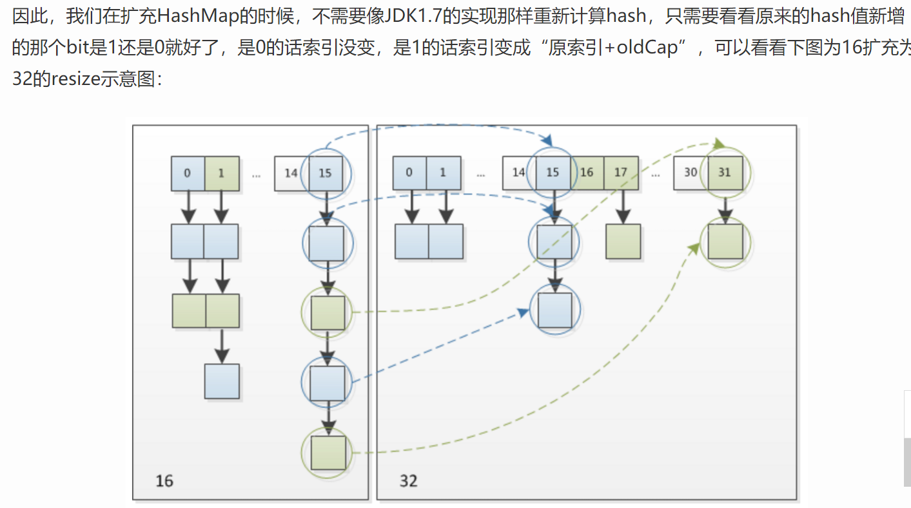


[参考](https://tech.meituan.com/2016/06/24/java-hashmap.html)

### （五）JDK1.8与JDK1.7的对比
* （1）JDK1.7用的是**头插法**，而JDK1.8及之后使用的都是**尾插法**，那么他们为什么要这样做呢？因为JDK1.7是用单链表进行的纵向延伸，当采用头插法时会容易出现逆序且环形链表死循环问题。但是在JDK1.8之后是因为加入了红黑树使用尾插法，能够避免出现逆序且链表死循环的问题。
* （2）扩容后数据存储位置的计算方式也不一样：
  * 1. 在JDK1.7的时候是直接用hash值和需要扩容的二进制数进行&（这里就是为什么扩容的时候为啥一定必须是2的多少次幂的原因所在，因为如果只有2的n次幂的情况时最后一位二进制数才一定是1，这样能最大程度减少hash碰撞）**（hash值 & length-1）**
  * 2. 而在JDK1.8的时候直接用了JDK1.7的时候计算的规律，也就是**扩容前的原始位置+扩容的大小值=JDK1.8的计算方式**，而不再是JDK1.7的那种异或的方法。但是这种方式就相当于只需要判断Hash值的新增参与运算的位是0还是1就直接迅速计算出了扩容后的储存方式。
* （3）JDK1.7的时候使用的是**数组+ 单链表的数据结构**。但是在JDK1.8及之后时，使用的是**数组+链表+红黑树的数据结构**（当链表的深度达到8的时候，也就是默认阈值，就会自动扩容把链表转成红黑树的数据结构来把时间复杂度从O（n）变成O（logN）提高了效率）

### （六）其他问题

#### 为什么 HashMap 中 String、Integer 这样的包装类适合作为 key 键


#### HashMap 中的 key若 Object类型， 则需实现哪些方法？

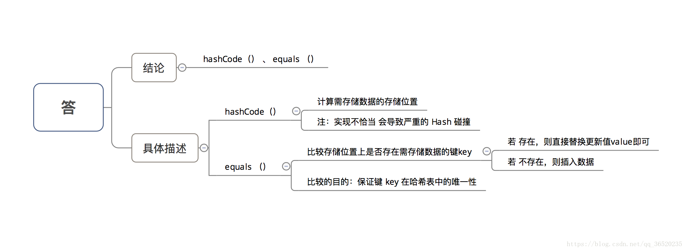

[参考](https://blog.csdn.net/qq_36520235/article/details/82417949?ops_request_misc=%257B%2522request%255Fid%2522%253A%2522161392290916780271531499%2522%252C%2522scm%2522%253A%252220140713.130102334.pc%255Fall.%2522%257D&request_id=161392290916780271531499&biz_id=0&utm_medium=distribute.pc_search_result.none-task-blog-2~all~first_rank_v2~hot_rank-23-82417949.pc_search_result_no_baidu_js&utm_term=hashmap%E9%97%AE%E9%A2%98&spm=1018.2226.3001.4187)

## 10. ConcurrentHashMap的底层说一下，为什么使用synchronized 

####  A HashMap的线程不安全体现在哪里？

* JDK1.7中扩容引发的线程不安全

​    在HashMap扩容的是时候会调用resize（）方法中的transfer()方法，在这里由于是**头插法**所以在多线程情况下可能出现**循环链表**，所以后面的数据定位到这条链表的时候会造成**数据丢失**。和读取的可能导致**死循环**。


| 过程                                                         | A线程                                                        | B线程                                                        |
| :----------------------------------------------------------- | ------------------------------------------------------------ | ------------------------------------------------------------ |
| 正常扩容前后                                                 |                                         | 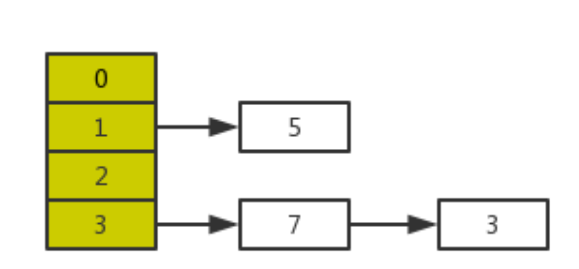                                        |
| A挂起e=3、next=7、e.next=null                                |                                          |                                                              |
| 线程B中成功的完成了数据迁移**7.next=3**、3.next=null         |                                                              | 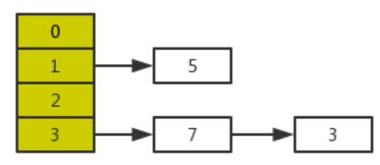                                         |
| A获得CPU时间片继续执行`newTable[i] = e`                      |                                          |                                                              |
| 接着继续执行下一轮循环，此时e=7，从主内存中读取e.next时发现主内存中**7.next=3**，于是乎next=3，并将7采用头插法的方式放入新数组中，并继续执行完此轮循环 |                                          |                                                              |
| 执行下一次循环可以发现，next=e.next=null，所以此轮循环将会是最后一轮循环。接下来当执行完e.next=newTable[i]即3.next=7后，3和7之间就相互连接了，当执行完newTable[i]=e后，3被头插法重新插入到链表中 | 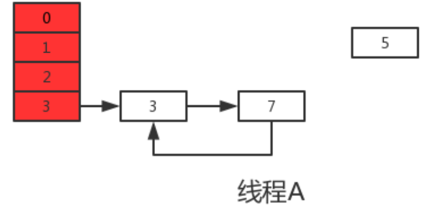                                         |                                                              |
| 结论                                                         | `HashMap`中出现了环形结构，当在以后对该`HashMap`进行操作时会出现**死循环**。 | 元素5在扩容期间被莫名的丢失了，这就发生了**数据丢失**的问题。 |


* JDK1.8中的线程不安全

   **1.8的HashMap对此做了优化，resize采用了尾插法**，即不改变原来链表的顺序，所以不会出现1.7的循环链表的问题。但是它也不是线程线程安全的。不安全性如下：

   **在多线程情况下put时计算出的插入的数组下标可能是相同的，这时可能出现值（数据）的覆盖从而导致size也是不准确的。**
   
   * 其中第六行代码是判断是否出现hash碰撞可以直接插入，假设两个线程A、B都在进行put操作，并且hash函数计算出的插入下标是相同的，当线程A执行完第六行代码后由于时间片耗尽导致被挂起，而线程B得到时间片后在该下标处插入了元素，完成了正常的插入，然后线程A获得时间片，**由于之前已经进行了hash碰撞的判断，所有此时不会再进行判断，而是直接进行插入，这就导致了线程B插入的数据被线程A覆盖了，从而线程不安全。**
   
   * 除此之前，还有就是代码的第38行处有个`++size`，我们这样想，还是线程A、B，这两个线程同时进行put操作时，假设当前`HashMap`的size大小为10，当线程A执行到第38行代码时，从主内存中获得size的值为10后准备进行+1操作，但是由于时间片耗尽只好让出CPU，线程B快乐的拿到CPU还是从主内存中拿到size的值10进行+1操作，完成了put操作并将size=11写回主内存，然后线程A再次拿到CPU并继续执行(此时size的值仍为10)，当执行完put操作后，还是将size=11写回内存，**此时，线程A、B都执行了一次put操作，但是size的值只增加了1，所有说还是由于数据覆盖又导致了线程不安全。**
   
   ```java
   final V putVal(int hash, K key, V value, boolean onlyIfAbsent,
                      boolean evict) {
           Node<K,V>[] tab; Node<K,V> p; int n, i;
           if ((tab = table) == null || (n = tab.length) == 0)
               n = (tab = resize()).length;
           if ((p = tab[i = (n - 1) & hash]) == null) // 6行 如果没有hash碰撞则直接插入元素
               tab[i] = newNode(hash, key, value, null);
           else {
               Node<K,V> e; K k;
               if (p.hash == hash &&
                   ((k = p.key) == key || (key != null && key.equals(k))))
                   e = p;
               else if (p instanceof TreeNode)
                   e = ((TreeNode<K,V>)p).putTreeVal(this, tab, hash, key, value);
               else {
                   for (int binCount = 0; ; ++binCount) {
                       if ((e = p.next) == null) {
                           p.next = newNode(hash, key, value, null);
                           if (binCount >= TREEIFY_THRESHOLD - 1) // -1 for 1st
                               treeifyBin(tab, hash);
                           break;
                       }
                       if (e.hash == hash &&
                           ((k = e.key) == key || (key != null && key.equals(k))))
                           break;
                       p = e;
                   }
               }
               if (e != null) { // existing mapping for key
                   V oldValue = e.value;
                   if (!onlyIfAbsent || oldValue == null)
                       e.value = value;
                   afterNodeAccess(e);
                   return oldValue;
               }
           }
           ++modCount;
           if (++size > threshold) //38行
               resize();
           afterNodeInsertion(evict);
           return null;
       }
   ```
   
   [参考](https://zhyocean.cn/article/1553946904) [参考](https://juejin.cn/post/6844904089688473614)

####  B 如何解决HashMap线程不安全的问题？

- 第一种方法，使用`Hashtable`线程安全类；

  Hashtable 是一个线程安全的类，Hashtable 几乎所有的添加、删除、查询方法都加了`synchronized`同步锁！

  **相当于给整个哈希表加了一把大锁**，多线程访问时候，只要有一个线程访问或操作该对象，那其他线程只能阻塞等待需要的锁被释放，在竞争激烈的多线程场景中性能就会非常差，**所以 Hashtable 不推荐使用！**

    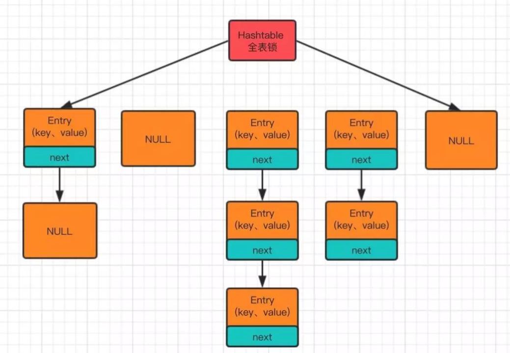

- 第二种方法，使用`Collections.synchronizedMap`方法，对方法进行加同步锁；

  果传入的是 HashMap 对象，其实也是对 HashMap 做的方法做了一层包装，里面使用对象锁来保证多线程场景下，操作安全，**本质也是对 HashMap 进行全表锁**

    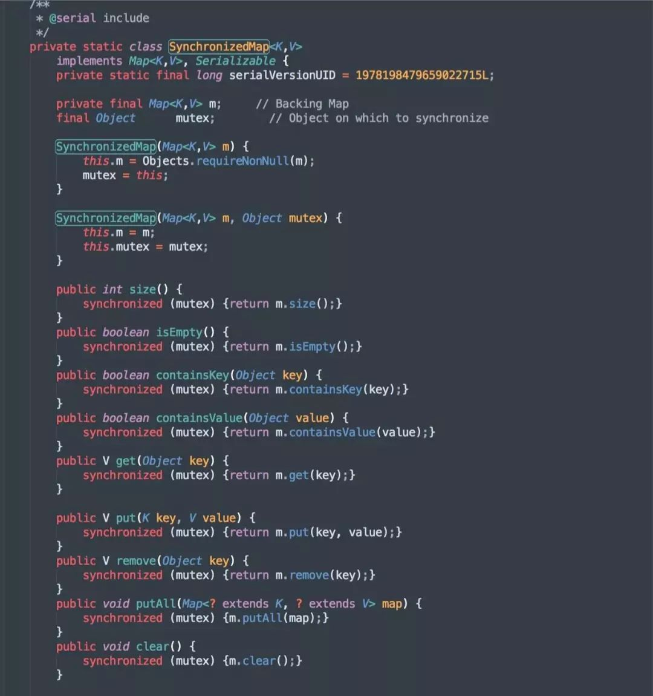

- 第三种方法，使用并发包中的`ConcurrentHashMap`类；

  因为hashMap 是数组 + 链表的数据结构，如果我们把数组进行分割多段，对每一段分别设计一把同步锁，这样在多线程访问不同段的数据时，就不会存在锁竞争了

  - JDK1.7 中

    **ConcurrentHashMap 类所采用的正是分段锁的思想，将 HashMap 进行切割，把 HashMap 中的哈希数组切分成小数组，每个小数组有 n 个 HashEntry 组成，其中小数组继承自`ReentrantLock（可重入锁）`，这个小数组名叫`Segment`，**

     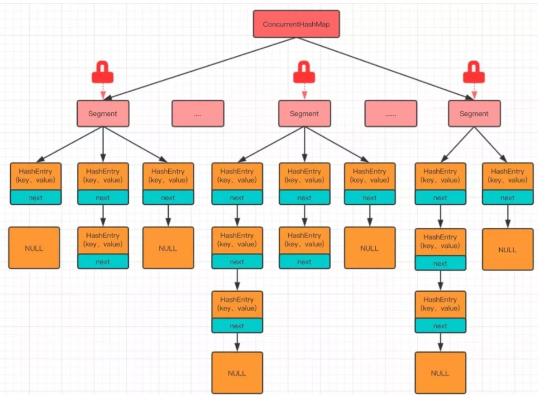

  * JDK1.8中

    JDK1.8 中 ConcurrentHashMap 类取消了 Segment 分段锁，采用 `CAS` + `synchronized` 来保证并发安全，数据结构跟 jdk1.8 中 HashMap 结构类似，都是**数组 + 链表（当链表长度大于 8 时，链表结构转为红黑二叉树**）结构。

    **ConcurrentHashMap 中 synchronized 只锁定当前链表或红黑二叉树的首节点，只要节点 hash 不冲突，就不会产生并发**，相比 JDK1.7 的 ConcurrentHashMap 效率又提升了 N 倍！

     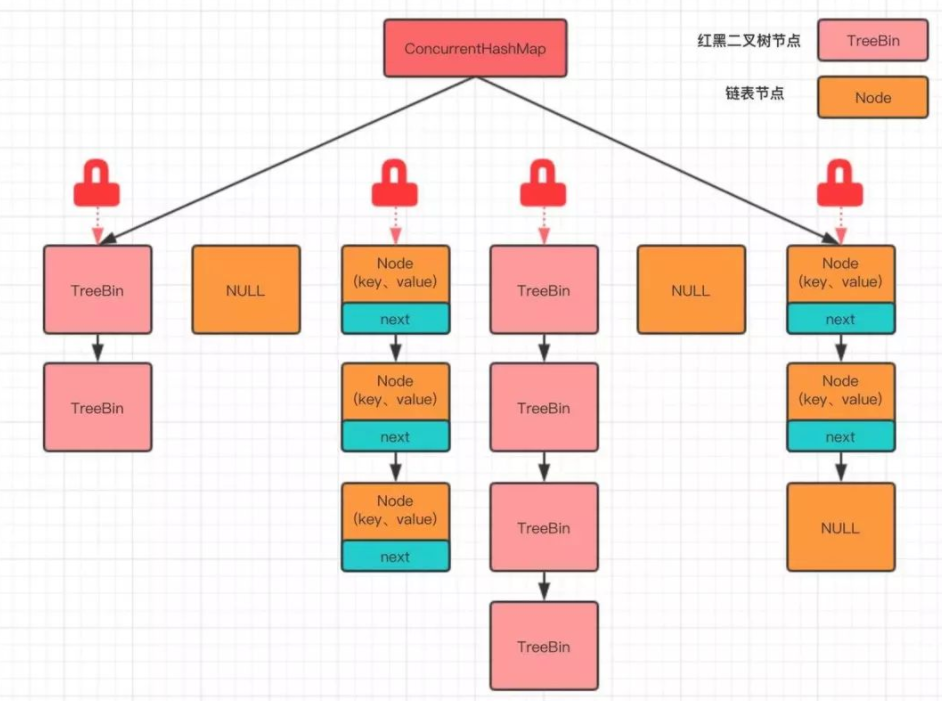

 ####  C JDK1.7 中的 ConcurrentHashMap 

##### C_1  存储结构

* Segment 数组

   ConcurrentHashMap 的主存是一个 Segment 数组。

   

* Segment 

  Segment 是 ConcurrentHashMap 中的一个静态内部类类似HashMap, 一个 Segment 就是一个子哈希表，Segment 里维护了一个 HashEntry 数组, Segment 这个静态内部类继承了`ReentrantLock`类，`ReentrantLock`是一个可重入锁, 对于不同的 Segment 数据进行操作是不用考虑锁竞争的，因此不会像 Hashtable 那样不管是添加、删除、查询操作都需要同步处理。

  

*  HashEntry

  HashEntry，也是一个静态内部类,`HashEntry`和`HashMap`中的 `Entry`非常类似，唯一的区别就是其中的核心数据如`value` ，以及`next`都使用了`volatile`关键字修饰，保证了多线程环境下数据获取时的**可见性**

  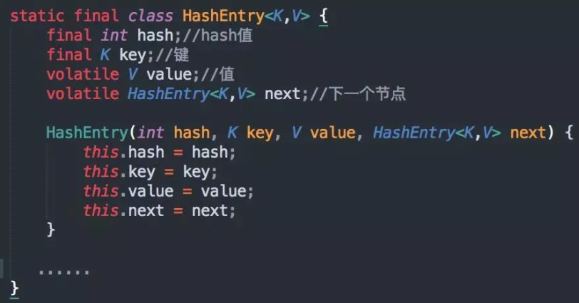

* 构造函数参数

  ConcurrentHashMap 初始化方法有三个参数，**initialCapacity（初始化容量）为 16、loadFactor（负载因子）为 0.75、concurrentLevel（并发等级）为 16**

##### C_1  方法
##### （一） put

 put 操作主要分两步：

- 定位 Segment 并确保定位的 Segment 已初始化；
- 调用 Segment 的 put 方法；
  - 第一步，**尝试获取对象锁**，如果获取到返回 true，否则执行**scanAndLockForPut**方法，这个方法也是尝试获取对象锁；
  - 第二步，获取到锁之后，类似 hashMap 的 put 方法，通过 key 计算所在 HashEntry 数组的下标；
  - 第三步，获取到数组下标之后遍历链表内容，通过 key 和 hash 值判断是否 key 已存在，如果已经存在，通过标识符判断是否覆盖，默认覆盖；
  - 第四步，如果不存在，采用头插法插入到 HashEntry 对象中；
  - 第五步，最后操作完整之后，**释放对象锁；**

*  **scanAndLockForPut**这个方法，操作也是分以下几步：
  * 当前线程尝试去获得锁，查找 key 是否已经存在，如果不存在，就创建一个 HashEntry 对象；
  * 如果重试次数大于最大次数，就调用`lock()`方法获取对象锁，如果依然没有获取到，当前线程就阻塞，直到获取之后退出循环；
  * 在这个过程中，key 可能被别的线程给插入，如果 HashEntry 存储内容发生变化，重置重试次数；
  * **类似于自旋锁的功能，循环式的判断对象锁是否能够被成功获取，直到获取到锁才会退出循环，防止执行 put 操作的线程频繁阻塞，这些优化都提升了 put 操作的性能**

#####  （二）get 操作

  由于 HashEntry 涉及到的共享变量都使用 volatile 修饰，volatile 可以保证内存可见性，所以不会读取到过期数据。

#####  （三）remove 操作

* 通过 key 找到元素所在的 Segment 对象

* 先获取对象锁，如果获取到之后执行移除操作，之后的操作类似 hashMap 的移除方法，步骤如下：
  * 先获取对象锁；
  * 计算 key 的 hash 值在 HashEntry[]中的角标；
  * 根据 index 角标获取 HashEntry 对象；
  * 循环遍历 HashEntry 对象，HashEntry 为单向链表结构；
  * 通过 key 和 hash 判断 key 是否存在，如果存在，就移除元素，并将需要移除的元素节点的下一个，向上移；
  * 最后就是释放对象锁，以便其他线程使用；

####  D JDK1.8 中的 ConcurrentHashMap 

JDK1.8 中的 ConcurrentHashMap 和往期 JDK 中的 ConcurrentHashMa 一样支持并发操作，整体结构和 JDK1.8 中的 HashMap 类似，相比 JDK1.7 中的 ConcurrentHashMap， 它抛弃了原有的 Segment 分段锁实现，采用了 `CAS + synchronized` 来保证并发的安全性。

##### D_1 存储结构

* Node

  JDK1.8 中的 ConcurrentHashMap 对节点`Node`类中的共享变量，和 JDK1.7 一样，使用`volatile`关键字，保证多线程操作时，变量的可见性

  

##### D_2 方法

  ##### (一) put

- 首先会判断 key、value 是否为空，如果为空就抛异常！

- 接着会判断容器数组是否为空，如果为空就**初始化数组（initTable 初始化数组）**；

- 进一步判断，要插入的元素`f`，在当前数组下标是否第一次插入，如果是就通过 **CAS** 方式插入；

- 在接着判断`f.hash == -1`是否成立，如果成立，说明当前`f`是`ForwardingNode`节点，表示有其它线程正在扩容，则一起进行扩容操作（**helpTransfer 帮助扩容**）；

- 其他的情况，就是把新的`Node`节点按链表或红黑树的方式插入到合适的位置；

- 节点插入完成之后，接着判断链表长度是否超过`8`，如果超过`8`个，就将链表转化为红黑树结构；

- 最后，插入完成之后，进行扩容判断（**addCount 扩容判断**）；

  ##### initTable () 初始化数组：如果数组为空就**初始化数组**

  sizeCtl 是一个对象属性，使用了 volatile 关键字修饰保证并发的可见性，默认为 0，当第一次执行 put 操作时，通过`Unsafe.compareAndSwapInt()`方法，俗称`CAS`，将 `sizeCtl`修改为 `-1`，有且只有一个线程能够修改成功，接着执行 table 初始化任务。

  如果别的线程发现`sizeCtl<0`，意味着有另外的线程执行 CAS 操作成功，当前线程通过执行`Thread.yield()`让出 CPU 时间片等待 table 初始化完成。

  ##### helpTransfer 帮助扩容

  `helpTransfer()`方法，如果`f.hash == -1`成立，说明当前`f`是`ForwardingNode`节点，意味有其它线程正在扩容，则一起进行扩容操作

  - 第 1 步，对 table、node 节点、node 节点的 nextTable，进行数据校验；
  - 第 2 步，根据数组的 length 得到一个标识符号；
  - 第 3 步，进一步校验 nextTab、tab、sizeCtl 值，如果 nextTab 没有被并发修改并且 tab 也没有被并发修改，同时 `sizeCtl < 0`，说明还在扩容；
  - 第 4 步，对 sizeCtl 参数值进行分析判断，如果不满足任何一个判断，将`sizeCtl + 1`, 增加了一个线程帮助其扩容;

  ##### addCount 扩容判断

  - 第 1 步，利用 CAS 将方法更新 baseCount 的值
  - 第 2 步，检查是否需要扩容，默认 check = 1，需要检查；
  - 第 3 步，如果满足扩容条件，判断当前是否正在扩容，如果是正在扩容就一起扩容；
  - 第 4 步，如果不在扩容，将 sizeCtl 更新为负数，并进行扩容处理；

##### (二) get

不涉及并发操作

- 第 1 步，判断数组是否为空，通过 key 定位到数组下标是否为空；
- 第 2 步，判断 node 节点第一个元素是不是要找到，如果是直接返回；
- 第 3 步，如果是红黑树结构，就从红黑树里面查询；
- 第 4 步，如果是链表结构，循环遍历判断；

##### (三) remove

- 第 1 步，循环遍历数组，接着校验参数；

- 第 2 步，判断是否有别的线程正在扩容，如果是一起扩容；

- 第 3 步，用 synchronized 同步锁，保证并发时元素移除安全；

- 第 4 步，因为 `check= -1`，所以不会进行扩容操作，利用 CAS 操作修改 baseCount 值；

  [参考](https://blog.csdn.net/singwhatiwanna/article/details/103900681)

#### E JDK 8的CHM用CAS和synchronized替代了JDK 7中的分段ReentrantLock。

其一，锁分离的**粒度细化**了，从Segment级别细化到了哈希桶级别。也就是说，在插入元素不发生哈希冲突的情况下，就不必加锁。

其二，在插入桶的头结点时使用无锁的**CAS操作**，效率很高。

其三，虽然我们也可以让Node类继承ReentrantLock并执行f.lock()/unlock()操作，但从JDK 6开始，JVM对内置的synchronized关键字做了大量优化，**synchronized不再是重量级锁的代名词**，而是会由无锁状态开始，随着并发程度的提升而膨胀成偏向锁、轻量级锁，再到重量级锁（其中包含适应性自旋过程）。在锁粒度细化的前提下，发生争用的概率降低，synchronized膨胀成重量级锁的机会也不多，故可以省去线程被挂起和唤醒（上下文切换）的大量开销。

[参考](https://www.jianshu.com/p/deae4d32a6e6)

## 11. synchronized的升级 
### (一) Synchronized使用场景

Synchronized锁的3种使用形式（使用场景）：

- Synchronized修饰普通同步方法：锁对象当前实例对象；
- Synchronized修饰静态同步方法：锁对象是当前的类Class对象；
- Synchronized修饰同步代码块：锁对象是Synchronized后面括号里配置的对象，这个对象可以是某个对象（xlock），也可以是某个类（Xlock.class）；

**注意：**

- 使用synchronized修饰非静态方法或者使用synchronized修饰代码块时制定的为实例对象时，同一个类的不同对象拥有自己的锁，因此不会相互阻塞。
- 使用synchronized修饰类和对象时，由于类对象和实例对象分别拥有自己的监视器锁，因此不会相互阻塞。
- 使用使用synchronized修饰实例对象时，如果一个线程正在访问实例对象的一个synchronized方法时，其它线程不仅不能访问该synchronized方法，该对象的其它synchronized方法也不能访问，因为一个对象只有一个监视器锁对象，但是其它线程可以访问该对象的非synchronized方法。
- 线程A访问实例对象的非static synchronized方法时，线程B也可以同时访问实例对象的static synchronized方法，因为前者获取的是实例对象的监视器锁，而后者获取的是类对象的监视器锁，两者不存在互斥关系。

### （二）Synchronized实现原理

#### Java对象头

对象是存放在堆内存中的，对象大致可以分为三个部分，分别是**对象头、实例变量和填充字节。**

- **对象头**的主要是由MarkWord和Klass Point(类型指针)组成，

  - Klass Point是是对象指向它的类元数据的指针，虚拟机通过这个指针来确定这个对象是哪个类的实例
  - Mark Word用于存储对象自身的运行时数据。如果对象是数组对象，那么对象头占用3个字宽（Word），如果对象是非数组对象，那么对象头占用2个字宽。（1word = 2 Byte = 16 bit）

- **实例变量**存储的是对象的属性信息，包括父类的属性信息，按照4字节对齐

- **填充字符**，因为虚拟机要求对象字节必须是8字节的整数倍，填充字符就是用于凑齐这个整数倍的

  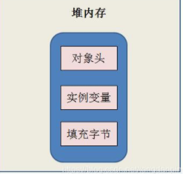

  **Synchronized锁对象是存在哪里的呢？答案是存在锁对象的对象头的MarkWord（如下图）中**

  在32位的虚拟机中：

  

  在64位的虚拟机中：

  

### （三）锁的优化

#### **1、锁升级**

锁的4中状态：无锁状态、偏向锁状态、轻量级锁状态、重量级锁状态（级别从低到高）

（1）偏向锁：

* 为什么要引入偏向锁？

  因为经过HotSpot的作者大量的研究发现，大多数时候是不存在锁竞争的，**常常是一个线程多次获得同一个锁，因此如果每次都要竞争锁会增大很多没有必要付出的代价，为了降低获取锁的代价，才引入的偏向锁。**

* 偏向锁的升级

  * 当线程1访问代码块并获取锁对象时，会在java对象头和栈帧中记录偏向的锁的threadID，因为**偏向锁不会主动释放锁**，因此以后线程1再次获取锁的时候，需要**比较当前线程的threadID和Java对象头中的threadID是否一致**
    * 如果一致（还是线程1获取锁对象），则无需使用CAS来加锁、解锁；
    * 如果不一致（其他线程，如线程2要竞争锁对象，而偏向锁不会主动释放因此还是存储的线程1的threadID），那么需要**查看Java对象头中记录的线程1是否存活**，
      * 如果没有存活，那么锁对象被重置为无锁状态，其它线程（线程2）可以竞争将其设置为偏向锁；
      * 如果存活，那么立刻**查找该线程（线程1）的栈帧信息，如果还是需要继续持有这个锁对象**，那么暂停当前线程1，**撤销偏向锁，升级为轻量级锁**，如果线程1 不再使用该锁对象，那么将锁对象状态设为无锁状态，重新偏向新的线程。

（2）轻量级锁

* 为什么要引入轻量级锁？

  **轻量级锁考虑的是竞争锁对象的线程不多，而且线程持有锁的时间也不长的情景**。因为阻塞线程需要CPU从用户态转到内核态，代价较大，如果刚刚阻塞不久这个锁就被释放了，那这个代价就有点得不偿失了，**因此这个时候就干脆不阻塞这个线程，让它自旋这等待锁释放。**

* 轻量级锁什么时候升级为重量级锁？
  * 线程1获取轻量级锁时会先把锁对象的**对象头MarkWord复制一份到线程1的栈帧中创建的用于存储锁记录的空间**（称为DisplacedMarkWord），然后**使用CAS把对象头中的内容替换为线程1存储的锁记录（**DisplacedMarkWord**）的地址**；
  * 如果在线程1复制对象头的同时（在线程1CAS之前），线程2也准备获取锁，复制了对象头到线程2的锁记录空间中，但是在线程2CAS的时候，发现线程1已经把对象头换了，**线程2的CAS失败，那么线程2就尝试使用自旋锁来等待线程1释放锁**。
  * 但是如果自旋的时间太长也不行，因为自旋是要消耗CPU的，因此自旋的次数是有限制的，比如10次或者100次，如果**自旋次数到了线程1还没有释放锁，或者线程1还在执行，线程2还在自旋等待，这时又有一个线程3过来竞争这个锁对象，那么这个时候轻量级锁就会膨胀为重量级锁。重量级锁把除了拥有锁的线程都阻塞，防止CPU空转。**

**注意：**为了避免无用的自旋，轻量级锁一旦膨胀为重量级锁就不会再降级为轻量级锁了；偏向锁升级为轻量级锁也不能再降级为偏向锁。一句话就是锁可以升级不可以降级，但是偏向锁状态可以被重置为无锁状态。

（3）这几种锁的优缺点（偏向锁、轻量级锁、重量级锁）


#### **2、锁粗化**

按理来说**，同步块的作用范围应该尽可能小**，仅在共享数据的实际作用域中才进行同步，这样做的目的是为了使需要同步的操作数量尽可能缩小，缩短阻塞时间，如果存在锁竞争，那么等待锁的线程也能尽快拿到锁。 
但是加锁解锁也需要消耗资源，如果存在一系列的连续加锁解锁操作，可能会导致不必要的性能损耗。 
锁粗化就是将多个连续的加锁、解锁操作连接在一起，扩展成一个范围更大的锁，避免频繁的加锁解锁操作。

#### **3、锁消除**

Java虚拟机在JIT编译时(可以简单理解为当某段代码即将第一次被执行时进行编译，又称即时编译)，通过对运行上下文的扫描，经过逃逸分析，**去除不可能存在共享资源竞争的锁，通过这种方式消除没有必要的锁，可以节省毫无意义的请求锁时间**

[参考](https://blog.csdn.net/tongdanping/article/details/79647337)

## 12. MySQL索引，B+树索引的底层，mysql中数据的存储形式，为什么不在非叶子结点存放数据（见一面问题7）

## 13. 两个栈转变为队列 

#### [232. 用栈实现队列](https://leetcode-cn.com/problems/implement-queue-using-stacks/)

>请你仅使用两个栈实现先入先出队列。队列应当支持一般队列的支持的所有操作（push、pop、peek、empty）：
>
>实现 MyQueue 类：
>
>void push(int x) 将元素 x 推到队列的末尾
>int pop() 从队列的开头移除并返回元素
>int peek() 返回队列开头的元素
>boolean empty() 如果队列为空，返回 true ；否则，返回 false
>
>
>说明：
>
>你只能使用标准的栈操作 —— 也就是只有 push to top, peek/pop from top, size, 和 is empty 操作是合法的。
>你所使用的语言也许不支持栈。你可以使用 list 或者 deque（双端队列）来模拟一个栈，只要是标准的栈操作即可。
>
>1 2 3
>
>instack 
>
>outstack 3  2 1

```java
class MyQueue {

    /** Initialize your data structure here. */
    LinkedList<Integer> instack;
    LinkedList<Integer> outstack;
    public MyQueue() {
         instack=new LinkedList<>();
         outstack=new LinkedList<>();
    }
    
    /** Push element x to the back of queue. */
    public void push(int x) {
        instack.addFirst(x);
    }
    
    /** Removes the element from in front of queue and returns that element. */
    public int pop() {
        if(!outstack.isEmpty()){
            return outstack.removeFirst();
        }
        while(!instack.isEmpty()){
            outstack.addFirst(instack.removeFirst());
        }
        return outstack.removeFirst();
    }
    
    /** Get the front element. */
    public int peek() {
         if(!outstack.isEmpty()){
            return outstack.peekFirst();
        }
        while(!instack.isEmpty()){
            outstack.addFirst(instack.removeFirst());
        }
        return outstack.peekFirst();

    }
    
    /** Returns whether the queue is empty. */
    public boolean empty() {
        return instack.isEmpty()&&outstack.isEmpty();
    }
}
```

二面有的地方在面试官的指引下说了正确的答案，周五的面试，大概在下一周的周二左右，收到hr的电话，说二面通过了，问什么时候能去实习。感谢感谢。