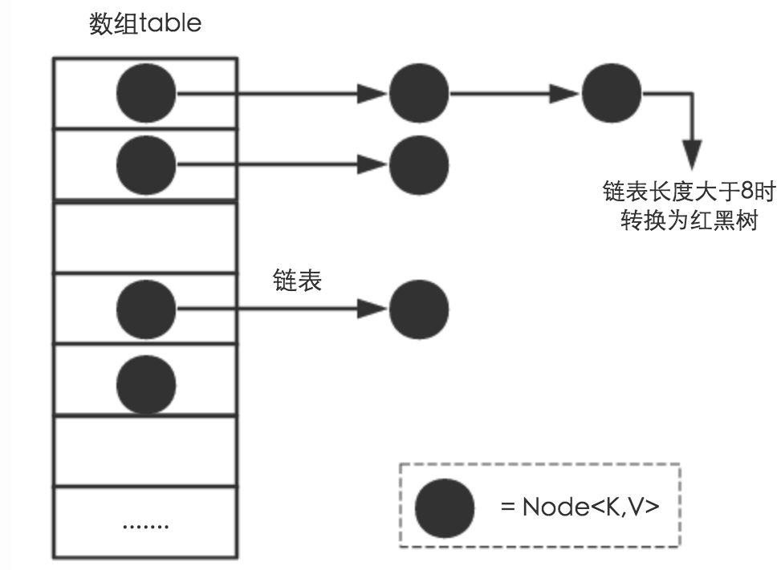
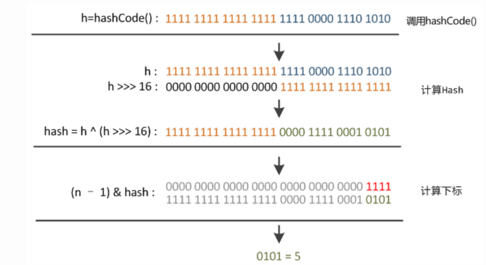
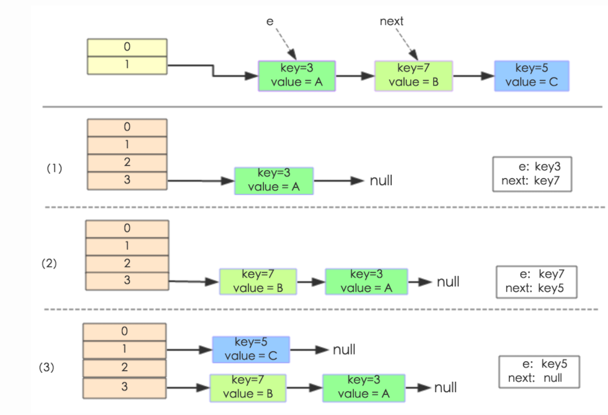
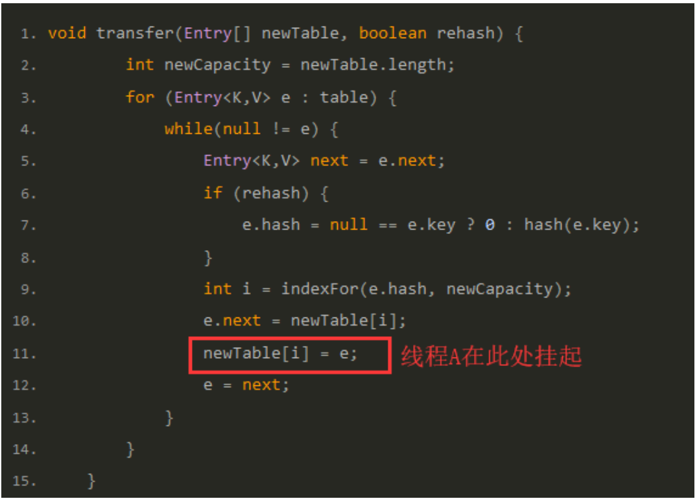
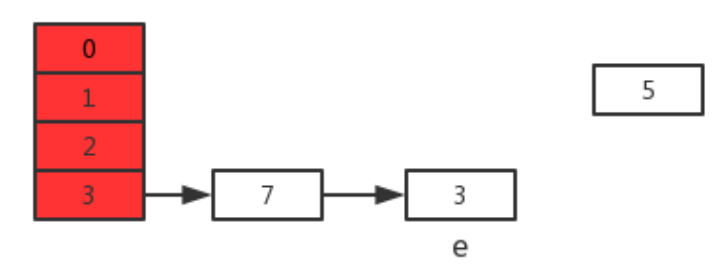
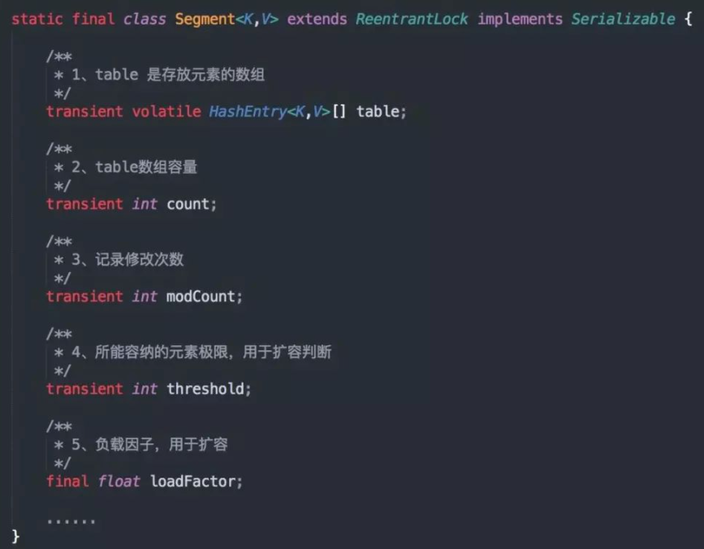

# Java容器
## 集合框架说一哈（Set，Map，List中的实现类大概介绍了下）


**Set、List和Map可以看做集合的三大类**

### （一）List

**List集合代表一个有序集合，集合中每个元素都有其对应的顺序索引。List集合允许使用重复元素，可以通过索引来访问指定位置的集合元素，实现List接口的集合主要有：`ArrayList、LinkedList、Vector、Stack`。**

#### ArrayList

**ArrayList是一个动态数组，擅长于随机访问。**同时ArrayList是非同步的。

#### LinkedList

**LinkedList是一个双向链表**，**LinkedList不能随机访问**，它所有的操作都是要按照双重链表的需要执行。在列表中索引的操作将从开头或结尾遍历列表（从靠近指定索引的一端）。这样做的好处就是可以通过较低的代价在List中进行插入和删除操作。**LinkedList也是非同步的**。

#### Vector

与ArrayList相似，但是Vector是同步的。所以说**Vector是线程安全的动态数组**。它的操作与ArrayList几乎一样。

#### Stack

Stack继承自Vector，实现一个**后进先出的堆栈**。

### （二）Map接口

Map与List、Set接口不同，它是由一系列键值对组成的集合，提供了key到Value的映射。在Map中它保证了key与value之间的一一对应关系。也就是说一个key对应一个value，所以它**不能存在相同的key值，当然value值可以相同**。

#### HashMap

以哈希表数据结构实现，查找对象时通过哈希函数计算其位置，它是为快速查询而设计的，其内部定义了一个hash表数组（Entry[] table），元素会通过哈希转换函数将元素的哈希地址转换成数组中存放的索引，如果有冲突，则使用散列链表的形式将所有相同哈希地址的元素串起来，可能通过查看HashMap.Entry的源码它是一个单链表结构。

#### LinkedHashMap

LinkedHashMap是HashMap的一个子类，它保留插入的顺序，如果需要输出的顺序和输入时的相同，那么就选用LinkedHashMap，且实现不是同步的

#### TreeMap

**TreeMap 是一个有序的key-value集合，非同步，基于红黑树（Red-Black tree）实现，每一个key-value节点作为红黑树的一个节点。**TreeMap存储时会进行排序的，会根据key来对key-value键值对进行排序，其中排序方式也是分为两种，一种是自然排序，一种是定制排序，具体取决于使用的构造方法。

**自然排序：**TreeMap中所有的key必须实现Comparable接口，并且所有的key都应该是同一个类的对象，否则会报ClassCastException异常。

**定制排序：**定义TreeMap时，创建一个comparator对象，该对象对所有的treeMap中所有的key值进行排序，采用定制排序的时候不需要TreeMap中所有的key必须实现Comparable接口。


### (三) Set接口

**Set是一种不包含重复的元素的Collection，无序，即任意的两个元素e1和e2都有e1.equals(e2)=false，Set最多有一个null元素。**

#### HashSet

HashSet 是一个没有重复元素的集合。它是由HashMap实现的，不保证元素的顺序(这里所说的没有顺序是指：元素插入的顺序与输出的顺序不一致)，而且HashSet允许使用null 元素。HashSet是非同步的

#### LinkedHashSet

LinkedHashSet继承自HashSet，其底层是**基于LinkedHashMap来实现的**，有序，非同步。**LinkedHashSet将会以元素的添加顺序访问集合的元素。**

#### TreeSet

TreeSet是一个有序集合，其底层是基于TreeMap实现的，非线程安全。TreeSet可以确保集合元素处于排序状态。**TreeSet支持两种排序方式，自然排序和定制排序，其中自然排序为默认的排序方式。**当我们构造TreeSet时，若使用不带参数的构造函数，则TreeSet的使用自然比较器；若用户需要使用自定义的比较器，则需要使用带比较器的参数。

[参考](https://www.javazhiyin.com/61290.html)
## Hashmap

**问题：HashMap的实现原理？**

(1) HashMap是基于hashing的原理，底层使用哈希表实现。里边最重要的两个方法put、get，使用put(key, value)存储对象到HashMap中，使用get(key)从HashMap中获取对象。

(2) 存储对象时，我们将K/V传给put方法时，它调用hashCode计算hash从而得到bucket位置，进一步存储，HashMap会根据当前bucket的占用情况自动调整容量(超过负载因子Load Facotr则resize扩容为原来的2倍)。

(3) 获取对象时，我们将K传给get，它调用hashCode计算hash从而得到bucket位置，并进一步调用equals()方法确定键值对。

(4) 如果发生碰撞的时候，Hashmap通过链表将产生碰撞冲突的元素组织起来，在Java 8中，如果一个bucket中碰撞冲突的元素超过某个限制(默认是8)，则使用红黑树来替换链表，从而提高速度。

注：

在Java 7中，hashmap的实现框架是：数组+链表/ 哈希表+链表

在Java 8之后，变成了：数组+链表+红黑树 / 哈希表+链表+红黑树

负载因子Load Facotr默认是0.75

如果链表中元素超过某个限制(默认是8)，用红黑树来替换链表

 **put函数大致的思路为：**

(1) 对key的hashCode()做hash，然后确定bucket的index；

(2) 如果没碰撞直接放到bucket里；

(3) 如果碰撞了，以链表的形式存在buckets后；

(4) 如果碰撞导致链表过长(大于等于TREEIFY_THRESHOLD，一般是8)，就把链表转换成红黑树；

(5) 如果节点已经存在就替换old value(保证key的唯一性)

**(6)** 如果bucket满了(超过负载因子*当前容量)，就要resize扩容。

**get函数大致的思路为：**

(1) bucket里的第一个节点，直接命中；

(2) 如果有冲突，则通过key.equals(k)去查找对应的entry

若为树，则在树中通过key.equals(k)查找，---O(logn)

若为链表，则在链表中通过key.equals(k)查找，----O(n)

 **hash函数的实现**

```java
static final int hash(Object key) {
    int h;
    return (key == null) ? 0 : (h = key.hashCode()) ^ (h >>> 16);
}

```


这个函数大概的作用就是：高16bit不变，低16bit和高16bit做了一个异或

**比较详细的讲了hashmap的工作原理**（上文主要参考此篇[博客](https://yikun.github.io/2015/04/01/Java-HashMap%E5%B7%A5%E4%BD%9C%E5%8E%9F%E7%90%86%E5%8F%8A%E5%AE%9E%E7%8E%B0/)）

非常详细了解其中各个步骤如何操作，参考[b站视频](https://www.bilibili.com/video/BV14z4y1d7Wa)
简洁，有很多[相关问题](https://blog.csdn.net/u012512634/article/details/72735183)

##  Java中的HashMap底层结构，为什么8的时候转换为红黑树具体说一下，为什么不直接用红黑树，链表和红黑树的查询效率 

HashMap是Java程序员使用频率最高的用于映射(键值对)处理的数据类型。随着JDK（Java Developmet Kit）版本的更新，JDK1.8对HashMap底层的实现进行了优化，例如**引入红黑树的数据结构和扩容的优化等。**

### （一）Map接口

Java为数据结构中的映射定义了一个接口java.util.Map，此接口主要有四个常用的实现类，分别是**HashMap、Hashtable、LinkedHashMap和TreeMap**

(1) **HashMap**：

* 它根据键的hashCode值存储数据，大多数情况下可以直接定位到它的值，因而具有很快的访问速度，但遍历顺序却是不确定的。 HashMap最多只允许一条记录的键为null，允许多条记录的值为null。
* HashMap**非线程安全**，即任一时刻可以有多个线程同时写HashMap，可能会导致数据的不一致。如果需要满足线程安全，可以用 **Collections的synchronizedMap方法**使HashMap具有线程安全的能力，或者使用**ConcurrentHashMap**。

(2) **Hashtable**：

* Hashtable是遗留类，很多映射的常用功能与HashMap类似，不同的是它承自Dictionary类，并且**是线程安全的**，任一时间只有一个线程能写Hashtable，并发性不如ConcurrentHashMap，因为ConcurrentHashMap引入了分段锁。
* Hashtable不建议在新代码中使用，不需要线程安全的场合可以用HashMap替换，需要线程安全的场合可以用ConcurrentHashMap替换。

(3) **LinkedHashMap**：LinkedHashMap是HashMap的一个子类，保存了记录的插入顺序，在用Iterator遍历LinkedHashMap时，先得到的记录肯定是先插入的，也可以在构造时带参数，按照访问次序排序。

(4) **TreeMap**：

* TreeMap实现SortedMap接口，能够把它保存的记录根据键排序，默认是按键值的升序排序，也可以指定排序的比较器，当用Iterator遍历TreeMap时，得到的记录是排过序的。
* **如果使用排序的映射，建议使用TreeMap**。在使用TreeMap时，key必须实现Comparable接口或者在构造TreeMap传入自定义的Comparator，否则会在运行时抛出java.lang.ClassCastException类型的异常。

### （二）存储结构-字段

* 存储结构

  HashMap是数组+链表+红黑树（JDK1.8增加了红黑树部分）

  

* 字段

   *   **Node[] table**，即哈希桶数组，明显它是一个Node的数组

      **Node**是HashMap的一个内部类，实现了Map.Entry接口，本质是就是一个映射(键值对)。上图中的每个黑色圆点就是一个Node对象。

      以下代码JDK1.8中Node

      ```java
      static class Node<K,V> implements Map.Entry<K,V> {
              final int hash;    //用来定位数组索引位置
              final K key;
              V value;
              Node<K,V> next;   //链表的下一个node
      
              Node(int hash, K key, V value, Node<K,V> next) { ... }
              public final K getKey(){ ... }
              public final V getValue() { ... }
              public final String toString() { ... }
              public final int hashCode() { ... }
              public final V setValue(V newValue) { ... }
              public final boolean equals(Object o) { ... }
      }
      ```

   * **HashMap如何解决地址冲突？**

     Java中HashMap采用了链地址法。链地址法，简单来说，就是数组加链表的结合。在每个数组元素上都一个链表结构，当数据被Hash后，得到数组下标，把数据放在对应下标元素的链表上。

     * map.put("美团","小美")的过程：
       * 系统将调用”美团”这个key的hashCode()方法得到其**hashCode 值**（该方法适用于每个Java对象）
       * Hash算法的后两步运算（**高位运算和取模运算）**来定位该键值对的存储位置
       * 有时两个key会定位到相同的位置，表示发生了Hash碰撞。
     * 通过什么方式来控制map使得Hash碰撞的概率又小，哈希桶数组（Node[] table）占用空间又少呢？
       * **好的Hash算法和扩容机制。**

   *   **Hash和扩容流程的相关字段**

       从HashMap的默认构造函数源码可知，构造函数就是对下面几个字段进行初始化

       ```java
       int threshold;             // 所能容纳的key-value对极限 
       final float loadFactor;    // 负载因子
       int modCount;  
       int size;  
       ```

       1) threshold&loadFactor

       * Node[] table的初始化长度length(默认值是16)，**Load factor**为负载因子(默认值是0.75)，threshold是HashMap所能容纳的最大数据量的Node(键值对)个数。**threshold = length * Load factor。**也就是说，在数组定义好长度之后，负载因子越大，所能容纳的键值对个数越多
       * **threshold**就是在此Load factor和length(数组长度)对应下允许的最大元素数目，超过这个数目就重新resize(扩容)，扩容后的HashMap容量是之前容量的两倍。

       2) size

       ​	就是HashMap中实际存在的键值对数量。

       3）modCount

          主要用来记录HashMap内部结构发生变化的次数，主要用于迭代的快速失败。

###  （三）红黑树

* 这里存在一个问题，即使负载因子和Hash算法设计的再合理，也免不了会出现拉链过长的情况，**一旦出现拉链过长，则会严重影响HashMap的性能。**

* 在JDK1.8版本中，对数据结构做了进一步的优化，引入了红黑树。**而当链表长度太长（默认超过8）时，链表就转换为红黑树，利用红黑树快速增删改查的特点提高HashMap的性能，其中会用到红黑树的插入、删除、查找等算法。**

* **为什么Map桶中个数超过8才转为红黑树？**

  * Map中桶的元素初始化是链表保存的，其查找性能是**O(n)**，而树结构能将查找性能提升到**O(log(n))**。

  * 那为什么不一开始就用红黑树，反而要经历一个转换的过程呢？

       默认是链表长度达到 8 就转成红黑树，而当长度降到 6 就转换回去，这体现了时间和空间平衡的思想，**最开始使用链表的时候，空间占用是比较少的，而且由于链表短，所以查询时间也没有太大的问题。**可是当链表越来越长，需要用红黑树的形式来保证查询的效率。

    ````java
    红黑树的平均查找长度是log(n)，如果长度为8，平均查找长度为log(8)=3，链表的平均查找长度为n/2，当长度为8时，平均查找长度为8/2=4，这才有转换成树的必要；
    链表长度如果是小于等于6，6/2=3，而log(6)=2.6，虽然速度也很快的，但是转化为树结构和生成树的时间并不会太短。
    ````

  * 为什么阈值是8?

    如果 hashCode 分布良好，也就是 hash 计算的结果离散好的话，那么红黑树这种形式是很少会被用到的，因为各个值都均匀分布，很少出现链表很长的情况。

    在理想情况下，链表长度符合泊松分布，各个长度的命中概率依次递减，当长度为 8 的时候，概率仅为 0.00000006。这是一个小于千万分之一的概率，通常我们的 Map 里面是不会存储这么多的数据的，所以通常情况下，并不会发生从链表向红黑树的转换。

    ```java
    0:    0.60653066
     1:    0.30326533
     2:    0.07581633
     3:    0.01263606
     4:    0.00157952
     5:    0.00015795
     6:    0.00001316
     7:    0.00000094
     8:    0.00000006
    ```

  * hash算法

    通常如果 hash 算法正常的话，那么链表的长度也不会很长，那么红黑树也不会带来明显的查询时间上的优势，反而会增加空间负担。所以通常情况下，并没有必要转为红黑树，所以就选择了概率非常小，小于千万分之一概率，也就是长度为 8 的概率，把长度 8 作为转化的默认阈值。

    [参考](https://www.jianshu.com/p/fdf3d24fe3e8) [参考](https://blog.csdn.net/sinat_41832255/article/details/88884586)

### （四）方法实现

#### 1. 确定哈希桶数组索引位置

HashMap定位数组索引位置，直接决定了hash方法的离散性能。

这里的Hash算法本质上就是三步：**取key的hashCode值、高位运算、取模运算**。

```java
方法一：方法一所计算得到的Hash码值
static final int hash(Object key) {   //jdk1.8 & jdk1.7
     int h;
     // 1 h = key.hashCode() 为第一步 取hashCode值
     // 2 h ^ (h >>> 16)  为第二步 高位参与运算
     return (key == null) ? 0 : (h = key.hashCode()) ^ (h >>> 16);
}
方法二：调用方法二来计算该对象应该保存在table数组的哪个索引处。
static int indexFor(int h, int length) {  //jdk1.7的源码，jdk1.8没有这个方法，但是实现原理一样的
     return h & (length-1);  //3 第三步 取模运算
}
```

n为table的长度



在JDK1.8的实现中，优化了高位运算的算法，**通过hashCode()的高16位异或低16位实现的**：(h = k.hashCode()) ^ (h >>> 16)，主要是从速度、功效、质量来考虑的，这么做可以在数组table的length比较小的时候，**也能保证考虑到高低Bit都参与到Hash的计算中**，同时不会有太大的开销。

#### 2. HashMap的put方法

①.判断键值对数组table是否为空或为null，否则执行resize()进行扩容； 

②.根据键值key计算hash值得到插入的数组索引i，如果table[i]==null，直接新建节点添加，转向⑥，如果table[i]不为空，则转向③；

 ③.判断table[i]的首个元素是否和key一样，如果相同直接覆盖value，否则转向④，这里的相同指的是hashCode以及equals； 

④.判断table[i] 是否为treeNode，即table[i] 是否是红黑树，如果是红黑树，则直接在树中插入键值对，否则转向⑤； 

⑤.遍历table[i]，判断链表长度是否大于8，大于8的话把链表转换为红黑树，在红黑树中执行插入操作，否则进行链表的插入操作；遍历过程中若发现key已经存在直接覆盖value即可；

 ⑥.插入成功后，判断实际存在的键值对数量size是否超多了最大容量threshold，如果超过，进行扩容。


JDK1.8HashMap的put方法

```java
public V put(K key, V value) {
 2     // 对key的hashCode()做hash
 3     return putVal(hash(key), key, value, false, true);
 4 }
 5 
 6 final V putVal(int hash, K key, V value, boolean onlyIfAbsent,
 7                boolean evict) {
 8     Node<K,V>[] tab; Node<K,V> p; int n, i;
 9     // 步骤①：tab为空则创建
10     if ((tab = table) == null || (n = tab.length) == 0)
11         n = (tab = resize()).length;
12     // 步骤②：计算index，并对null做处理 
13     if ((p = tab[i = (n - 1) & hash]) == null) 
14         tab[i] = newNode(hash, key, value, null);
15     else {
16         Node<K,V> e; K k;
17         // 步骤③：节点key存在，直接覆盖value
18         if (p.hash == hash &&
19             ((k = p.key) == key || (key != null && key.equals(k))))
20             e = p;
21         // 步骤④：判断该链为红黑树
22         else if (p instanceof TreeNode)
23             e = ((TreeNode<K,V>)p).putTreeVal(this, tab, hash, key, value);
24         // 步骤⑤：该链为链表
25         else {
26             for (int binCount = 0; ; ++binCount) {
27                 if ((e = p.next) == null) {
28                     p.next = newNode(hash, key,value,null);
                        //链表长度大于8转换为红黑树进行处理
29                     if (binCount >= TREEIFY_THRESHOLD - 1) // -1 for 1st  
30                         treeifyBin(tab, hash);
31                     break;
32                 }
                    // key已经存在直接覆盖value
33                 if (e.hash == hash &&
34                     ((k = e.key) == key || (key != null && key.equals(k)))) 
35							break;
36                 p = e;
37             }
38         }
39         
40         if (e != null) { // existing mapping for key
41             V oldValue = e.value;
42             if (!onlyIfAbsent || oldValue == null)
43                 e.value = value;
44             afterNodeAccess(e);
45             return oldValue;
46         }
47     }

48     ++modCount;
49     // 步骤⑥：超过最大容量 就扩容
50     if (++size > threshold)
51         resize();
52     afterNodeInsertion(evict);
53     return null;
54 }
```

#### 3. 扩容机制

**resize的源码,使用JDK1.7的代码**

使用一个容量更大的数组来代替已有的容量小的数组，**transfer()方法**将原有Entry数组的元素拷贝到新的Entry数组里。

```java
 1 void resize(int newCapacity) {   //传入新的容量
 2     Entry[] oldTable = table;    //引用扩容前的Entry数组
 3     int oldCapacity = oldTable.length;         
 4     if (oldCapacity == MAXIMUM_CAPACITY) {  //扩容前的数组大小如果已经达到最大(2^30)了
 5         threshold = Integer.MAX_VALUE; //修改阈值为int的最大值(2^31-1)，这样以后就不会扩容了
 6         return;
 7     }
 8  
 9     Entry[] newTable = new Entry[newCapacity];  //初始化一个新的Entry数组
10     transfer(newTable);                         //！！将数据转移到新的Entry数组里
11     table = newTable;                           //HashMap的table属性引用新的Entry数组
12     threshold = (int)(newCapacity * loadFactor);//修改阈值
13 }
```

单链表的头插入方式

```java
 1 void transfer(Entry[] newTable) {
 2     Entry[] src = table;                   //src引用了旧的Entry数组
 3     int newCapacity = newTable.length;
 4     for (int j = 0; j < src.length; j++) { //遍历旧的Entry数组
 5         Entry<K,V> e = src[j];             //取得旧Entry数组的每个元素
 6         if (e != null) {
 7             src[j] = null;//释放旧Entry数组的对象引用（for循环后，旧的Entry数组不再引用任何对象）
 8             do {
 9                 Entry<K,V> next = e.next;
10                 int i = indexFor(e.hash, newCapacity); //！！重新计算每个元素在数组中的位置
     			   //接起新链表
11                 e.next = newTable[i]; //标记[1]
12                 newTable[i] = e;      //将元素放在数组上
     			  //访问下一个
13                 e = next;             //访问下一个Entry链上的元素
14             } while (e != null);
15         }
16     }
17 } 
```



**resize的源码,使用JDK1.8的优化：**使用的是2次幂的扩展(指长度扩为原来2倍)，所以，**元素的位置要么是在原位置，要么是在原位置再移动2次幂的位置。**


[参考](https://tech.meituan.com/2016/06/24/java-hashmap.html)

### （五）JDK1.8与JDK1.7的对比
* （1）JDK1.7用的是**头插法**，而JDK1.8及之后使用的都是**尾插法**，那么他们为什么要这样做呢？因为JDK1.7是用单链表进行的纵向延伸，当采用头插法时会容易出现逆序且环形链表死循环问题。但是在JDK1.8之后是因为加入了红黑树使用尾插法，能够避免出现逆序且链表死循环的问题。
* （2）扩容后数据存储位置的计算方式也不一样：
  * 1. 在JDK1.7的时候是直接用hash值和需要扩容的二进制数进行&（这里就是为什么扩容的时候为啥一定必须是2的多少次幂的原因所在，因为如果只有2的n次幂的情况时最后一位二进制数才一定是1，这样能最大程度减少hash碰撞）**（hash值 & length-1）**
  * 2. 而在JDK1.8的时候直接用了JDK1.7的时候计算的规律，也就是**扩容前的原始位置+扩容的大小值=JDK1.8的计算方式**，而不再是JDK1.7的那种异或的方法。但是这种方式就相当于只需要判断Hash值的新增参与运算的位是0还是1就直接迅速计算出了扩容后的储存方式。
* （3）JDK1.7的时候使用的是**数组+ 单链表的数据结构**。但是在JDK1.8及之后时，使用的是**数组+链表+红黑树的数据结构**（当链表的深度达到8的时候，也就是默认阈值，就会自动扩容把链表转成红黑树的数据结构来把时间复杂度从O（n）变成O（logN）提高了效率）

### （六）其他问题

#### 为什么 HashMap 中 String、Integer 这样的包装类适合作为 key 键


#### HashMap 中的 key若 Object类型， 则需实现哪些方法？


[参考](https://blog.csdn.net/qq_36520235/article/details/82417949?ops_request_misc=%257B%2522request%255Fid%2522%253A%2522161392290916780271531499%2522%252C%2522scm%2522%253A%252220140713.130102334.pc%255Fall.%2522%257D&request_id=161392290916780271531499&biz_id=0&utm_medium=distribute.pc_search_result.none-task-blog-2~all~first_rank_v2~hot_rank-23-82417949.pc_search_result_no_baidu_js&utm_term=hashmap%E9%97%AE%E9%A2%98&spm=1018.2226.3001.4187)

## ConcurrentHashMap 具体实现，cas和synchronize具体如何用的 
* ConcurrentHashMap同样也分为 1.7 、1.8 版，两者在实现上略有不同。	
* Base 1.7

    * 是由 Segment 数组、HashEntry 组成，和 HashMap 一样，仍然是数组加链表。
         * Segment 数组，存放数据时首先需要定位到具体的 Segment 中 。
         * HashEntry 和 HashMap 中的 HashEntry 作用一样，真正存放数据的桶，唯一的区别就是其中的核心数据如 value ，以及链表都是 volatile 修饰的，保证了获取时的可见性。

       * ConcurrentHashMap 采用了分段锁技术，其中 **Segment 继承于 ReentrantLock**。不会像 HashTable 那样不管是 put 还是 get 操作都需要做同步处理，理论上 ConcurrentHashMap 支持 CurrencyLevel (Segment 数组数量)的线程并发。每当一个线程占用锁访问一个 Segment 时，不会影响到其他的 Segment。

       * put 方法

            * 首先是通过 key 定位到 Segment，之后在对应的 Segment 中进行具体的 put。
            * 虽然 HashEntry 中的 value 是用 volatile 关键词修饰的，但是并不能保证并发的原子性，所以 **put 操作时仍然需要加锁处理。**
        * get 方法

            * 只需要将 Key 通过 Hash 之后定位到具体的 Segment ，再通过一次 Hash 定位到具体的元素上。
            *  由于 HashEntry 中的 value 属性是用 volatile 关键词修饰的，保证了内存可见性，所以每次获取时都是最新值。**因为整个过程都不需要加锁**。

* Base 1.8
	* 抛弃了原有的 Segment 分段锁，而采用了 **`CAS + synchronized`** 来保证并发安全性。
	* 也将 1.7 中存放数据的 HashEntry 改为 Node，但作用都是相同的。
    * 其中的 `val next` 都用了 volatile 修饰，保证了可见性。
    * put方法
    	* 根据 key 计算出 hashcode 。
        * 判断是否需要进行初始化。
        * `f` 即为当前 key 定位出的 Node，如果为空表示当前位置可以写入数据，利用 **CAS 尝试写入，失败则自旋保证成功**。
        * 如果当前位置的 `hashcode == MOVED == -1`,则需要进行扩容。
        * 如果都不满足，则利用 **synchronized 锁写入数据**。
        * 如果数量大于 `TREEIFY_THRESHOLD` 则要转换为红黑树。
	* get 方法
      * 根据计算出来的 hashcode 寻址，如果就在桶上那么直接返回值。
      
      * 如果是红黑树那就按照树的方式获取值。
      
      * 都不满足那就按照链表的方式遍历获取值    
        [参考](https://crossoverjie.top/2018/07/23/java-senior/ConcurrentHashMap/)

## ConcurrentHashMap的底层说一下，为什么使用synchronized 

####  A HashMap的线程不安全体现在哪里？

* JDK1.7中扩容引发的线程不安全

​    在HashMap扩容的是时候会调用resize（）方法中的transfer()方法，在这里由于是**头插法**所以在多线程情况下可能出现**循环链表**，所以后面的数据定位到这条链表的时候会造成**数据丢失**。和读取的可能导致**死循环**。



| 过程                                                         | A线程                                                        | B线程                                                        |
| :----------------------------------------------------------- | ------------------------------------------------------------ | ------------------------------------------------------------ |
| 正常扩容前后                                                 |                                         |                                         |
| A挂起e=3、next=7、e.next=null                                |                                          |                                                              |
| 线程B中成功的完成了数据迁移**7.next=3**、3.next=null         |                                                              |                                          |
| A获得CPU时间片继续执行`newTable[i] = e`                      |                                          |                                                              |
| 接着继续执行下一轮循环，此时e=7，从主内存中读取e.next时发现主内存中**7.next=3**，于是乎next=3，并将7采用头插法的方式放入新数组中，并继续执行完此轮循环 |                                          |                                                              |
| 执行下一次循环可以发现，next=e.next=null，所以此轮循环将会是最后一轮循环。接下来当执行完e.next=newTable[i]即3.next=7后，3和7之间就相互连接了，当执行完newTable[i]=e后，3被头插法重新插入到链表中 |                                          |                                                              |
| 结论                                                         | `HashMap`中出现了环形结构，当在以后对该`HashMap`进行操作时会出现**死循环**。 | 元素5在扩容期间被莫名的丢失了，这就发生了**数据丢失**的问题。 |


* JDK1.8中的线程不安全

   **1.8的HashMap对此做了优化，resize采用了尾插法**，即不改变原来链表的顺序，所以不会出现1.7的循环链表的问题。但是它也不是线程线程安全的。不安全性如下：

   **在多线程情况下put时计算出的插入的数组下标可能是相同的，这时可能出现值（数据）的覆盖从而导致size也是不准确的。**
   
   * 其中第六行代码是判断是否出现hash碰撞可以直接插入，假设两个线程A、B都在进行put操作，并且hash函数计算出的插入下标是相同的，当线程A执行完第六行代码后由于时间片耗尽导致被挂起，而线程B得到时间片后在该下标处插入了元素，完成了正常的插入，然后线程A获得时间片，**由于之前已经进行了hash碰撞的判断，所有此时不会再进行判断，而是直接进行插入，这就导致了线程B插入的数据被线程A覆盖了，从而线程不安全。**
   
   * 除此之前，还有就是代码的第38行处有个`++size`，我们这样想，还是线程A、B，这两个线程同时进行put操作时，假设当前`HashMap`的size大小为10，当线程A执行到第38行代码时，从主内存中获得size的值为10后准备进行+1操作，但是由于时间片耗尽只好让出CPU，线程B快乐的拿到CPU还是从主内存中拿到size的值10进行+1操作，完成了put操作并将size=11写回主内存，然后线程A再次拿到CPU并继续执行(此时size的值仍为10)，当执行完put操作后，还是将size=11写回内存，**此时，线程A、B都执行了一次put操作，但是size的值只增加了1，所有说还是由于数据覆盖又导致了线程不安全。**
   
   ```java
   final V putVal(int hash, K key, V value, boolean onlyIfAbsent,
                      boolean evict) {
           Node<K,V>[] tab; Node<K,V> p; int n, i;
           if ((tab = table) == null || (n = tab.length) == 0)
               n = (tab = resize()).length;
           if ((p = tab[i = (n - 1) & hash]) == null) // 6行 如果没有hash碰撞则直接插入元素
               tab[i] = newNode(hash, key, value, null);
           else {
               Node<K,V> e; K k;
               if (p.hash == hash &&
                   ((k = p.key) == key || (key != null && key.equals(k))))
                   e = p;
               else if (p instanceof TreeNode)
                   e = ((TreeNode<K,V>)p).putTreeVal(this, tab, hash, key, value);
               else {
                   for (int binCount = 0; ; ++binCount) {
                       if ((e = p.next) == null) {
                           p.next = newNode(hash, key, value, null);
                           if (binCount >= TREEIFY_THRESHOLD - 1) // -1 for 1st
                               treeifyBin(tab, hash);
                           break;
                       }
                       if (e.hash == hash &&
                           ((k = e.key) == key || (key != null && key.equals(k))))
                           break;
                       p = e;
                   }
               }
               if (e != null) { // existing mapping for key
                   V oldValue = e.value;
                   if (!onlyIfAbsent || oldValue == null)
                       e.value = value;
                   afterNodeAccess(e);
                   return oldValue;
               }
           }
           ++modCount;
           if (++size > threshold) //38行
               resize();
           afterNodeInsertion(evict);
           return null;
       }
   ```
   
   [参考](https://zhyocean.cn/article/1553946904) [参考](https://juejin.cn/post/6844904089688473614)
####  B 如何解决HashMap线程不安全的问题？

- 第一种方法，使用`Hashtable`线程安全类；

  Hashtable 是一个线程安全的类，Hashtable 几乎所有的添加、删除、查询方法都加了`synchronized`同步锁！

  **相当于给整个哈希表加了一把大锁**，多线程访问时候，只要有一个线程访问或操作该对象，那其他线程只能阻塞等待需要的锁被释放，在竞争激烈的多线程场景中性能就会非常差，**所以 Hashtable 不推荐使用！**

    

- 第二种方法，使用`Collections.synchronizedMap`方法，对方法进行加同步锁；

  果传入的是 HashMap 对象，其实也是对 HashMap 做的方法做了一层包装，里面使用对象锁来保证多线程场景下，操作安全，**本质也是对 HashMap 进行全表锁**

    

- 第三种方法，使用并发包中的`ConcurrentHashMap`类；

  因为hashMap 是数组 + 链表的数据结构，如果我们把数组进行分割多段，对每一段分别设计一把同步锁，这样在多线程访问不同段的数据时，就不会存在锁竞争了

  - JDK1.7 中

    **ConcurrentHashMap 类所采用的正是分段锁的思想，将 HashMap 进行切割，把 HashMap 中的哈希数组切分成小数组，每个小数组有 n 个 HashEntry 组成，其中小数组继承自`ReentrantLock（可重入锁）`，这个小数组名叫`Segment`，**

     

  * JDK1.8中

    JDK1.8 中 ConcurrentHashMap 类取消了 Segment 分段锁，采用 `CAS` + `synchronized` 来保证并发安全，数据结构跟 jdk1.8 中 HashMap 结构类似，都是**数组 + 链表（当链表长度大于 8 时，链表结构转为红黑二叉树**）结构。

    **ConcurrentHashMap 中 synchronized 只锁定当前链表或红黑二叉树的首节点，只要节点 hash 不冲突，就不会产生并发**，相比 JDK1.7 的 ConcurrentHashMap 效率又提升了 N 倍！

     

 ####  C JDK1.7 中的 ConcurrentHashMap 

##### C_1  存储结构

* Segment 数组

   ConcurrentHashMap 的主存是一个 Segment 数组。

   

* Segment 

  Segment 是 ConcurrentHashMap 中的一个静态内部类类似HashMap, 一个 Segment 就是一个子哈希表，Segment 里维护了一个 HashEntry 数组, Segment 这个静态内部类继承了`ReentrantLock`类，`ReentrantLock`是一个可重入锁, 对于不同的 Segment 数据进行操作是不用考虑锁竞争的，因此不会像 Hashtable 那样不管是添加、删除、查询操作都需要同步处理。

  

*  HashEntry

  HashEntry，也是一个静态内部类,`HashEntry`和`HashMap`中的 `Entry`非常类似，唯一的区别就是其中的核心数据如`value` ，以及`next`都使用了`volatile`关键字修饰，保证了多线程环境下数据获取时的**可见性**

  

* 构造函数参数

  ConcurrentHashMap 初始化方法有三个参数，**initialCapacity（初始化容量）为 16、loadFactor（负载因子）为 0.75、concurrentLevel（并发等级）为 16**

##### C_1  方法
##### （一） put

 put 操作主要分两步：

- 定位 Segment 并确保定位的 Segment 已初始化；
- 调用 Segment 的 put 方法；
  - 第一步，**尝试获取对象锁**，如果获取到返回 true，否则执行**scanAndLockForPut**方法，这个方法也是尝试获取对象锁；
  - 第二步，获取到锁之后，类似 hashMap 的 put 方法，通过 key 计算所在 HashEntry 数组的下标；
  - 第三步，获取到数组下标之后遍历链表内容，通过 key 和 hash 值判断是否 key 已存在，如果已经存在，通过标识符判断是否覆盖，默认覆盖；
  - 第四步，如果不存在，采用头插法插入到 HashEntry 对象中；
  - 第五步，最后操作完整之后，**释放对象锁；**

*  **scanAndLockForPut**这个方法，操作也是分以下几步：
  * 当前线程尝试去获得锁，查找 key 是否已经存在，如果不存在，就创建一个 HashEntry 对象；
  * 如果重试次数大于最大次数，就调用`lock()`方法获取对象锁，如果依然没有获取到，当前线程就阻塞，直到获取之后退出循环；
  * 在这个过程中，key 可能被别的线程给插入，如果 HashEntry 存储内容发生变化，重置重试次数；
  * **类似于自旋锁的功能，循环式的判断对象锁是否能够被成功获取，直到获取到锁才会退出循环，防止执行 put 操作的线程频繁阻塞，这些优化都提升了 put 操作的性能**

#####  （二）get 操作

  由于 HashEntry 涉及到的共享变量都使用 volatile 修饰，volatile 可以保证内存可见性，所以不会读取到过期数据。

#####  （三）remove 操作

* 通过 key 找到元素所在的 Segment 对象

* 先获取对象锁，如果获取到之后执行移除操作，之后的操作类似 hashMap 的移除方法，步骤如下：
  * 先获取对象锁；
  * 计算 key 的 hash 值在 HashEntry[]中的角标；
  * 根据 index 角标获取 HashEntry 对象；
  * 循环遍历 HashEntry 对象，HashEntry 为单向链表结构；
  * 通过 key 和 hash 判断 key 是否存在，如果存在，就移除元素，并将需要移除的元素节点的下一个，向上移；
  * 最后就是释放对象锁，以便其他线程使用；

####  D JDK1.8 中的 ConcurrentHashMap 

JDK1.8 中的 ConcurrentHashMap 和往期 JDK 中的 ConcurrentHashMa 一样支持并发操作，整体结构和 JDK1.8 中的 HashMap 类似，相比 JDK1.7 中的 ConcurrentHashMap， 它抛弃了原有的 Segment 分段锁实现，采用了 `CAS + synchronized` 来保证并发的安全性。

##### D_1 存储结构

* Node

  JDK1.8 中的 ConcurrentHashMap 对节点`Node`类中的共享变量，和 JDK1.7 一样，使用`volatile`关键字，保证多线程操作时，变量的可见性

  

##### D_2 方法

  ##### (一) put

- 首先会判断 key、value 是否为空，如果为空就抛异常！

- 接着会判断容器数组是否为空，如果为空就**初始化数组（initTable 初始化数组）**；

- 进一步判断，要插入的元素`f`，在当前数组下标是否第一次插入，如果是就通过 **CAS** 方式插入；

- 在接着判断`f.hash == -1`是否成立，如果成立，说明当前`f`是`ForwardingNode`节点，表示有其它线程正在扩容，则一起进行扩容操作（**helpTransfer 帮助扩容**）；

- 其他的情况，就是把新的`Node`节点按链表或红黑树的方式插入到合适的位置；

- 节点插入完成之后，接着判断链表长度是否超过`8`，如果超过`8`个，就将链表转化为红黑树结构；

- 最后，插入完成之后，进行扩容判断（**addCount 扩容判断**）；

  ##### initTable () 初始化数组：如果数组为空就**初始化数组**

  sizeCtl 是一个对象属性，使用了 volatile 关键字修饰保证并发的可见性，默认为 0，当第一次执行 put 操作时，通过`Unsafe.compareAndSwapInt()`方法，俗称`CAS`，将 `sizeCtl`修改为 `-1`，有且只有一个线程能够修改成功，接着执行 table 初始化任务。

  如果别的线程发现`sizeCtl<0`，意味着有另外的线程执行 CAS 操作成功，当前线程通过执行`Thread.yield()`让出 CPU 时间片等待 table 初始化完成。

  ##### helpTransfer 帮助扩容

  `helpTransfer()`方法，如果`f.hash == -1`成立，说明当前`f`是`ForwardingNode`节点，意味有其它线程正在扩容，则一起进行扩容操作

  - 第 1 步，对 table、node 节点、node 节点的 nextTable，进行数据校验；
  - 第 2 步，根据数组的 length 得到一个标识符号；
  - 第 3 步，进一步校验 nextTab、tab、sizeCtl 值，如果 nextTab 没有被并发修改并且 tab 也没有被并发修改，同时 `sizeCtl < 0`，说明还在扩容；
  - 第 4 步，对 sizeCtl 参数值进行分析判断，如果不满足任何一个判断，将`sizeCtl + 1`, 增加了一个线程帮助其扩容;

  ##### addCount 扩容判断

  - 第 1 步，利用 CAS 将方法更新 baseCount 的值
  - 第 2 步，检查是否需要扩容，默认 check = 1，需要检查；
  - 第 3 步，如果满足扩容条件，判断当前是否正在扩容，如果是正在扩容就一起扩容；
  - 第 4 步，如果不在扩容，将 sizeCtl 更新为负数，并进行扩容处理；

##### (二) get

不涉及并发操作

- 第 1 步，判断数组是否为空，通过 key 定位到数组下标是否为空；
- 第 2 步，判断 node 节点第一个元素是不是要找到，如果是直接返回；
- 第 3 步，如果是红黑树结构，就从红黑树里面查询；
- 第 4 步，如果是链表结构，循环遍历判断；

##### (三) remove

- 第 1 步，循环遍历数组，接着校验参数；

- 第 2 步，判断是否有别的线程正在扩容，如果是一起扩容；

- 第 3 步，用 synchronized 同步锁，保证并发时元素移除安全；

- 第 4 步，因为 `check= -1`，所以不会进行扩容操作，利用 CAS 操作修改 baseCount 值；

  [参考](https://blog.csdn.net/singwhatiwanna/article/details/103900681)

#### E JDK 8的CHM用CAS和synchronized替代了JDK 7中的分段ReentrantLock。

其一，锁分离的**粒度细化**了，从Segment级别细化到了哈希桶级别。也就是说，在插入元素不发生哈希冲突的情况下，就不必加锁。

其二，在插入桶的头结点时使用无锁的**CAS操作**，效率很高。

其三，虽然我们也可以让Node类继承ReentrantLock并执行f.lock()/unlock()操作，但从JDK 6开始，JVM对内置的synchronized关键字做了大量优化，**synchronized不再是重量级锁的代名词**，而是会由无锁状态开始，随着并发程度的提升而膨胀成偏向锁、轻量级锁，再到重量级锁（其中包含适应性自旋过程）。在锁粒度细化的前提下，发生争用的概率降低，synchronized膨胀成重量级锁的机会也不多，故可以省去线程被挂起和唤醒（上下文切换）的大量开销。

[参考](https://www.jianshu.com/p/deae4d32a6e6)        

## 说一下线程安全的集合 
### 一、早期线程安全的集合

我们先从早期的线程安全的集合说起，它们是Vector和HashTable

#### 1.Vector

Vector和ArrayList类似，是长度可变的数组，与ArrayList不同的是，Vector是线程安全的，它给几乎所有的public方法都加上了synchronized关键字。由于加锁导致性能降低，在不需要并发访问同一对象时，这种强制性的同步机制就显得多余，所以现在Vector已被弃用

#### 2.HashTable

HashTable和HashMap类似，不同点是HashTable是线程安全的，它给几乎所有public方法都加上了synchronized关键字，还有一个不同点是HashTable的K，V都不能是null，但HashMap可以，它现在也因为性能原因被弃用了

### 二、Collections包装方法

Vector和HashTable被弃用后，它们被ArrayList和HashMap代替，但它们不是线程安全的，所以**Collections工具类中提供了相应的包装方法把它们包装成线程安全的集合**

```
List<E> synArrayList = Collections.synchronizedList(new ArrayList<E>());

Set<E> synHashSet = Collections.synchronizedSet(new HashSet<E>());

Map<K,V> synHashMap = Collections.synchronizedMap(new HashMap<K,V>());

...1234567
```

Collections针对每种集合都声明了一个线程安全的包装类，在原集合的基础上添加了锁对象，**集合中的每个方法都通过这个锁对象实现同步**

### 三、java.util.concurrent包中的集合

#### 1.ConcurrentHashMap

ConcurrentHashMap和HashTable都是线程安全的集合，它们的不同主要是加锁粒度上的不同。HashTable的加锁方法是给每个方法加上synchronized关键字，这样锁住的是整个Table对象。而ConcurrentHashMap是更细粒度的加锁

* 在JDK1.8之前，ConcurrentHashMap加的是分段锁，也就是Segment锁，每个Segment含有整个table的一部分，这样不同分段之间的并发操作就互不影响
*  JDK1.8对此做了进一步的改进，它取消了Segment字段，直接在table元素上加锁，实现对每一行进行加锁，进一步减小了并发冲突的概率

#### 2.CopyOnWriteArrayList和CopyOnWriteArraySet

* 它们是加了**写锁**的ArrayList和ArraySet，锁住的是整个对象，但**读操作可以并发执行**

#### 3.其他

除此之外还有ConcurrentSkipListMap、ConcurrentSkipListSet、ConcurrentLinkedQueue、ConcurrentLinkedDeque等，**至于为什么没有ConcurrentArrayList，原因是无法设计一个通用的而且可以规避ArrayList的并发瓶颈的线程安全的集合类，只能锁住整个list，这用Collections里的包装类就能办到**

[参考](https://blog.csdn.net/lixiaobuaa/article/details/79689338)        
        

​        