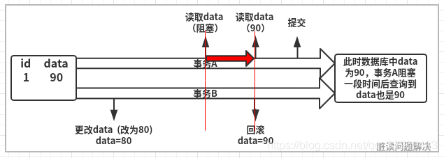
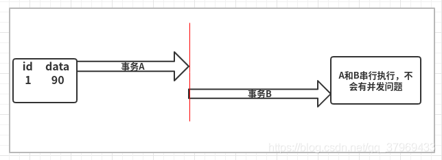
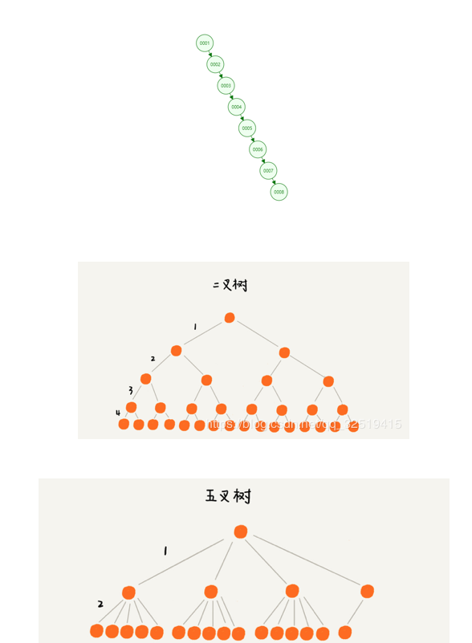
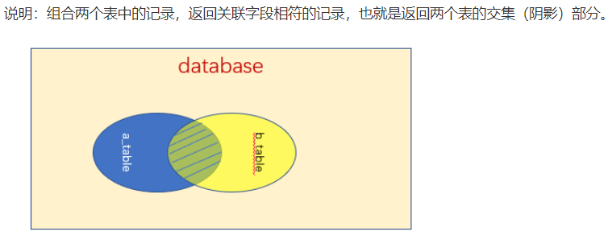
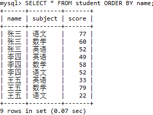

# MySQL
## 事务的问题及隔离级别

**事务**： 一个或多个原子操作组合而成的执行单元，即一条或多条不可再分的数据操作指令组合而成的执行单元。
事务的四个特性，即原子性（Atomicity）、一致性（Consistency）、隔离性（Isolation）、持久性（Durability），这也就是所称的ACID事务。

一个叫事务的**提交**，即在事务成功执行后提交结束事务；
一个叫事务的**回滚**，即在事务执行过程中某个操作出现问题，恢复到事务执行之前的那个一致性状态。

**事务并发问题：脏写、脏读、不可重复读、幻读**

(1)	**脏写**：指两个事务A、B，A更新数据还未提交，B也来更新数据。对于A来讲，最终的数据不是自己想要更新的值。
脏写问题使用**行级排它锁**即可解决，在一条记录被一个事务更新时，另外的事务是无法更新这条事务的。

(2)	**脏读**:是指两个事务A、B，A读取了B更新尚未提交的内容，B事务回滚，导致A读取的内容错误。


(3)	**不可重复读**：是指两个事务A、B，A读取一个字段，B更新了这个字段，A再读取一次这个字段，两次读取的结果不同。如图


(4)	**幻读**：是指两个事务A、B，A读取一个字段的行数，B插入或删除了某些记录，A再读取这个字段的行数，行数不同了。


不可重复读和幻读问题十分相似：
不可重复读是并发事务B的UPDATE操作对事务A带来的问题
幻读是并发事务B的INSERT和DELETE操作对事务A带来的问题。

**隔离级别：读未提交、读已提交、可重复读、串行化/序列化**

**(1)	读未提交（READ UNCOMMITTED）**
允许事务A读取事务B未提交的更新。自然，事务的并发工作流程是与以上三幅图片所示的流程一样的，脏读、不可重复读、幻读问题均不可实现。

**(2)	读已提交（READ COMMITTED）**
只允许事务A读取事务B已经提交的更新。若B事务更改某条记录未结束（提交或回滚），A事务读取相应记录会阻塞至B事务结束。在个隔离级别下，脏读问题图示会变为：



**(3)	可重复读（REPEATABLE READ）**
A事务读取某个字段，在A事务操作期间，禁止B事务对该字段的更新。可重复读解决事务的不可重复读问题，这样，流程图变为：


**(4)	串行化（SERIALIZABLE）**
串行化即舍弃事务的并发处理能力，将所有事务串行执行，这样虽然避免了所有的并发问题，但性能效率实在太低，一般不用。



四个隔离级别解决并发问题总结如下：


四个隔离级别解决问题程度的递增，是用牺牲数据库的并发性能来得到的，如串行化级别，解决了所有的并发问题，但却没有任何并发能力。所以需要根据实际业务情况选择合适的隔离级别。
还需要清楚，四个隔离级别只是SQL给出的规范，包括前面所讲的ACID事务的实现，每个数据库存储引擎对这些的实现技术都是不同的，所有引擎都在追求更高的隔离级别下的更高的并发能力。比如**MySQL默认使用的InnoDB引擎，使用MVCC技术在可重复读级别下，不用阻塞事务B的写操作就可以解决不可重复读甚至是幻读问题。**

[参考](https://blog.csdn.net/qq_37969433/article/details/103247421)

## 数据库为什么是 B+ 树而不是hash表等等

1. hash表只能匹配是否相等，**不能实现范围查找**

   由于 Hash 索引比较的是进行 Hash 运算之后的 Hash 值，所以它只能用于等值的过滤，不能用于基于范围的过滤，因为经过相应的 Hash 算法处理之后的 Hash 值的大小关系，并不能保证和Hash运算前完全一样。例如：select * from xx where id > 23; 这时就没办法索引了。

2. 当需要按照索引进行order by排序操作时，hash值**没办法支持排序**。

   特别是在有大量重复键值的情况下，哈希索引的效率是非常低的

3. Hash 索引**不能利用部分索引键查询**。

   组合索引可以支持部分索引查询，如(a,b,c)的组合索引，查询中只用到了a和b也可以查询的，而Hash 索引在计算 Hash 值的时候，是组合索引键合并后再一起计算 Hash 值，而不是单独计算 Hash 值，没办法支持部分索引。

4. 当数据量很大时，**hash冲突的概率也会非常大**。

   特别是在有大量重复键值的情况下，哈希索引的效率是非常低的

[参考1](https://www.jianshu.com/p/2bb912caa3b1)

[参考2](https://blog.csdn.net/Alen_xiaoxin/article/details/104753391)

## 底层B+树， 为什么不用B树?

我认为最关键的是应用场景，因为mysql场景里，有很多例如: score > 90 and score< 120 范围查询。
而B+树这种数据结构能更好满足这种**范围查询**输出。理论上，**单个节点**的查找，B树性能可能要高于B+

##### **B和B+树核心区别**

B+树的非叶子节点只保存key值，而B-树存储key值和data值，这样B+树每次读取时可以读取到更多的key值；

- mysql进行**区间访问**时，由于B+树叶子节点之间用指针相连，只需要遍历所有的叶子节点即可；而B-树则需要中序遍历那样遍历
- B+树非叶子节点只存储key值，而B-树存储key值和data值，导致B+树的层级更少，查询效率更高
- B+树所有关键词地址都存在叶子节点上，所以每次查询次数都相同，比B-树稳定

[参考](https://zhuanlan.zhihu.com/p/158205230)

## 为什么选择B+树？ 

* （一） **初始设计索引的数据结构（指导思想）**

  * 区域查询

    当查找到起点节点 10 后，再顺着链表进行遍历，直到链表中的节点数据大于区间的终止值为止。**所有遍历到的数据，就是符合区间值的所有数据**。

    

  * 优化树的高度

    为了节省内存，我们只能把树存储在硬盘中。那么，**每个节点的读取或者访问，都对应一次硬盘 IO 操作。每次查询数据时磁盘 IO 操作的次数，也叫做IO 渐进复杂度，也就是树的高度**。所以，我们要减少磁盘 IO 操作的次数，也就是 **要降低树的高度**。

    

    这里将二叉树变为了 M 叉树，降低了树的高度，那么这个 M 应该选择多少才合适呢？

    

    **关键：对于相同个数的数据构建 m 叉树索引，m 叉树中的 m 越大，那树的高度就越小，那 m 叉树中的 m 是不是越大越好呢？到底多大才合适呢？**

    不管是内存中的数据还是磁盘中的数据，操作系统都是按页（一页的大小通常是 4kb，这个值可以通过`getconfig(PAGE_SIZE)`命令查看）来读取的，一次只会读取一页的数据。

    如果要读取的数据量超过了一页的大小，就会触发多次 IO 操作。所以在选择 m 大小的时候，**要尽量让每个节点的大小等于一个页的大小。**

    **结论：一般实际应用中，出度 d（树的分叉数）是非常大的数字，通常超过 100；树的高度（h）非常小，通常不超过 3。**

* （二）B树（也就是 B-树）

  * 关键字分布在整棵树的所有节点。

  * 任何一个关键字 **出现且只出现在一个节点中。**

  * 搜索有可能在 **非叶子节点** 结束。

  * 其搜索性能等价于在关键字全集内做一次二分查找。

    

* （三）B+树

  * 非叶子节点的子树指针与关键字个数相同。

  * 非叶子节点的子树指针 P[i]，指向关键字属于 **[k[i],K[i+1])** 的子树（**注意：区间是前闭后开**)。

  * **为所有叶子节点增加一个链指针**。

  * **所有关键字都在叶子节点出现**。

    

  * 特性

    * 所有的关键字 **都出现在叶子节点的链表中**，且链表中的关键字是有序的。
    * **搜索只在叶子节点命中**。
    * 非叶子节点相当于是 **叶子节点的索引层**，叶子节点是 **存储关键字数据的数据层**。

* （四）相对 B 树，B+树做索引的优势

  - B+树的磁盘读写代价更低。**B+树的内部没有指向关键字具体信息的指针，所以其内部节点相对 B 树更小**，如果把所有关键字存放在同一块盘中，那么盘中所能容纳的关键字数量也越多，一次性读入内存的需要查找的关键字也就越多，**相应的，IO 读写次数就降低了**。
  - **树的查询效率更加稳定**。B+树所有数据都存在于叶子节点，所有关键字查询的路径长度相同，每次数据的查询效率相当。而 B 树可能在非叶子节点就停止查找了，所以查询效率不够稳定。
  - **B+树只需要去遍历叶子节点就可以实现整棵树的遍历**。
  
  [参考](https://www.infoq.cn/article/ojkwyykjoyc2ygb0sj2c)

## B+树的时间复杂度，为什么是log（N），B+树上查询数据的流程 

B+树的时间复杂度: 一棵含n个结点的**B树的高度**也为O（logn)   （二叉树 2^m = n ）

查询流程


## 为什么不适用hash，hash应该很快啊?

* 定义

  哈希索引就是采用一定的哈希算法，只需一次哈希算法即可立刻定位到相应的位置，速度非常快。**本质上就是把键值换算成新的哈希值，根据这个哈希值来定位**。

  
  
* 局限性 

  - 哈希索引没办法利用索引完成排序。
  - 不能进行多字段查询。
  - 在有大量重复键值的情况下，哈希索引的效率也是极低的（出现哈希碰撞问题）。
  - 不支持范围查询。

* InnoDB 引擎中

  ​	在 MySQL 常用的 InnoDB 引擎中，还是使用 B+树索引比较多。InnoDB 是自适应哈希索引的（hash 索引的创建由 **InnoDB 存储引擎自动优化创建**，我们干预不了）。

  [参考](https://www.infoq.cn/article/ojkwyykjoyc2ygb0sj2c)

## mysql索引 
* 从存储结构上来划分
  * Btree 索引（B+tree，B-tree)
  * 哈希索引
  * full-index 全文索引
  * RTree

* 从应用层次上来划分
  * 普通索引：即一个索引只包含单个列，一个表可以有多个单列索引。
  * 唯一索引：索引列的值必须唯一，但允许有空值。
  * 复合索引：一个索引包含多个列。

* 从表记录的排列顺序和索引的排列顺序是否一致来划分

  * 聚集索引：表记录的排列顺序和索引的排列顺序一致。

    聚集索引就是以**主键创建的索引**。

    聚集索引表记录的排列顺序和索引的排列顺序一致，所以查询效率快，因为只要找到第一个索引值记录，其余的连续性的记录在物理表中也会连续存放，一起就可以查询到。

    **缺点**：新增比较慢，因为为了保证表中记录的物理顺序和索引顺序一致，在记录插入的时候，会对数据页重新排序

  * 非聚集索引：表记录的排列顺序和索引的排列顺序不一致。

    非聚集索引就是以**非主键创建的索引（也叫做二级索引）**。

    **索引的逻辑顺序与磁盘上行的物理存储顺序不同**，非聚集索引在叶子节点存储的是主键和索引列，当我们使用非聚集索引查询数据时，需要拿到叶子上的主键再去表中查到想要查找的数据。这个过程就是我们所说的**回表**。

  * 区别

    - 聚集索引在叶子节点存储的是表中的数据。
    - 非聚集索引在叶子节点存储的是主键和索引列。

    [参考](https://www.infoq.cn/article/ojkwyykjoyc2ygb0sj2c)  
## 组合索引（=联合索引=复合索引）

（索引是对数据库表中一列或多列的值进行排序的一种结构，使用索引可快速访问数据库表中的特定信息。

索引是一种数据结构）

**两个或更多个列上的索引被称作联合索引。**对于复合索引:Mysql从左到右的使用索引中的字段，一个查询可以只使用索引中的一部份，但只能是最左侧部分。例如索引是key index (a,b,c). 可以支持a | a,b| a,b,c 3种组合进行查找，但不支持 b,c进行查找 .

最左匹配
所谓最左原则指的就是如果你的 SQL 语句中用到了联合索引中的最左边的索引，那么这条 SQL 语句就可以利用这个联合索引去进行匹配，值得注意的是，当遇到范围查询(>、<、between、like)就会停止匹配。

最左匹配原则：如果SQL 语句中用到了联合索引中的最左边的索引，那么这条 SQL 语句就可以利用这个联合索引去进行匹配，值得注意的是，当遇到范围查询(>、<、between、like)就会停止匹配。

应用的时候，重点要的是将区分度高的字段放在前面，区分度低的字段放后面。

## mysql 内连接外连接

* 内连接

  关键字：inner join on

  语句：select * from a_table a inner join b_table b on a.a_id = b.b_id;

  

  

* 外连接

  * 左连接（左外连接）
  
    关键字：left join on / left outer join on
  
    语句：select * from a_table a left join b_table b on a.a_id = b.b_id;
  
    
  
  * 右外连接
  
    关键字：right join on / right outer join on
  
    语句：select * from a_table a right outer join b_table b on a.a_id = b.b_id;
  
    说明：
  
    right join是right outer join的简写，它的全称是右外连接，是外连接中的一种。
  
    与左(外)连接相反，右(外)连接，左表(a_table)只会显示符合搜索条件的记录，而**右表(b_table)的记录将会全部表示出来。左表记录不足的地方均为NULL。**

## having 和 where 的区别

“Where” 是一个约束声明，使用Where来约束来自数据库的数据，Where是在**结果返回之前**起作用的，且**Where中不能使用聚合函数**（聚合函数可以用来统计、求和、求最值等）。
 “Having”是一个过滤声明，是在查询**返回结果集以后**对查询结果进行的过滤操作，在Having中**可以使用**聚合函数。

having可以让我们筛选成组后的各组数据，where在聚合前先筛选记录。也就是说where是作用在group by和having之前，而having是在聚合后对组记录进行筛选。

```csharp
select region,sum(population),sum(area) from bbc group by region having sum(population) > 1000000
```

注意：在这里，我们不能用where来筛选超过1000000的地区，因为表中不存在这样一条记录。相反，having子句可以让我们筛选成组后的各组数据。

[参考](https://www.jianshu.com/p/fbf5d6376f9d)

## mysql 写查询：给定name， subject ，score， 查挂了两门课程以上学生的个数

  

  ```sql
  select name,sum(score<60) as gks from student group by name;
  ```

  

  ```sql
  select name,sum(score<60) as gks from student group by name having gks>2;
  ```

  

  ```sql
   select count(name) from(select name,sum(score<60) as gks from student group by name having gks>2)as a;
  ```

  

  [参考](https://blog.csdn.net/qq_41051690/article/details/98749438)

