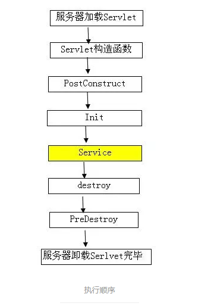

# Spring
## Spring bean的生命周期?

   对于普通的Java对象，当new的时候创建对象，当它没有任何引用的时候被垃圾回收机制回收。而由Spring IoC容器托管的对象，它们的生命周期完全由容器控制。

   Bean 的生命周期概括起来就是 **4 个阶段**：

   1. 实例化（Instantiation）

   	* 实例化Bean 

   2. 属性赋值（Populate）

      * 设置对象属性（依赖注入）

   3. 初始化（Initialization）
   
      * 初始化前
        * 注入Aware接口（通过让bean 实现 Aware 接口，则能在 bean 中获得相应的 Spring 容器资源。）
        * BeanPostProcessor前置处理
      * 初始化操作
         * 是否实现InitializingBean接口（接口实现写初始化逻辑）
         * 是否配置自定义的init-method（指定初始化方法）
   	 * 初始化后
           * BeanPostProcessor后置处理
   4. 销毁（Destruction）
       * 是否实现Disposablebean接口
       * 配置自定义的destroy-method

   

   [参考博客](https://chaycao.github.io/2020/02/15/%E5%A6%82%E4%BD%95%E8%AE%B0%E5%BF%86Spring-Bean%E7%9A%84%E7%94%9F%E5%91%BD%E5%91%A8%E6%9C%9F/)

   [参考博客](https://www.zhihu.com/question/38597960)


## PostConstruct注解 

   用途：@PostConstruct主要应用场景是在初始化Servlet时加载一些缓存数据等。

   PostConstruct 注释用于在**依赖关系注入完成之后**需要执行的方法上，以执行任何初始化。此方法必须在将**类放入服务之前（init方法，初始化**）调用。

   顺序 Constructo（构造方法）>> @Autowired（依赖注入） >> @PostConstruct（生成对象时完成某些初始化操作）

   

   [参考博客](https://www.jianshu.com/p/98cf7d8b9ec3)

   [参考博客](https://blog.csdn.net/wo541075754/article/details/52174900)


## Spring的循环依赖问题 

* **循环依赖**其实就是循环引用，也就是两个或者两个以上的bean互相持有对方，最终形成闭环。比如A依赖于B，B依赖于C，C又依赖于A。

* **Spring中循环依赖场景**有：

  1. 构造器的循环依赖(无法解决，只能拋出BeanCurrentlyInCreationException异常)

  2. field属性的循环依赖

     * setter方式单例，默认方式其中

       先将Bean对象实例化【依赖无参构造函数】--->再设置对象属性的,不会出来循环的问题

     * setter方式原型，prototype

       Spring容器无法完成依赖注入，因为“prototype”作用域的Bean，Spring容器不进行缓存，因此无法提前暴露一个创建中的Bean。

* Spring怎么解决循环依赖

  Spring解决循环依赖的诀窍就在于singletonFactories这个三级cache, 发生在**createBeanInstance(实例化)**之后，也就是说单例对象此时已经被创建出来(调用了构造器)。这个对象已经被生产出来了，虽然还不完美（还没有进行初始化的第二步和第三步），但是已经能被人认出来了（根据对象引用能定位到堆中的对象），所以Spring此时将这个对象提前曝光出来让大家认识，让大家使用。
  
## 问Spring启动过程中发生了什么，聊自己的理解？ 

   Spring 的启动流程主要是定位 -> 加载 -> 注册 -> 实例化

   - *定位 - 获取配置文件路径*

   - *加载 - 把配置文件读取成 BeanDefinition*

   - *注册 - 存储 BeanDefinition*

   - *实例化 - 根据 BeanDefinition 创建实例*

     [参考](https://blog.leapmie.com/archives/390/#2-%E5%AF%BB%E6%89%BE%E5%85%B3%E9%94%AE%E5%85%A5%E5%8F%A3%E6%96%B9%E6%B3%95refresh)

## mybatis #{} ${}的区别

* **#将传入的数据都当成一个字符串**，会对自动传入的数据加一个双引号。

  如：order by #user_id#，如果传入的值是111,那么解析成sql时的值为order by "111", 如果传入的值是id，则解析成的sql为order by "id".
   **$将传入的数据直接显示生成在sql中**。如：order by $user_id$，如果传入的值是111,那么解析成sql时的值为order by user_id, 如果传入的值是id，则解析成的sql为order by id.

* **\#方式能够很大程度防止sql注入。$方式无法防止Sql注入。**

  \#类似jdbc中的PreparedStatement，对于传入的参数，在预处理阶段会使用?代替，比如：

  ```sql
  select * from student where id = ?;
  ```

  待真正查询的时候即在数据库管理系统中（DBMS）才会代入参数。

  ${}则是**简单的替换**，如下：

  ```sql
  select * from student where id = 2;
  ```

## Spring 注入方式，注解，平时xml使用的多么

控制反转（**Inversion of Control**），是一种设计思想，而依赖注入（**DI**)是一种实现的方法。原本对象的创建是依靠程序员来创建，通过依赖注入的方法来改造后，对象的创建是依赖IOC容器,对象的属性依赖IOC容器注入。
**依赖注入：**set注入
**依赖：**Bean对象的创建依赖容器
**注入：**Bean对象所有属性由容器注入

### Set方式注入（Setter Injection）

Setter方法注入实例化bean之后，**调用该bean的setter方法，即实现了基于setter的依赖注入。**

### 构造器注入（Constructor Injection）

构造器依赖注入通过容器触发一个类的构造器来实现的

### 注解方式

@Autowired默认按类型装配
@Qualifier和Autowired配合使用，指定bean的名称
@Resource默认按名称装配，当找不到与名称匹配的bean时，才会按类型装配。

[参考](https://segmentfault.com/a/1190000023309818)


## springmvc过程，注解，具体注解的作用是什么，springboot和spring与springmvc的关系是什么

### SpringMVC过程


**SpringMVC执行流程:**
 1.用户发送请求至前端控制器DispatcherServlet
 2.DispatcherServlet收到请求调用处理器映射器HandlerMapping。
 3.处理器映射器HandlerMapping根据请求url**找到具体的处理器**，生成处理器执行链HandlerExecutionChain(包括处理器对象和处理器拦截器)一并返回给DispatcherServlet。
 4.DispatcherServlet根据处理器Handler获取处理器适配器HandlerAdapter执行HandlerAdapter处理一系列的操作，如：参数封装，数据格式转换，数据验证等操作
 5.执行处理器Handler(Controller，也叫页面控制器)。
 6.Handler执行完成返回ModelAndView
 7.HandlerAdapter将Handler执行结果ModelAndView返回到DispatcherServlet
 8.DispatcherServlet将ModelAndView传给ViewReslover视图解析器
 9.ViewReslover解析后返回具体View
 10.DispatcherServlet对View进行渲染视图（即将模型数据model填充至视图中）。
 11.DispatcherServlet响应用户。

**组件介绍:**

1.DispatcherServlet：前端控制器。用户请求到达前端控制器，它就相当于mvc模式中的c，dispatcherServlet是整个流程控制的中心，由它调用其它组件处理用户的请求，dispatcherServlet的存在降低了组件之间的耦合性,系统扩展性提高。由框架实现
 2.HandlerMapping：处理器映射器。HandlerMapping负责根据用户请求的url找到Handler即处理器，springmvc提供了不同的映射器实现不同的映射方式，根据一定的规则去查找,例如：xml配置方式，实现接口方式，注解方式等。由框架实现
 3.Handler：处理器。Handler 是继DispatcherServlet前端控制器的后端控制器，在DispatcherServlet的控制下Handler对具体的用户请求进行处理。由于Handler涉及到具体的用户业务请求，所以一般情况需要程序员根据业务需求开发Handler。
 4.HandlAdapter：处理器适配器。通过HandlerAdapter对处理器进行执行，这是适配器模式的应用，通过扩展适配器可以对更多类型的处理器进行执行。由框架实现。
 5.ModelAndView是springmvc的封装对象，将model和view封装在一起。
 6.ViewResolver：视图解析器。ViewResolver负责将处理结果生成View视图，ViewResolver首先根据逻辑视图名解析成物理视图名即具体的页面地址，再生成View视图对象，最后对View进行渲染将处理结果通过页面展示给用户。
 7 View:是springmvc的封装对象，是一个接口, springmvc框架提供了很多的View视图类型，包括：jspview，pdfview,jstlView、freemarkerView、pdfView等。一般情况下需要通过页面标签或页面模版技术将模型数据通过页面展示给用户，需要由程序员根据业务需求开发具体的页面。

[参考](https://www.jianshu.com/p/8a20c547e245)

### SpringMVC 具体注解及其作用

#### @Controller

SpringMVC 中，控制器Controller 负责处理由DispatcherServlet 分发的请求，它把用户请求的数据经过业务处理层处理之后封装成一个Model ，然后再把该Model 返回给对应的View 进行展示。在SpringMVC 中提供了一个非常简便的定义Controller 的方法，你无需继承特定的类或实现特定的接口，只需使用@Controller 标记一个类是Controller 

#### @RequestMapping

RequestMapping是一个用来处理请求地址映射的注解，可用于类或方法上。用于类上，表示类中的所有响应请求的方法都是以该地址作为父路径。

#### @Resource和@Autowired

@Resource和@Autowired都是做bean的注入时使用，其实@Resource并不是Spring的注解，它的包是javax.annotation.Resource，需要导入，但是Spring支持该注解的注入。

#### @PathVariable

用于将请求URL中的模板变量映射到功能处理方法的参数上，即取出uri模板中的变量作为参数

#### @ResponseBody

作用： 该注解用于将Controller的方法返回的对象，通过适当的HttpMessageConverter转换为指定格式后，写入到Response对象的body数据区,使用时机：返回的数据不是html标签的页面，而是其他某种格式的数据时（如json、xml等）使用；

```java
 @ResponseBody  
    @RequestMapping("/pay/tenpay")  
    public String tenpayReturnUrl(HttpServletRequest request, HttpServletResponse response) throws Exception {  
        unpackCookie(request, response);  
        payReturnUrl.payReturnUrl(request, response);  
        return "pay/success";  
    }  
```

[参考](https://blog.csdn.net/fuyuwei2015/article/details/71486842)

[参考](https://www.cnblogs.com/leskang/p/5445698.html)

### Springboot和spring与springmvc的关系是什么

Spring 最初利用“工厂模式”（DI）和“代理模式”（AOP）解耦应用组件。

大家觉得挺好用，于是按照这种模式搞了一个 MVC框架（一些用Spring 解耦的组件），用开发 web 应用（ SpringMVC ）。Spring MVC提供了一种轻度耦合的方式来开发web应用。Spring MVC是Spring的一个模块，式一个web框架

然后有发现每次开发都写很多样板代码，为了简化工作流程，于是开发出了一些“懒人整合包”（starter），这套就是 Spring Boot。Spring Boot实现了自动配置