参考面经

[哈喽](https://www.nowcoder.com/discuss/594402)
[网易](https://www.nowcoder.com/discuss/591315)
[京东](https://www.nowcoder.com/discuss/585692)

# 线程及高并发
## 1 线程创建的方式、区别

### 四种方式创建线程

1）继承Thread类创建线程

2）实现Runnable接口创建线程

3）使用Callable和Future创建线程

4）使用线程池例如用Executor框架

###  方式1: 继承Thread类创建线程

1. **定义Thread类的子类**，并**重写该类的run()方法**，该方法的方法体就是线程需要完成的任务，**run()方法也称为线程执行体**。

2. 创建Thread子类的实例，也就是创建了线程对象

3. 启动线程，即**调用线程的start()方法**

```java

public class Mythread extends Thread {
	
	private int i;
	public void run(){//run()是线程类的核心方法
		for(int i=0;i<10;i++){
			System.out.println(this.getName()+":"+i);
		}
	}
	public static void main(String[] args) {
		Mythread t1=new Mythread();
		Mythread t2=new Mythread();
		Mythread t3=new Mythread();
		t1.start();
		t2.start();
		t3.start();
	}
}
```

### 方式2：实现 Runnable接口创建线程

1. **定义Runnable接口的实现类**，必须**重写run(）方法**，这个run()方法和Thread中的run()方法一样，是线程的执行体

2. 创建Runnable实现类的实例，并**用这个实例作为Thread的target来创建Thread对象**，这个Thread对象才是真正的线程对象

3. 调用start()方法

```java
public class MyThread implements Runnable{
 
	@Override
	public void run() {
		for(int i=0;i<10;i++){
			System.out.println(Thread.currentThread().getName()+" : "+i);
		}
		
	}
	public static void main(String[] args) {
		MyThread myThread=new MyThread();
		Thread thread1=new Thread(myThread,"线程1");
		Thread thread2=new Thread(myThread,"线程2");
		Thread thread3=new Thread(myThread,"线程3");
		thread1.start();
		thread2.start();
		thread3.start();
	}

```

#### 继承Tread和实现Runnable接口的区别

a.实现Runnable接口避免**单继承局限**

b.当子类实现Runnable接口，此时子类和Thread的代理模式（**子类负责真实业务的操作**（调用start()方法），**thread负责资源调度与线程创建辅助真实业务**。

### 方式3：覆写Callable接口实现多线程

#### Callable接口提供的call()方法和Runnable接口提供的run()方法区别

1. call方法可以有返回值

2. call()方法可以声明抛出异常

和Runnable接口不一样，Callable接口提供了一个call()方法作为线程执行体，**call()方法比run()方法功能要强大**

#### 使用实现类FutureTask的原因

* Java5提供了**Future接口**来代表Callable接口里call()方法的**返回值**，并且为Future接口提供了一个实现类FutureTask

  在Future接口里定义了几个公共方法来控制它关联的Callable任务。

  ```java
  >boolean cancel(boolean mayInterruptIfRunning)：试图取消该Future里面关联的Callable任务
  
  >V get()：返回Callable里call（）方法的返回值，调用这个方法会导致程序阻塞，必须等到子线程结束后才会得到返回值
  
  >V get(long timeout,TimeUnit unit)：返回Callable里call（）方法的返回值，最多阻塞timeout时间，经过指定时间没有返回抛出TimeoutException
  
  >boolean isDone()：若Callable任务完成，返回True
  
  >boolean isCancelled()：如果在Callable任务正常完成前被取消，返回True
  ```

* FutureTask实现了Runnable接口，因此可以作为Thread类的target

#### 步骤

1. 创建**Callable接口的实现类**，并实现call()方法，然后创建该实现类的实例（从java8开始可以直接使用Lambda表达式创建Callable对象）。

2. 使用FutureTask类来包装Callable对象，**该FutureTask对象封装了Callable对象的call()方法的返回值**

3. 使用FutureTask对象**作为Thread对象的target创建并启动线程**（因为FutureTask实现了Runnable接口）

4. 调用FutureTask对象的get()方法来获得子线程执行结束后的返回值

```java
public class MyThread implements Callable<String>{//Callable是一个泛型接口
 
	@Override
	public String call() throws Exception {//返回的类型就是传递过来的V类型
		for(int i=0;i<10;i++){
			System.out.println(Thread.currentThread().getName()+" : "+i);
		}
		
		return "Hello Tom";
	}
	public static void main(String[] args) throws Exception {
		MyThread myThread=new MyThread();
		FutureTask<String> futureTask=new FutureTask<>(myThread);
		Thread t1=new Thread(futureTask,"线程1");
		Thread t2=new Thread(futureTask,"线程2");
		Thread t3=new Thread(futureTask,"线程3");
		t1.start();
		t2.start();
		t3.start();
		System.out.println(futureTask.get());
		
	}
}

```

### 方式4：使用线程池例如用Executor框架

 Executor框架包括：线程池，Executor，Executors，ExecutorService，CompletionService，Future，Callable等。

**Executor接口**中之定义了一个方法execute（Runnable command），该方法接收一个Runable实例，它用来执行一个任务，任务即一个实现了Runnable接口的类。

**ExecutorService接口：**继承自Executor接口，它提供了更丰富的实现多线程的方法。

* ExecutorService可为跟踪一个或多个异步任务执行状况而生成 Future 的方法。 
* ExecutorService的shutdown（）方法来平滑地关闭 ExecutorService，调用该方法后，将导致ExecutorService停止接受任何新的任务且等待已经提交的任务执行完成(已经提交的任务会分两类：一类是已经在执行的，另一类是还没有开始执行的)，当所有已经提交的任务执行完毕后将会关闭ExecutorService。**因此我们一般用该接口来实现和管理多线程。**

**Executors**：提供了一系列工厂方法用于创先线程池，**返回的线程池**都实现了ExecutorService接口。  

```java
public static ExecutorService newFixedThreadPool(int nThreads)
创建固定数目线程的线程池。

public static ExecutorService newCachedThreadPool()
创建一个可缓存的线程池，调用execute将重用以前构造的线程（如果线程可用）。如果现有线程没有可用的，则创建一个新线程并添加到池中。终止并从缓存中移除那些已有 60 秒钟未被使用的线程。
    
public static ExecutorService newSingleThreadExecutor()
创建一个单线程化的Executor。

public static ScheduledExecutorService newScheduledThreadPool(int corePoolSize)
创建一个支持定时及周期性的任务执行的线程池，多数情况下可用来替代Timer类。
```

这四种方法都是用的Executors中的**ThreadFactory**建立的线程，下面就以上四个方法做个比较:  

| 线程池                      | 描述                                                         |
| --------------------------- | ------------------------------------------------------------ |
| newCachedThreadPool()       | -缓存型池子，**先查看池中有没有以前建立的线程**，如果有，就 reuse.如果没有，就建一个新的线程加入池中 <br/>-缓存型池子通常用于执行一些**生存期很短的异步型任务**  因此在一些面向连接的daemon型SERVER中用得不多。但对于生存期短的异步任务，它是Executor的首选。<br/> -能reuse的线程，必须是timeout IDLE内的池中线程，**缺省timeout是60s,超过这个IDLE时长，线程实例将被终止及移出池**。  注意，放入CachedThreadPool的线程不必担心其结束，超过TIMEOUT不活动，其会自动被终止。 |
| newFixedThreadPool(int)     | -newFixedThreadPool与cacheThreadPool差不多，**也是能reuse就用，但不能随时建新的线程-**其独特之处:任意时间点，**最多只能有固定数目的活动线程存在**，此时如果有新的线程要建立，只能放在另外的队列中等待，直到当前的线程中某个线程终止直接被移出池子<br/>-和cacheThreadPool不同，FixedThreadPool没有IDLE机制（可能也有，但既然文档没提，肯定非常长，类似依赖上层的TCP或UDP IDLE机制之类的），所以FixedThreadPool多数针对一些很稳定很**固定的正规并发线程，多用于服务器**<br/>-从方法的源代码看，cache池和fixed 池调用的是同一个底层 池，只不过参数不同:<br/>**fixed池线程数固定，并且是0秒IDLE（无IDLE）**   <br/>**cache池线程数支持0-Integer.MAX_VALUE(显然完全没考虑主机的资源承受能力），60秒IDLE** |
| newScheduledThreadPool(int) | -调度型线程池<br/> -这个池子里的线程可以**按schedule依次delay执行，或周期执行** |
| SingleThreadExecutor()      | -单例线程，任意时间池中只能有一个线程<br/> -用的是和cache池和fixed池相同的底层池，但线程数目是1-1,0秒IDLE（无IDLE） |

线程池Executor底层实现类的**ThredPoolExecutor**的构造函数：

```java
public ThreadPoolExecutor(int corePoolSize,
                              int maximumPoolSize,
                              long keepAliveTime,
                              TimeUnit unit,
                              BlockingQueue<Runnable> workQueue,
                              ThreadFactory threadFactory,
                              RejectedExecutionHandler handler) {
       ...
    }
```

其中各个参数含义如下：

* corePoolSize- 池中所保存的线程数，包括空闲线程。需要注意的是在初创建线程池时线程不会立即启动，直到有任务提交才开始启动线程并使逐渐线程数目达到corePoolSize。若想一开始就创建所有核心线程需调用prestartAllCoreThreads方法。
* maximumPoolSize-池中允许的最大线程数。需要注意的是当核心线程满且**阻塞队列也满时才会判断当前线程数是否小于最大线程数**，并决定是否创建新线程。
* keepAliveTime - 当线程数大于核心时，多于的空闲线程最多存活时间
* unit - keepAliveTime 参数的时间单位。
* workQueue - 当线程数目超过核心线程数时用于保存任务的队列。主要有3种类型的BlockingQueue可供选择：无界队列，有界队列和同步移交。将在下文中详细阐述。从参数中可以看到，**此队列仅保存实现Runnable接口的任务**。
* threadFactory - 执行程序创建新线程时使用的工厂。
* handler - 阻塞队列已满且线程数达到最大值时所采取的饱和策略。java默认提供了4种饱和策略的实现方式：中止、抛弃、抛弃最旧的、调用者运行。

#### 自定义线程池

自定义线程池，可以用**ThreadPoolExecutor**类创建，它有多个构造方法来创建线程池，用该类很容易实现自定义的线程池。

```java
public class ThreadPoolTest{   
    public static void main(String[] args){   
        //创建等待队列   
        BlockingQueue<Runnable> bqueue = new ArrayBlockingQueue<Runnable>(20);   
        //创建线程池，池中保存的线程数为3，允许的最大线程数为5  
        ThreadPoolExecutor pool = new ThreadPoolExecutor(3,5,50,TimeUnit.MILLISECONDS,bqueue);   
        //创建七个任务   
        Runnable t1 = new MyThread();   
        Runnable t2 = new MyThread();   
        Runnable t3 = new MyThread();   
        Runnable t4 = new MyThread();   
        Runnable t5 = new MyThread();   
        Runnable t6 = new MyThread();   
        Runnable t7 = new MyThread();   
        //每个任务会在一个线程上执行  
        pool.execute(t1);   
        pool.execute(t2);   
        pool.execute(t3);   
        pool.execute(t4);   
        pool.execute(t5);   
        pool.execute(t6);   
        pool.execute(t7);   
        //关闭线程池   
        pool.shutdown();   
    }   
}   
  
class MyThread implements Runnable{   
    @Override   
    public void run(){   
        System.out.println(Thread.currentThread().getName() + "正在执行。。。");   
        try{   
            Thread.sleep(100);   
        }catch(InterruptedException e){   
            e.printStackTrace();   
        }   
    }   
}
```

####  Executor执行Runnable任务

通过Executors的以上四个静态工厂方法获得 ExecutorService实例，而后调用该实例的execute（Runnable command）方法即可。一旦Runnable任务传递到execute（）方法，该方法便会自动在一个线程上

```java

public class TestCachedThreadPool{   
    public static void main(String[] args){   
        ExecutorService executorService = Executors.newCachedThreadPool();   
        for (int i = 0; i < 3; i++){  //执行三个任务，那么线程池中最多创建三个线程
            executorService.execute(new TestRunnable());   
            System.out.println("************* a" + i + " *************");   
        }   
        executorService.shutdown();   
    }   
}   
  
class TestRunnable implements Runnable{   
    public void run(){   
    	for(int i=0;i<5;i++){
    		 System.out.println(Thread.currentThread().getName() + "线程被调用了。");   
    	}
    }   
} 
```

####  Executor执行Callable任务

Callable的call()方法只能通过**ExecutorService的submit(Callable<T> task) 方法来执行**，并且返回一个 **<T>Future<T>**，是表示任务等待完成的 Future。

当将一个Callable的对象传递给ExecutorService的submit方法，则该call方法自动在一个线程上执行，**并且会返回执行结果Future对象。**同样，将Runnable的对象传递给ExecutorService的submit方法，则该run方法自动在一个线程上执行，并且会返回执行结果Future对象，但是在该Future对象上调用get方法，**将返回null。**

```java
public class CallableDemo{   
    public static void main(String[] args){   
        ExecutorService executorService = Executors.newCachedThreadPool();   
        List<Future<String>> resultList = new ArrayList<Future<String>>();   
  
        //创建10个任务并执行   
        for (int i = 0; i < 10; i++){   
            //使用ExecutorService执行Callable类型的任务，并将结果保存在future变量中   
            Future<String> future = executorService.submit(new TaskWithResult(i));   
            //将任务执行结果存储到List中   
            resultList.add(future);   
        }   
  
        //遍历任务的结果   
        for (Future<String> fs : resultList){   
                try{   
                    while(!fs.isDone);//Future返回如果没有完成，则一直循环等待，直到Future返回完成  
                    System.out.println(fs.get());     //打印各个线程（任务）执行的结果   
                }catch(InterruptedException e){   
                    e.printStackTrace();   
                }catch(ExecutionException e){   
                    e.printStackTrace();   
                }finally{   
                    //启动一次顺序关闭，执行以前提交的任务，但不接受新任务  
                    executorService.shutdown();   
                }   
        }   
    }   
}   
  
  
class TaskWithResult implements Callable<String>{   
    private int id;   
  
    public TaskWithResult(int id){   
        this.id = id;   
    }   
  
    /**  
     * 任务的具体过程，一旦任务传给ExecutorService的submit方法， 
     * 则该方法自动在一个线程上执行 
     */   
    public String call() throws Exception {  
        System.out.println("call()方法被自动调用！！！    " + Thread.currentThread().getName());   
        //该返回结果将被Future的get方法得到  
        return "call()方法被自动调用，任务返回的结果是：" + id + "    " + Thread.currentThread().getName();   
    }   
} 
```

###  四种创建线程方法对比

实现Runnable和实现Callable接口的方式基本相同，不过是后者执行call()方法有返回值，后者线程执行体run()方法无返回值，并且如果使用FutureTask类的话，只执行一次Callable任务。因此可以把这两种方式归为一种方式与继承Thread类的方法之间的差别如下：

1、线程只是实现Runnable或实现Callable接口，还可以继承其他类。

2、这种方式下，多个线程可以共享一个target对象，非常适合多线程处理同一份资源的情形。

3、继承Thread类只需要this就能获取当前线程。不需要使用Thread.currentThread()方法

4、继承Thread类的线程类不能再继承其他父类（Java单继承决定）。

5、前三种的线程如果创建关闭频繁会消耗系统资源影响性能，而使用线程池可以不用线程的时候放回线程池，用的时候再从线程池取，项目开发中主要使用线程池的方式创建多个线程。

6.实现接口的创建线程的方式必须实现方法（run() call()）。

[参考](https://blog.csdn.net/baihualindesu/article/details/89523837) [参考](https://blog.csdn.net/m0_37840000/article/details/79756932)

### 补充 ：Executor框架详解

#### 一、什么是Executor框架？

我们知道线程池就是线程的集合，线程池集中管理线程，以实现线程的重用，降低资源消耗，提高响应速度等。线程用于执行异步任务，单个的线程既是工作单元也是执行机制，从JDK1.5开始，为了把工作单元与执行机制分离开，**Executor框架诞生了，他是一个用于统一创建与运行的接口。Executor框架实现的就是线程池的功能。**

####  二、Executor框架结构图解

1、Executor框架包括3大部分：

（1）任务。也就是工作单元，包括被执行任务需要实现的接口：**Runnable接口或者Callable接口；**

（2）任务的执行。也就是把任务分派给多个线程的执行机制，包括**Executor接口**及继承自Executor接口的**ExecutorService接口**。

（3）异步计算的结果。包括**Future接口**及实现了Future接口的**FutureTask类**。

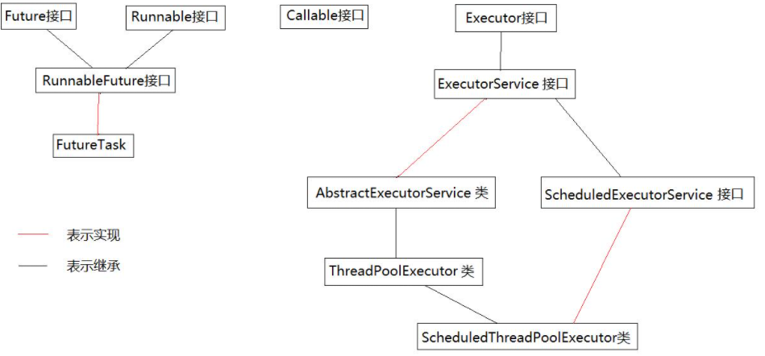

2、Executor框架的使用示意图：

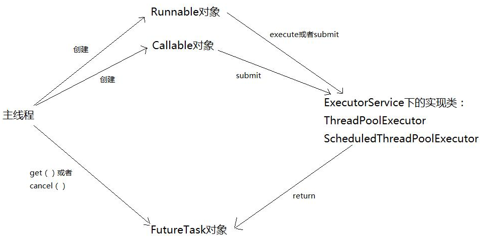

3、 使用步骤

**（1）创建Runnable并重写run（）方法或者Callable对象并重写call（）方法：**

```java

class callableTest implements Callable<String >{
            @Override
            public String call() {
                try{
                    String a = "return String";
                    return a;
                }
                catch(Exception e){
                    e.printStackTrace();
                    return "exception";
                }
            }
        }
```

（2）创建Executor接口的实现类**ThreadPoolExecutor类**或者**ScheduledThreadPoolExecutor类**的对象，然后调用其**execute（）**方法或者**submit（）**方法把工作任务添加到线程中，如果有返回值则返回Future对象。

* **Callable**对象有返回值，因此使用submit（）方法；

* **Runnable**可以使用execute（）方法，此外还可以使用submit（）方法，只要使用**callable（Runnable task）或者callable(Runnable task,  Object result)方法把Runnable对象包装起**来就可以，使用callable（Runnable task）方法返回的null，使用callable(Runnable task,  Object result)方法返回result。

  ```java
  ThreadPoolExecutor tpe = new ThreadPoolExecutor(5, 10,
                  100, MILLISECONDS, new ArrayBlockingQueue<Runnable>(5));
  Future<String> future = tpe.submit(new callableTest());
  ```

(3）**调用Future对象的get（）方法后的返回值，或者调用Future对象的cancel（）方法取消当前线程的执行**。最后关闭线程池。

```java	
try{
            System.out.println(future.get());
        }
        catch(Exception e){
            e.printStackTrace();
        }
        finally{
            tpe.shutdown();
        }
```

#### 三、Executor框架成员：
ThreadPoolExecutor实现类、ScheduledThreadPoolExecutor实现类、Future接口、Runnable和Callable接口、Executors工厂类

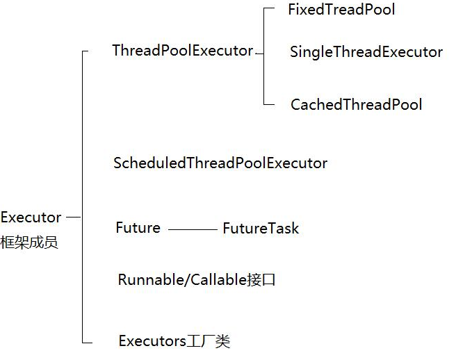

[参考](https://blog.csdn.net/tongdanping/article/details/79604637)

## 2 线程池的工作原理（7大参数）

### 一.Java中的ThreadPoolExecutor类

#### (1) 在ThreadPoolExecutor类中提供了四个构造方法：

```java
public class ThreadPoolExecutor extends AbstractExecutorService {
    .....
    public ThreadPoolExecutor(int corePoolSize,int maximumPoolSize,long keepAliveTime,TimeUnit unit,
            BlockingQueue<Runnable> workQueue);
 
    public ThreadPoolExecutor(int corePoolSize,int maximumPoolSize,long keepAliveTime,TimeUnit unit,
            BlockingQueue<Runnable> workQueue,ThreadFactory threadFactory);
 
    public ThreadPoolExecutor(int corePoolSize,int maximumPoolSize,long keepAliveTime,TimeUnit unit,
            BlockingQueue<Runnable> workQueue,RejectedExecutionHandler handler);
 
    public ThreadPoolExecutor(int corePoolSize,int maximumPoolSize,long keepAliveTime,TimeUnit unit,
        BlockingQueue<Runnable> workQueue,ThreadFactory threadFactory,RejectedExecutionHandler handler);
    ...
}
```

ThreadPoolExecutor继承了AbstractExecutorService类，并提供了四个构造器，事实上，通过观察每个构造器的源码具体实现，发现前面三个构造器都是调用的第四个构造器进行的初始化工作。

####  (2) 构造器中各个参数的含义(七大参数)：

- corePoolSize：核心池的大小，这个参数跟后面讲述的线程池的实现原理有非常大的关系。在创建了线程池后，默认情况下，线程池中并没有任何线程，而是等待有任务到来才创建线程去执行任务，除非**调用了prestartAllCoreThreads()或者prestartCoreThread()方法，从这2个方法的名字就可以看出，是预创建线程的意思，即在没有任务到来之前就创建corePoolSize个线程或者一个线程。**默认情况下，在创建了线程池后，线程池中的线程数为0，当有任务来之后，就会创建一个线程去执行任务，当线程池中的线程数目达到corePoolSize后，就会把到达的任务放到缓存队列当中；

- maximumPoolSize：线程池最大线程数，这个参数也是一个非常重要的参数，它表示在线程池中最多能创建多少个线程；

- keepAliveTime：表示线程没有任务执行时最多保持多久时间会终止。默认情况下，**只有当线程池中的线程数大于corePoolSize时，keepAliveTime才会起作用**，直到线程池中的线程数不大于corePoolSize，即当线程池中的线程数大于corePoolSize时，如果一个线程空闲的时间达到keepAliveTime，则会终止，直到线程池中的线程数不超过corePoolSize。但是如果调用了allowCoreThreadTimeOut(boolean)方法，在线程池中的线程数不大于corePoolSize时，keepAliveTime参数也会起作用，直到线程池中的线程数为0；

- unit：参数keepAliveTime的时间单位，有7种取值，在TimeUnit类中有7种静态属性：

  ```java
  TimeUnit.DAYS;               //天
  TimeUnit.HOURS;             //小时
  TimeUnit.MINUTES;           //分钟
  TimeUnit.SECONDS;           //秒
  TimeUnit.MILLISECONDS;      //毫秒
  TimeUnit.MICROSECONDS;      //微妙
  TimeUnit.NANOSECONDS;       //纳秒
  ```

- workQueue：一个阻塞队列，用来存储等待执行的任务

  一般来说，这里的阻塞队列有以下几种选择：

  ```
  ArrayBlockingQueue;
  LinkedBlockingQueue;
  SynchronousQueue;
  ```

　ArrayBlockingQueue和PriorityBlockingQueue使用较少，一般使用LinkedBlockingQueue和Synchronous。**线程池的排队策略与BlockingQueue有关。**

- threadFactory：线程工厂，主要用来创建线程；

- handler：表示当拒绝处理任务时的策略，有以下四种取值：

  ```java
  ThreadPoolExecutor.AbortPolicy:丢弃任务并抛出RejectedExecutionException异常。 
  ThreadPoolExecutor.DiscardPolicy：也是丢弃任务，但是不抛出异常。 
  ThreadPoolExecutor.DiscardOldestPolicy：丢弃队列最前面的任务，然后重新尝试执行任务（重复此过程）
  ThreadPoolExecutor.CallerRunsPolicy：由调用线程处理该任务 
  ```

#### (3) AbstractExecutorService的实现

ThreadPoolExecutor继承了AbstractExecutorService

```java
public abstract class AbstractExecutorService implements ExecutorService {
 
     
    protected <T> RunnableFuture<T> newTaskFor(Runnable runnable, T value) { };
    protected <T> RunnableFuture<T> newTaskFor(Callable<T> callable) { };
    public Future<?> submit(Runnable task) {};
    public <T> Future<T> submit(Runnable task, T result) { };
    public <T> Future<T> submit(Callable<T> task) { };
    private <T> T doInvokeAny(Collection<? extends Callable<T>> tasks,
                            boolean timed, long nanos)
        throws InterruptedException, ExecutionException, TimeoutException {
    };
    public <T> T invokeAny(Collection<? extends Callable<T>> tasks)
        throws InterruptedException, ExecutionException {
    };
    public <T> T invokeAny(Collection<? extends Callable<T>> tasks,
                           long timeout, TimeUnit unit)
        throws InterruptedException, ExecutionException, TimeoutException {
    };
    public <T> List<Future<T>> invokeAll(Collection<? extends Callable<T>> tasks)
        throws InterruptedException {
    };
    public <T> List<Future<T>> invokeAll(Collection<? extends Callable<T>> tasks,
                                         long timeout, TimeUnit unit)
        throws InterruptedException {
    };
}
```

#### (4) ExecutorService接口

AbstractExecutorService是一个抽象类，它实现了ExecutorService接口。

```java
public interface ExecutorService extends Executor {
 
    void shutdown();
    boolean isShutdown();
    boolean isTerminated();
    boolean awaitTermination(long timeout, TimeUnit unit)
        throws InterruptedException;
    <T> Future<T> submit(Callable<T> task);
    <T> Future<T> submit(Runnable task, T result);
    Future<?> submit(Runnable task);
    <T> List<Future<T>> invokeAll(Collection<? extends Callable<T>> tasks)
        throws InterruptedException;
    <T> List<Future<T>> invokeAll(Collection<? extends Callable<T>> tasks,
                                  long timeout, TimeUnit unit)
        throws InterruptedException;
 
    <T> T invokeAny(Collection<? extends Callable<T>> tasks)
        throws InterruptedException, ExecutionException;
    <T> T invokeAny(Collection<? extends Callable<T>> tasks,
                    long timeout, TimeUnit unit)
        throws InterruptedException, ExecutionException, TimeoutException;
}
```
#### (5) Executor接口

而ExecutorService又是继承了Executor接口

```java
public interface Executor {
    void execute(Runnable command);
}
```

#### (6) 接口之间的关系

ThreadPoolExecutor、AbstractExecutorService、ExecutorService和Executor几个之间的关系了。

* Executor是一个顶层接口，在它里面只声明了一个方法execute(Runnable)，返回值为void，参数为Runnable类型，从字面意思可以理解，就是用来执行传进去的任务的；
* 然后ExecutorService接口继承了Executor接口，并声明了一些方法：submit、invokeAll、invokeAny以及shutDown等；
* 抽象类AbstractExecutorService实现了ExecutorService接口，基本实现了ExecutorService中声明的所有方法；
* 然后ThreadPoolExecutor继承了类AbstractExecutorService。

#### (7) ThreadPoolExecutor类的方法

```java
execute()
submit()
shutdown()
shutdownNow()
```

* **execute()方法**实际上是Executor中声明的方法，在ThreadPoolExecutor进行了具体的实现，这个方法是ThreadPoolExecutor的核心方法，通过这个方法可以向线程池提交一个任务，交由线程池去执行。

* **submit()方法**是在ExecutorService中声明的方法，在AbstractExecutorService就已经有了具体的实现，在ThreadPoolExecutor中并没有对其进行重写，这个方法也是用来向线程池提交任务的，但是它和execute()方法不同，**它能够返回任务执行的结果**，去看submit()方法的实现，会发现它实际上还是调用的execute()方法，只不过它利用了Future来获取任务执行结果（Future相关内容将在下一篇讲述）。
* **shutdown()和shutdownNow()**是用来关闭线程池的。
* 其他方法：比如：getQueue() 、getPoolSize() 、getActiveCount()、getCompletedTaskCount()等获取与线程池相关属性的方法

### 二.深入剖析线程池实现原理

#### **1.线程池状态**

在ThreadPoolExecutor中定义了一个volatile变量，另外定义了几个static final变量表示线程池的各个状态：

```java
volatile int runState;
static final int RUNNING    = 0;
static final int SHUTDOWN   = 1;
static final int STOP       = 2;
static final int TERMINATED = 3;
```

**runState表示当前线程池的状态**，它是一个volatile变量用来保证线程之间的可见性；

**下面的几个static final变量表示runState可能的几个取值**。

* 当创建线程池后，初始时，线程池处于**RUNNING状态**；
* 如果调用了shutdown()方法，则线程池处于**SHUTDOWN状态**，此时线程池不能够接受新的任务，它会等待所有任务执行完毕；
* 如果调用了shutdownNow()方法，则线程池处于**STOP状态**，此时线程池不能接受新的任务，并且会去尝试终止正在执行的任务；
* 当线程池处于SHUTDOWN或STOP状态，并且所有工作线程已经销毁，任务缓存队列已经清空或执行结束后，线程池被设置为**TERMINATED**状态。

#### **2.任务的执行**

##### 2.1  ThreadPoolExecutor类中其他的一些比较重要成员变量

```java
private final BlockingQueue<Runnable> workQueue;              //任务缓存队列，用来存放等待执行的任务
private final ReentrantLock mainLock = new ReentrantLock();   //线程池的主要状态锁，对线程池状态（比如线程池大小
                                                              //、runState等）的改变都要使用这个锁
private final HashSet<Worker> workers = new HashSet<Worker>();  //用来存放工作集
 
private volatile long  keepAliveTime;    //线程存货时间   
private volatile boolean allowCoreThreadTimeOut;   //是否允许为核心线程设置存活时间
private volatile int   corePoolSize;     //核心池的大小（即线程池中的线程数目大于这个参数时，提交的任务会被放进任务缓存队列）
private volatile int   maximumPoolSize;   //线程池最大能容忍的线程数
 
private volatile int   poolSize;       //线程池中当前的线程数
 
private volatile RejectedExecutionHandler handler; //任务拒绝策略
 
private volatile ThreadFactory threadFactory;   //线程工厂，用来创建线程
 
private int largestPoolSize;   //用来记录线程池中曾经出现过的最大线程数
 
private long completedTaskCount;   //用来记录已经执行完毕的任务个数
```
##### 2.2  任务提交给线程池之后到被执行的整个过程及比喻

　1）首先，要清楚corePoolSize和maximumPoolSize的含义；、

```java
	corePoolSize在很多地方被翻译成核心池大小，其实我的理解这个就是线程池的大小。举个简单的例子：

　　假如有一个工厂，工厂里面有10个工人，每个工人同时只能做一件任务。

　　因此只要当10个工人中有工人是空闲的，来了任务就分配给空闲的工人做；

　　当10个工人都有任务在做时，如果还来了任务，就把任务进行排队等待；

　　如果说新任务数目增长的速度远远大于工人做任务的速度，那么此时工厂主管可能会想补救措施，比如重新招4个临时工人进来；

　　然后就将任务也分配给这4个临时工人做；

　　如果说着14个工人做任务的速度还是不够，此时工厂主管可能就要考虑不再接收新的任务或者抛弃前面的一些任务了。

　　当这14个工人当中有人空闲时，而新任务增长的速度又比较缓慢，工厂主管可能就考虑辞掉4个临时工了，只保持原来的10个工人，毕竟请额外的工人是要花钱的。	
```

* corePoolSize就是10，而maximumPoolSize就是14（10+4）。

* 也就是说corePoolSize就是线程池大小，maximumPoolSize在我看来是线程池的一种补救措施，即任务量突然过大时的一种补救措施。

* largestPoolSize只是一个用来起记录作用的变量，用来记录线程池中曾经有过的最大线程数目，跟线程池的容量没有任何关系。

2）其次，要知道Worker是用来起到什么作用的？Worker实现了Runnable接口,相当于一个任务

3）要知道任务提交给线程池之后的处理策略，这里总结一下主要有4点：

- 如果当前线程池中的线程数目小于corePoolSize，则每来一个任务，就会创建一个线程去执行这个任务；

- 如果当前线程池中的线程数目>=corePoolSize，则每来一个任务，会尝试将其添加到任务缓存队列当中，若添加成功，则该任务会等待空闲线程将其取出去执行；若添加失败（一般来说是任务缓存队列已满），则会尝试创建新的线程去执行这个任务；

- 如果当前线程池中的线程数目达到maximumPoolSize，则会采取任务拒绝策略进行处理；

- 如果线程池中的线程数量大于 corePoolSize时，如果某线程空闲时间超过keepAliveTime，线程将被终止，直至线程池中的线程数目不大于corePoolSize；如果允许为核心池中的线程设置存活时间，那么核心池中的线程空闲时间超过keepAliveTime，线程也会被终止

##### 2.3  源码分析 

**execute()方法**

在ThreadPoolExecutor类中，最核心的任务提交方法是execute()方法，虽然通过submit也可以提交任务，但是实际上submit方法里面最终调用的还是execute()方法

```java
public void execute(Runnable command) {
    if (command == null)
        throw new NullPointerException();
    if (poolSize >= corePoolSize || !addIfUnderCorePoolSize(command)) {
        if (runState == RUNNING && workQueue.offer(command)) {
            if (runState != RUNNING || poolSize == 0)
                ensureQueuedTaskHandled(command);
        }
        else if (!addIfUnderMaximumPoolSize(command))
            reject(command); // is shutdown or saturated
    }
}
```

上面的代码可能看起来不是那么容易理解，下面我们一句一句解释：

首先，判断提交的任务command是否为null，若是null，则抛出空指针异常；

接着是这句，这句要好好理解一下：

```java
if(poolSize >= corePoolSize || !addIfUnderCorePoolSize(command))
```

由于是或条件运算符，所以先计算前半部分的值

* 如果线程池中当前线程数不小于核心池大小，那么就会直接进入下面的if语句块了。
* 如果线程池中当前线程数小于核心池大小，则接着执行后半部分，也就是执行
    ```java
    addIfUnderCorePoolSize(command)
    ```

　　如果执行完**addIfUnderCorePoolSize**这个方法返回false，则继续执行下面的if语句块，否则整个方法就直接执行完毕了。

　　如果执行完**addIfUnderCorePoolSize**这个方法返回false，然后接着判断：
        ```java
 if(runState == RUNNING && workQueue.offer(command))
        ```

 　 如果当前线程池处于RUNNING状态，则将任务放入任务缓存队列；如果当前线程池不处于RUNNING状态或者任务放入缓存队列失败，则执行：

```java
addIfUnderMaximumPoolSize(command)
```

　　如果执行**addIfUnderMaximumPoolSize**方法失败，则执行reject()方法进行任务拒绝处理。

　　回到前面：

```java
if (runState == RUNNING && workQueue.offer(command))
```

 　这句的执行，如果说当前线程池处于RUNNING状态且将任务放入任务缓存队列成功，则继续进行判断：

```java
if(runState != RUNNING || poolSize == ``0``)
```

 　这句判断是为了防止在将此任务添加进任务缓存队列的同时其他线程突然调用shutdown或者shutdownNow方法关闭了线程池的一种应急措施。如果是这样就执行：

```
ensureQueuedTaskHandled(command)
```

 　进行应急处理，从名字可以看出是保证 添加到任务缓存队列中的任务得到处理。

**2个关键方法的实现：addIfUnderCorePoolSize和addIfUnderMaximumPoolSize：**

* addIfUnderCorePoolSize

  ```java
  private boolean addIfUnderCorePoolSize(Runnable firstTask) {
      Thread t = null;
      final ReentrantLock mainLock = this.mainLock;
      mainLock.lock();
      try {
          if (poolSize < corePoolSize && runState == RUNNING)
              t = addThread(firstTask);        //创建线程去执行firstTask任务   
          } finally {
          mainLock.unlock();
      }
      if (t == null)
          return false;
      t.start();
      return true;
  }
  ```

  addIfUnderCorePoolSize方法的具体实现，从名字可以看出它的意图就是当低于核心大小时执行的方法。下面看其具体实现，

  * 首先获取到锁，因为这地方涉及到线程池状态的变化，先通过if语句判断当前线程池中的线程数目是否小于核心池大小
  * 有朋友也许会有疑问：前面在execute()方法中不是已经判断过了吗，只有线程池当前线程数目小于核心池大小才会执行addIfUnderCorePoolSize方法的，为何这地方还要继续判断？原因很简单，前面的判断过程中并没有加锁，因此可能在execute方法判断的时候poolSize小于corePoolSize，而判断完之后，在其他线程中又向线程池提交了任务，就可能导致poolSize不小于corePoolSize了，所以需要在这个地方继续判断。
  * 然后接着判断线程池的状态是否为RUNNING，原因也很简单，因为有可能在其他线程中调用了shutdown或者shutdownNow方法。然后就是执行

  ```java
  t = addThread(firstTask);
  ```

   　这个方法也非常关键，传进去的参数为提交的任务，返回值为Thread类型。然后接着在下面判断t是否为空，为空则表明创建线程失败（即poolSize>=corePoolSize或者runState不等于RUNNING），否则调用t.start()方法启动线程。

* addThread方法的实现

  ```java
  private Thread addThread(Runnable firstTask) {
      Worker w = new Worker(firstTask);
      Thread t = threadFactory.newThread(w);  //创建一个线程，执行任务   
      if (t != null) {
          w.thread = t;            //将创建的线程的引用赋值为w的成员变量       
          workers.add(w);
          int nt = ++poolSize;     //当前线程数加1       
          if (nt > largestPoolSize)
              largestPoolSize = nt;
      }
      return t;
  }
  ```

  在addThread方法中，首先用提交的任务创建了一个Worker对象，然后调用线程工厂threadFactory创建了一个新的线程t，然后将线程t的引用赋值给了Worker对象的成员变量thread，接着通过workers.add(w)将Worker对象添加到工作集当中。

* Worker类的实现

  实际上实现了Runnable接口，因此上面的**Thread t = threadFactory.newThread(w);**效果跟下面这句的效果基本一样，相当于传进去了一个Runnable任务，在线程t中执行这个Runnable。

  ```java
  Thread t = new Thread(w);
  ```

  ```java
  private final class Worker implements Runnable {
      private final ReentrantLock runLock = new ReentrantLock();
      private Runnable firstTask;
      volatile long completedTasks;
      Thread thread;
      Worker(Runnable firstTask) {
          this.firstTask = firstTask;
      }
      boolean isActive() {
          return runLock.isLocked();
      }
      void interruptIfIdle() {
          final ReentrantLock runLock = this.runLock;
          if (runLock.tryLock()) {
              try {
          if (thread != Thread.currentThread())
          thread.interrupt();
              } finally {
                  runLock.unlock();
              }
          }
      }
      void interruptNow() {
          thread.interrupt();
      }
   
      private void runTask(Runnable task) {
          final ReentrantLock runLock = this.runLock;
          runLock.lock();
          try {
              if (runState < STOP &&
                  Thread.interrupted() &&
                  runState >= STOP)
              boolean ran = false;
              beforeExecute(thread, task);   //beforeExecute方法是ThreadPoolExecutor类的一个方法，没有具体实现，用户可以根据
              //自己需要重载这个方法和后面的afterExecute方法来进行一些统计信息，比如某个任务的执行时间等           
              try {
                  task.run();
                  ran = true;
                  afterExecute(task, null);
                  ++completedTasks;
              } catch (RuntimeException ex) {
                  if (!ran)
                      afterExecute(task, ex);
                  throw ex;
              }
          } finally {
              runLock.unlock();
          }
      }
   
      public void run() {
          try {
              Runnable task = firstTask;
              firstTask = null;
              while (task != null || (task = getTask()) != null) {
                  runTask(task);
                  task = null;
              }
          } finally {
              workerDone(this);   //当任务队列中没有任务时，进行清理工作       
          }
      }
  }
  ```

  既然Worker实现了Runnable接口，那么自然最核心的方法便是run()方法了：

  从run方法的实现可以看出，

  * 它首先执行的是通过构造器传进来的任务firstTask，
  * 在调用**runTask()**执行完firstTask之后，在while循环里面不断通过getTask()去取新的任务来执行，那么去哪里取呢？
  * **自然是从任务缓存队列里面去取**，**getTask**是ThreadPoolExecutor类中的方法，并不是Worker类中的方法，下面是getTask方法的实现：

* getTask方法的实现：

  * 先判断当前线程池状态，如果runState大于SHUTDOWN（即为STOP或者TERMINATED），则直接返回null。

  * 如果runState为SHUTDOWN或者RUNNING，则从任务缓存队列取任务。
  * 如果当前线程池的线程数大于核心池大小corePoolSize或者允许为核心池中的线程设置空闲存活时间，则调用poll(time,timeUnit)来取任务，这个方法会等待一定的时间，如果取不到任务就返回null。
  * 然后判断取到的任务r是否为null，为null则通过调用**workerCanExit()**方法来判断当前worker是否可以退出

  ```java
  Runnable getTask() {
      for (;;) {
          try {
              int state = runState;
              if (state > SHUTDOWN)
                  return null;
              Runnable r;
              if (state == SHUTDOWN)  // Help drain queue
                  r = workQueue.poll();
              else if (poolSize > corePoolSize || allowCoreThreadTimeOut) //如果线程数大于核心池大小或者允许为核心池线程设置空闲时间，
                  //则通过poll取任务，若等待一定的时间取不到任务，则返回null
                  r = workQueue.poll(keepAliveTime, TimeUnit.NANOSECONDS);
              else
                  r = workQueue.take();
              if (r != null)
                  return r;
              if (workerCanExit()) {    //如果没取到任务，即r为null，则判断当前的worker是否可以退出
                  if (runState >= SHUTDOWN) // Wake up others
                      interruptIdleWorkers();   //中断处于空闲状态的worker
                  return null;
              }
              // Else retry
          } catch (InterruptedException ie) {
              // On interruption, re-check runState
          }
      }
  }
  ```

* workerCanExit()的实现

  线程池处于STOP状态、或者任务队列已为空或者**允许为核心池线程设置空闲存活时间并且线程数大于1时**，允许worker退出。如果允许worker退出，则调用**interruptIdleWorkers()**中断处于空闲状态的worker

  ```java
  private boolean workerCanExit() {
      final ReentrantLock mainLock = this.mainLock;
      mainLock.lock();
      boolean canExit;
      //如果runState大于等于STOP，或者任务缓存队列为空了
      //或者  允许为核心池线程设置空闲存活时间并且线程池中的线程数目大于1
      try {
          canExit = runState >= STOP ||
              workQueue.isEmpty() ||
              (allowCoreThreadTimeOut &&
               poolSize > Math.max(1, corePoolSize));
      } finally {
          mainLock.unlock();
      }
      return canExit;
  }
  ```

* interruptIdleWorkers()的实现

  ```java
  void interruptIdleWorkers() {
      final ReentrantLock mainLock = this.mainLock;
      mainLock.lock();
      try {
          for (Worker w : workers)  //实际上调用的是worker的interruptIfIdle()方法
              w.interruptIfIdle();
      } finally {
          mainLock.unlock();
      }
  }
  ```

  它实际上调用的是worker的interruptIfIdle()方法，在worker的interruptIfIdle()方法中：

  ```java
  void interruptIfIdle() {
      final ReentrantLock runLock = this.runLock;
      if (runLock.tryLock()) {    //注意这里，是调用tryLock()来获取锁的，因为如果当前worker正在执行任务，锁已经被获取了，是无法获取到锁的
                                  //如果成功获取了锁，说明当前worker处于空闲状态
          try {
      if (thread != Thread.currentThread())  
      thread.interrupt();
          } finally {
              runLock.unlock();
          }
      }
  }
  ```

* addIfUnderMaximumPoolSize方法的实现

  addIfUnderCorePoolSize方法的实现基本一模一样，只是if语句判断条件中的poolSize < maximumPoolSize不同而已。

  ```java
  private boolean addIfUnderMaximumPoolSize(Runnable firstTask) {
      Thread t = null;
      final ReentrantLock mainLock = this.mainLock;
      mainLock.lock();
      try {
          if (poolSize < maximumPoolSize && runState == RUNNING)
              t = addThread(firstTask);
      } finally {
          mainLock.unlock();
      }
      if (t == null)
          return false;
      t.start();
      return true;
  }
  ```

#### **3.线程池中的线程初始化**

默认情况下，创建线程池之后，线程池中是没有线程的，需要提交任务之后才会创建线程。

在实际中如果需要线程池创建之后立即创建线程，可以通过以下两个方法办到：

- prestartCoreThread()：初始化一个核心线程；

- prestartAllCoreThreads()：初始化所有核心线程

  ```java
  public boolean prestartCoreThread() {
      return addIfUnderCorePoolSize(null); //注意传进去的参数是null
  }
   
  public int prestartAllCoreThreads() {
      int n = 0;
      while (addIfUnderCorePoolSize(null))//注意传进去的参数是null
          ++n;
      return n;
  }
  ```

  注意上面传进去的参数是null，根据第2小节的分析可知如果传进去的参数为null，则最后执行**线程会阻塞在getTask方法中的**

  ```java
  r = workQueue.take();
  ```

  即等待任务队列中有任务。

#### **4.任务缓存队列及排队策略**

任务缓存队列，即workQueue，它用来存放等待执行的任务。

workQueue的类型为BlockingQueue<Runnable>，通常可以取下面三种类型：

1）ArrayBlockingQueue：基于数组的先进先出队列，此队列创建时必须指定大小；

2）LinkedBlockingQueue：基于链表的先进先出队列，如果创建时没有指定此队列大小，则默认为Integer.MAX_VALUE；

3）synchronousQueue：这个队列比较特殊，它不会保存提交的任务，而是将直接新建一个线程来执行新来的任务。	

#### **5.任务拒绝策略**

当线程池的任务缓存队列已满并且线程池中的线程数目达到maximumPoolSize，如果还有任务到来就会采取任务拒绝策略，通常有以下四种策略：

```
ThreadPoolExecutor.AbortPolicy:丢弃任务并抛出RejectedExecutionException异常。
ThreadPoolExecutor.DiscardPolicy：也是丢弃任务，但是不抛出异常。
ThreadPoolExecutor.DiscardOldestPolicy：丢弃队列最前面的任务，然后重新尝试执行任务（重复此过程）
ThreadPoolExecutor.CallerRunsPolicy：由调用线程处理该任务
```

#### **6.线程池的关闭**

　ThreadPoolExecutor提供了两个方法，用于线程池的关闭，分别是shutdown()和shutdownNow()，其中：

- shutdown()：不会立即终止线程池，而是要等所有任务缓存队列中的任务都执行完后才终止，但再也不会接受新的任务
- shutdownNow()：立即终止线程池，并尝试打断正在执行的任务，并且清空任务缓存队列，返回尚未执行的任务

#### **7.线程池容量的动态调整**

ThreadPoolExecutor提供了动态调整线程池容量大小的方法：setCorePoolSize()和setMaximumPoolSize()，

- setCorePoolSize：设置核心池大小
- setMaximumPoolSize：设置线程池最大能创建的线程数目大小

### 三.使用示例

```java
public class Test {
     public static void main(String[] args) {   
         ThreadPoolExecutor executor = new ThreadPoolExecutor(5, 10, 200, TimeUnit.MILLISECONDS,
                 new ArrayBlockingQueue<Runnable>(5));
          
         for(int i=0;i<15;i++){
             MyTask myTask = new MyTask(i);
             executor.execute(myTask);
             System.out.println("线程池中线程数目："+executor.getPoolSize()+"，队列中等待执行的任务数目："+
             executor.getQueue().size()+"，已执行玩别的任务数目："+executor.getCompletedTaskCount());
         }
         executor.shutdown();
     }
}
 
 
class MyTask implements Runnable {
    private int taskNum;
     
    public MyTask(int num) {
        this.taskNum = num;
    }
     
    @Override
    public void run() {
        System.out.println("正在执行task "+taskNum);
        try {
            Thread.currentThread().sleep(4000);
        } catch (InterruptedException e) {
            e.printStackTrace();
        }
        System.out.println("task "+taskNum+"执行完毕");
    }
}
```

当线程池中线程的数目大于5时，便将任务放入任务缓存队列里面，当任务缓存队列满了之后，便创建新的线程。如果上面程序中，将for循环中改成执行20个任务，就会抛出任务拒绝异常了。

#### Executors类中提供的几个静态方法来创建线程池：

```java
Executors.newCachedThreadPool();        //创建一个缓冲池，缓冲池容量大小为Integer.MAX_VALUE
Executors.newSingleThreadExecutor();   //创建容量为1的缓冲池
Executors.newFixedThreadPool(int);    //创建固定容量大小的缓冲池
```

这三个静态方法的具体实现;

```java
public static ExecutorService newFixedThreadPool(int nThreads) {
    return new ThreadPoolExecutor(nThreads, nThreads,
                                  0L, TimeUnit.MILLISECONDS,
                                  new LinkedBlockingQueue<Runnable>());
}
public static ExecutorService newSingleThreadExecutor() {
    return new FinalizableDelegatedExecutorService
        (new ThreadPoolExecutor(1, 1,
                                0L, TimeUnit.MILLISECONDS,
                                new LinkedBlockingQueue<Runnable>()));
}
public static ExecutorService newCachedThreadPool() {
    return new ThreadPoolExecutor(0, Integer.MAX_VALUE,
                                  60L, TimeUnit.SECONDS,
                                  new SynchronousQueue<Runnable>());
}
```

* newFixedThreadPool创建的线程池**corePoolSize和maximumPoolSize值是相等**的，它使用的LinkedBlockingQueue；

* newSingleThreadExecutor将**corePoolSize和maximumPoolSize都设置为1**，也使用的LinkedBlockingQueue；

* newCachedThreadPool将**corePoolSize设置为0，将maximumPoolSize设置为Integer.MAX_VALUE**，使用的SynchronousQueue，也就是说来了任务就创建线程运行，当线程空闲超过60秒，就销毁线程。

### 四.如何合理配置线程池的大小　

一般需要根据任务的类型来配置线程池大小：

如果是CPU密集型任务，就需要尽量压榨CPU，参考值可以设为 *N*CPU+1

如果是IO密集型任务，参考值可以设置为2**N*CPU

[参考](https://www.cnblogs.com/dolphin0520/p/3932921.html)

### 五  总结

####  （一）ThreadPoolExecutor是如何运行，如何同时维护线程和执行任务的呢？

ThreadPoolExecutor将会一方面**维护自身的生命周期**，另一方面同时**管理线程**和**任务**

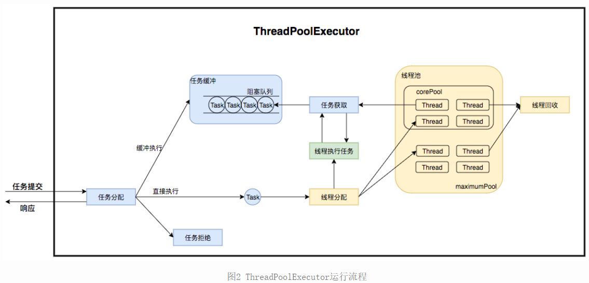

线程池在内部实际上构建了一个**生产者消费者模型**，将线程和任务两者解耦。

线程池的运行主要分成两部分：**任务管理**、**线程管理**。

* 任务管理部分充**当生产者的角色**。 当任务提交后，线程池会判断该任务后续的流转：
  * （1）直接申请线程执行该任务；
  * （2）缓冲到队列中等待线程执行；
  * （3）拒绝该任务。
* 线程管理部分是**消费者**，它们被统一维护在线程池内，根据任务请求进行线程的分配。
  * 当线程执行完任务后则会继续获取新的任务去执行
  * 最终当线程获取不到任务的时候，线程就会被回收。
####  （二）ThreadPoolExecutor生命周期管理

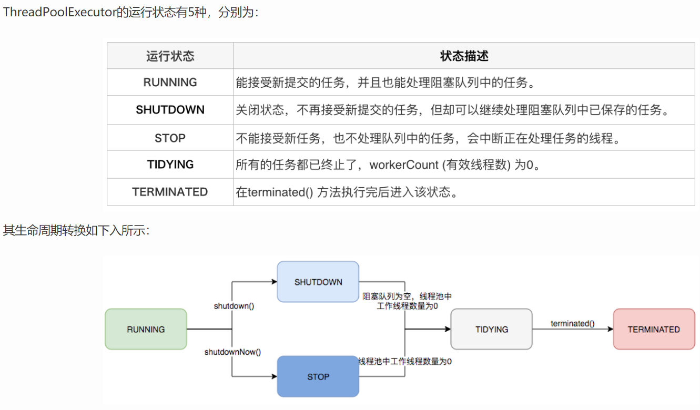

####  （三）任务执行机制

#####  **（1）任务调度**

所有任务的调度都是由**execute方法**完成的

1. 首先检测线程池运行状态，如果不是RUNNING，则直接拒绝，线程池要保证在RUNNING的状态下执行任务。

2. 如果workerCount（当前线程数） < corePoolSize，则创建并启动一个线程来执行新提交的任务。

3. 如果workerCount >= corePoolSize，且线程池内的阻塞队列未满，则将任务添加到该阻塞队列中。

4. 如果workerCount >= corePoolSize && workerCount < maximumPoolSize，且线程池内的阻塞队列已满，则创建并启动一个线程来执行新提交的任务。

5. 如果workerCount >= maximumPoolSize，并且线程池内的阻塞队列已满, 则根据拒绝策略来处理该任务, 默认的处理方式是直接抛异常。

   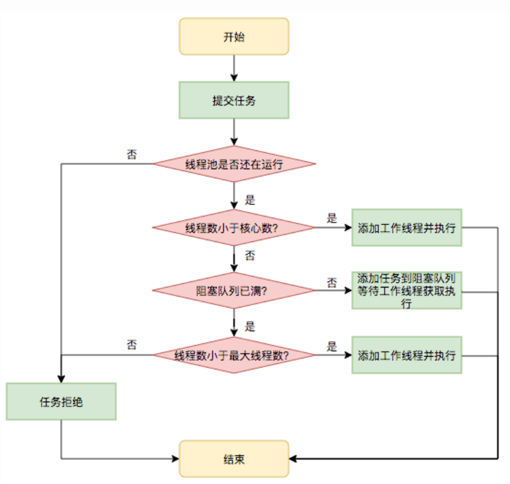

 #####  **（2）任务缓冲**  

**阻塞队列(BlockingQueue)**是一个支持两个附加操作的队列。

这两个附加的操作是：

* 在队列为空时，获取元素的线程会等待队列变为非空。
* 当队列满时，存储元素的线程会等待队列可用。阻塞队列常用于生产者和消费者的场景

生产者是往队列里添加元素的线程，消费者是从队列里拿元素的线程。阻塞队列就是生产者存放元素的容器，而消费者也只从容器里拿元素。

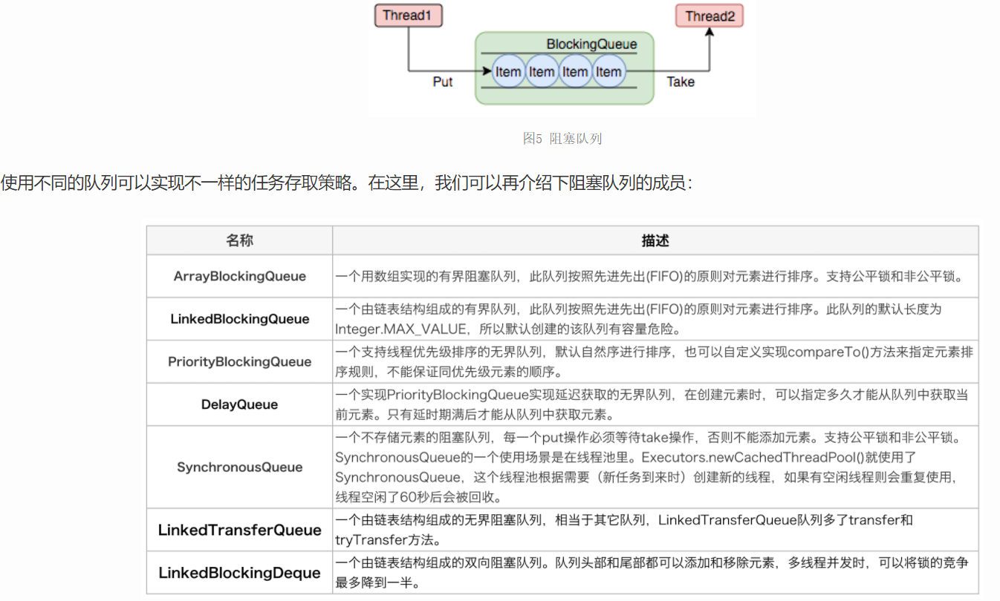

 #####  **（3）任务申请** 

任务的执行有两种可能：

* 一种是任务直接由新创建的线程执行。
* 另一种是线程从任务队列中获取任务然后执行，执行完任务的空闲线程会再次去从队列中申请任务再去执行。第一种情况仅出现在线程初始创建的时候，第二种是线程获取任务绝大多数的情况。

**线程需要从任务缓存模块中不断地取任务执行，帮助线程从阻塞队列中获取任务**，实现线程管理模块和任务管理模块之间的通信。这部分策略由**getTask**方法实现

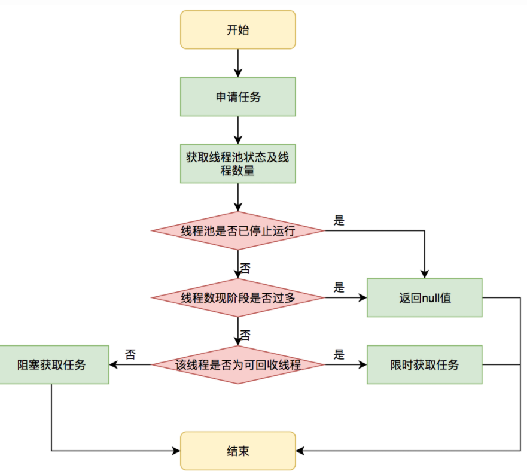

#####  **（4）任务拒绝** 

任务拒绝模块是线程池的保护部分，线程池有一个最大的容量，当线程池的任务缓存队列已满，并且线程池中的线程数目达到maximumPoolSize时，就需要拒绝掉该任务，采取任务拒绝策略，保护线程池。

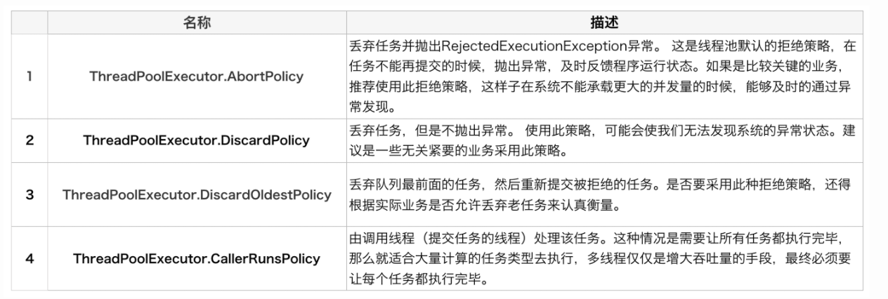

### （四）Worker线程管理

####  （1） Worker线程

```java
private final class Worker extends AbstractQueuedSynchronizer implements Runnable{
    final Thread thread;//Worker持有的线程
    Runnable firstTask;//初始化的任务，可以为null
}
```

* Worker这个工作线程，实现了Runnable接口，并持有一个线程thread，一个初始化的任务firstTask。thread是在调用构造方法时通过ThreadFactory来创建的线程，可以用来执行任务；

* firstTask用它来保存传入的第一个任务

  * 这个任务可以有也可以为null,如果这个值是null，那么就需要创建一个线程去执行任务列表（workQueue）中的任务，也就是**非核心线程的创建。**

  * 如果这个值是非空的，那么线程就会在启动初期立即执行这个任务，也就对**应核心线程创建**时的情况；

    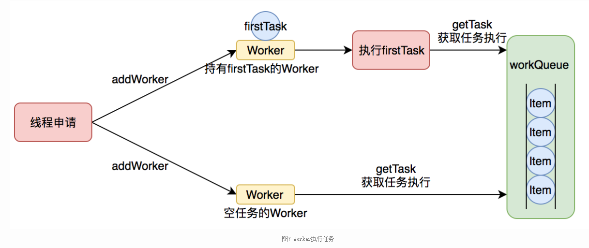

**Worker是通过继承AQS，使用AQS来实现独占锁这个功能**。没有使用可重入锁ReentrantLock，而是使用AQS，为的就是实现不可重入的特性去反应线程现在的执行状态。

* 1.lock方法一旦获取了独占锁，表示当前线程正在执行任务中。 

* 2.如果正在执行任务，则不应该中断线程。 

* 3.如果该线程现在不是独占锁的状态，也就是空闲的状态，说明它没有在处理任务，这时可以对该线程进行中断。 

* 4.线程池在执行shutdown方法或tryTerminate方法时会调用interruptIdleWorkers方法来中断空闲的线程，interruptIdleWorkers方法会使用tryLock方法来判断线程池中的线程是否是空闲状态；如果线程是空闲状态则可以安全回收。

  
####  （2） Worker线程增加

增加线程是通过线程池中的addWorker方法

addWorker方法有两个参数：firstTask、core。

* firstTask参数用于指定新增的线程执行的第一个任务，该参数可以为空；
* core参数为true表示在新增线程时会判断当前活动线程数是否少于**corePoolSize**，false表示新增线程前需要判断当前活动线程数是否少于maximumPoolSiz

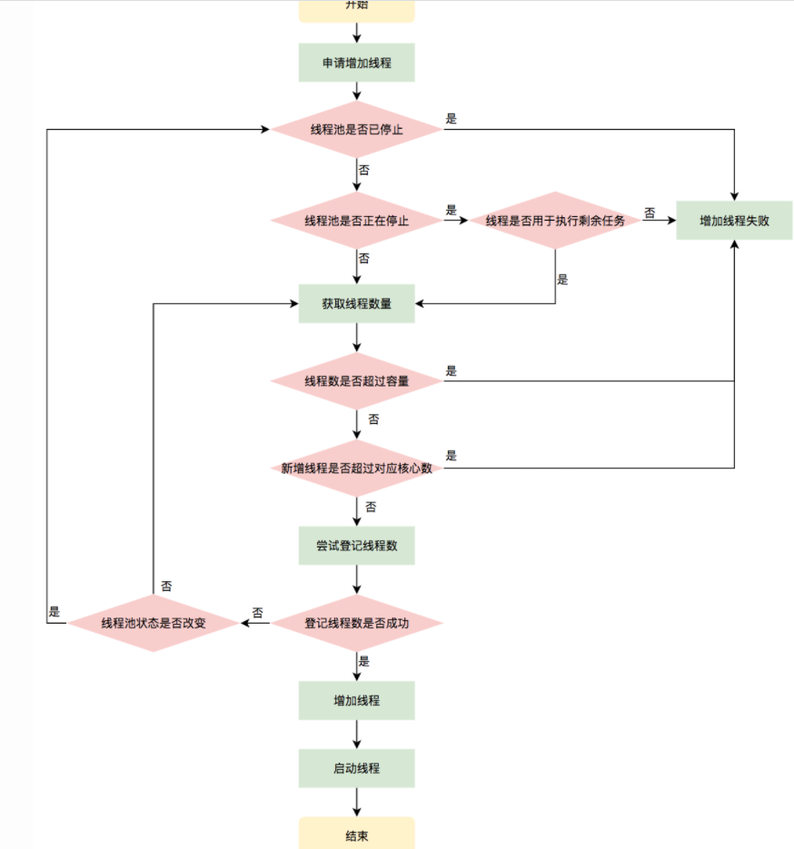

####  （3） Worker线程回收

* 线程池中线程的销毁依赖**JVM自动的回收**，线程池做的工作是根据当前线程池的状态维护一定数量的线程引用，防止这部分线程被JVM回收，当线程池决定哪些线程需要回收时，只需要将其引用消除即可。

* Worker被创建出来后，就会不断地进行轮询，然后获取任务去执行

* **核心线程可以无限等待获取任务**，**非核心线程要限时获取任务**。

* 当Worker无法获取到任务，也就是获取的任务为空时，循环会结束，Worker会主动消除自身在线程池内的引用。

  ```java
  try {
    while (task != null || (task = getTask()) != null) {
      //执行任务
    }
  } finally {
    processWorkerExit(w, completedAbruptly);//获取不到任务时，主动回收自己
  }
  ```

  

####  （4） Worker线程执行任务

在Worker类中的run方法调用了runWorker方法来执行任务，runWorker方法的执行过程如下：

* 1.while循环不断地通过getTask()方法获取任务。 

* 2.getTask()方法从阻塞队列中取任务。 

* 3.如果线程池正在停止，那么要保证当前线程是中断状态，否则要保证当前线程不是中断状态。 

* 4.执行任务。 

* 5.如果getTask结果为null则跳出循环，执行processWorkerExit()方法，销毁线程。

  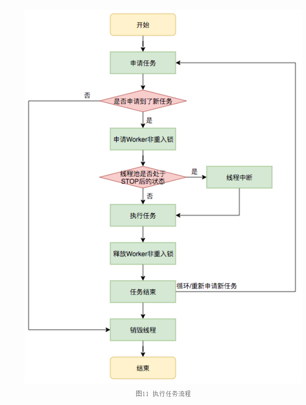

[参考](https://tech.meituan.com/2020/04/02/java-pooling-pratice-in-meituan.html)

## 3 线程异常怎么捕获
### (一) 为什么不能抛出到外部线程捕获？

因为线程是独立执行的代码片断，线程的问题应该由线程自己来解决，而不要委托到外部。基于这样的设计理念，在Java中，线程方法的异常都应该在线程代码边界之内**（run方法内）进行try catch并处理掉**。换句话说，我们不能捕获从线程中逃逸的异常。

### （二）现在我们可以怎样捕获线程中的异常？

Java中在处理异常的时候，通常的做法是使用**try-catch-finall**y来包含代码块，但是Java自身还有一种方式可以处理——使用**UncaughtExceptionHandler**。它能检测出某个线程由于未捕获的异常而终结的情况。当一个线程由于未捕获异常而退出时，JVM会把这个事件报告给应用程序提供的**UncaughtExceptionHandler异常处理器（这是Thread类中的接口）：**

```java
//Thread类中的接口
public interface UncaughtExceptionHanlder {
	void uncaughtException(Thread t, Throwable e);
}
```

JDK5之后允许我们在每一个**Thread对象上添加一个异常处理器UncaughtExceptionHandler 。**Thread.UncaughtExceptionHandler.uncaughtException()方法会在线程因未捕获的异常而面临死亡时被调用。

首先要先**定义一个异常捕获器：**

```java
public class MyUnchecckedExceptionhandler implements UncaughtExceptionHandler {
    @Override
    public void uncaughtException(Thread t, Throwable e) {
        System.out.println("捕获异常处理方法：" + e);
    }
}
```
### （第一类）基于异常处理器的方法
####  方法1 创建线程时设置异常处理Handler

```java
Thread t = new Thread(new ExceptionThread());
t.setUncaughtExceptionHandler(new MyUnchecckedExceptionhandler());
t.start();
```
#### 方法2 使用Executors创建线程时，还可以在ThreadFactory中设置

```java
ExecutorService exec = Executors.newCachedThreadPool(new ThreadFactory(){
            @Override
            public Thread newThread(Runnable r) {
                Thread thread = new Thread(r);
                thread.setUncaughtExceptionHandler(new MyUnchecckedExceptionhandler());
                return thread;
            }
});
exec.execute(new ExceptionThread());
```

* **通过execute方式提交的任务，能将它抛出的异常交给异常处理器。**

* **如果改成submit方式提交任务，则异常不能被异常处理器捕获，这是为什么呢？**

  查看源码后可以发现，如果一个由submit提交的任务由于抛出了异常而结束，那么这个异常将被Future.get封装在ExecutionException中重新抛出。所以，**通过submit提交到线程池的任务，无论是抛出的未检查异常还是已检查异常，都将被认为是任务返回状态的一部分，因此不会交由异常处理器来处理。**

  ```java
  java.util.concurrent.FutureTask 源码
  
  public V get() throws InterruptedException, ExecutionException {
      int s = state;
      if (s <= COMPLETING)//如果任务没有结束，则等待结束
          s = awaitDone(false, 0L);
      return report(s);//如果执行结束，则报告执行结果
  }
  
  @SuppressWarnings("unchecked")
  private V report(int s) throws ExecutionException {
      Object x = outcome;
      if (s == NORMAL)//如果执行正常，则返回结果
          return (V)x;
      if (s >= CANCELLED)//如果任务被取消，调用get则报CancellationException
          throw new CancellationException();
      throw new ExecutionException((Throwable)x);//执行异常，则抛出ExecutionException
  }
  ```

####  方法3. 使用线程组ThreadGroup

```java
//1.创建线程组
ThreadGroup threadGroup =
        // 这是匿名类写法
        new ThreadGroup("group") {
            // 继承ThreadGroup并重新定义以下方法
            // 在线程成员抛出unchecked exception 会执行此方法
            @Override
            public void uncaughtException(Thread t, Throwable e) {
                //4.处理捕获的线程异常
            }
        };
//2.创建Thread        
Thread thread = new Thread(threadGroup, new Runnable() {
    @Override
    public void run() {
        System.out.println(1 / 0);

    }
}, "my_thread");  
//3.启动线程
thread.start();   

```

#### 方法4. 默认的线程异常捕获器

如果我们只需要一个线程异常处理器处理线程的异常，那么我们可以设置一个**默认的线程异常处理器**，当线程出现异常时，
如果我们**没有指定线程的异常处理器**，而且**线程组也没有设置**，那么就会使用默认的线程异常处理器。

```java
// 设置默认的线程异常捕获处理器
Thread.setDefaultUncaughtExceptionHandler(new MyUnchecckedExceptionhandler());
```

### （第二类）基于基于FutureTask实现的方法

#### 方法5. 使用FetureTask来捕获异常

```java
//1.创建FeatureTask
FutureTask<Integer> futureTask = new FutureTask<>(new Callable<Integer>() {
    @Override
    public Integer call() throws Exception {
        return 1/0;
    }
});
//2.创建Thread
Thread thread = new Thread(futureTask);
//3.启动线程
thread.start();
try {
    Integer result = futureTask.get();
} catch (InterruptedException e) {
    e.printStackTrace();
} catch (ExecutionException e) {
    //4.处理捕获的线程异常
}
```
#### 方法6. 利用线程池提交线程时返回的Feature引用

```java
//1.创建线程池
ExecutorService executorService = Executors.newFixedThreadPool(10);
//2.创建Callable，有返回值的，你也可以创建一个线程实现Callable接口。
//  如果你不需要返回值，这里也可以创建一个Thread即可，在第3步时submit这个thread。
Callable<Integer> callable = new Callable<Integer>() {
    @Override
    public Integer call() throws Exception {
        return 1/0;
    }
};
//3.提交待执行的线程
Future<Integer> future = executorService.submit(callable);
try {
     Integer result = future.get();
} catch (InterruptedException e) {
    e.printStackTrace();
} catch (ExecutionException e) {
    //4.处理捕获的线程异常
}
```

### （第三类）重写ThreadPoolExecutor

#### 方法7.重写ThreadPoolExecutor的afterExecute方法

```java
//1.创建线程池
ThreadPoolExecutor threadPoolExecutor = new ThreadPoolExecutor(10, 10, 0L, TimeUnit.MILLISECONDS,
        new LinkedBlockingQueue<>()) {
    @Override
    protected void afterExecute(Runnable r, Throwable t) {
        if (r instanceof Thread) {
            if (t != null) {
                //处理捕获的异常
            }
        } else if (r instanceof FutureTask) {
            FutureTask futureTask = (FutureTask) r;
            try {
                futureTask.get();
            } catch (InterruptedException e) {
                e.printStackTrace();
            } catch (ExecutionException e) {
                //处理捕获的异常
            }
        }

    }
};


Thread t1 = new Thread(() -> {
    int c = 1 / 0;
});
threadPoolExecutor.execute(t1);

Callable<Integer> callable = () -> 2 / 0;
threadPoolExecutor.submit(callable);
```

### 总结

* 线程最好交由线程池进行管理。

* 线程池中如果你的线程不需要返回值则可以使用**方法2，利用ThreadFactory**为线程指定统一的异常处理器。记得一定要用execute方式提交任务，否则异常处理器捕获不到异常。

* 线程池中如果你的线程需要返回值，你又想捕获线程异常，则需要借助**FutureTask，即使用方法6**。使用submit方法提交线程。当然了，不需要返回值的情况也可以使用方法6。

* **方法7**同时支持execute和submit提交任务时异常的捕获，适合相同类型任务的统一异常处理，但是**异常处理粒度较粗**，而**方法2和方法6**可以针对每个任务进行**自定义的异常处理**。

  [参考](https://blog.csdn.net/pange1991/article/details/82115437)

## 4 AQS
### (一) Java的各种锁

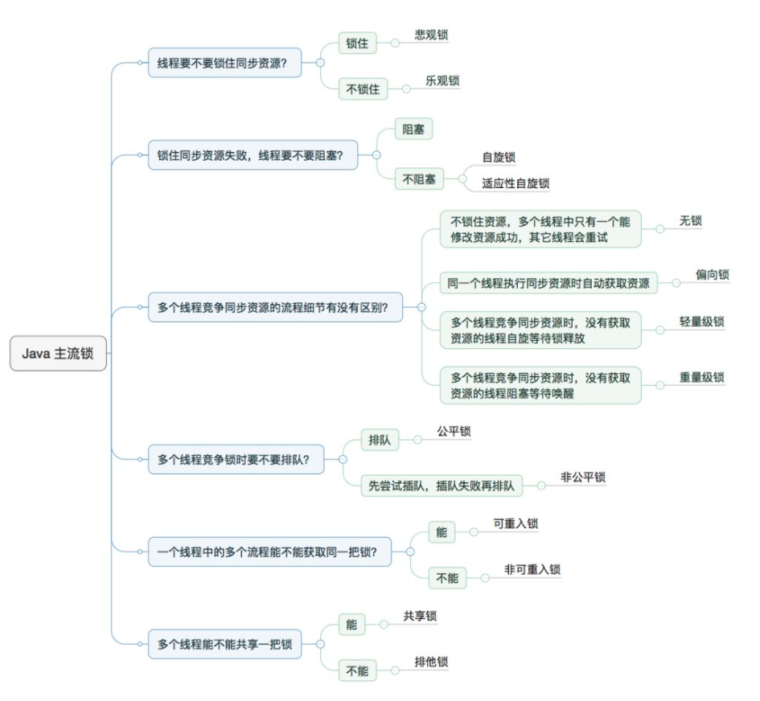

* **自适应意味着自旋的时间（次数）不再固定**，而是由前一次在同一个锁上的自旋时间及锁的拥有者的状态来决定。如果在同一个锁对象上，自旋等待刚刚成功获得过锁，并且持有锁的线程正在运行中，那么虚拟机就会认为这次自旋也是很有可能再次成功，进而它将允许自旋等待持续相对更长的时间。如果对于某个锁，自旋很少成功获得过，那在以后尝试获取这个锁时将可能省略掉自旋过程，直接阻塞线程，避免浪费处理器资源。

  [参考](https://mp.weixin.qq.com/s?__biz=MjM5NjQ5MTI5OA==&mid=2651749434&idx=3&sn=5ffa63ad47fe166f2f1a9f604ed10091&chksm=bd12a5778a652c61509d9e718ab086ff27ad8768586ea9b38c3dcf9e017a8e49bcae3df9bcc8&scene=38#wechat_redirect)

### (二) Java的状态及转换

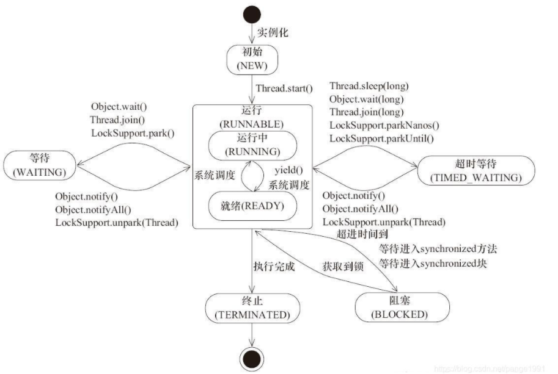

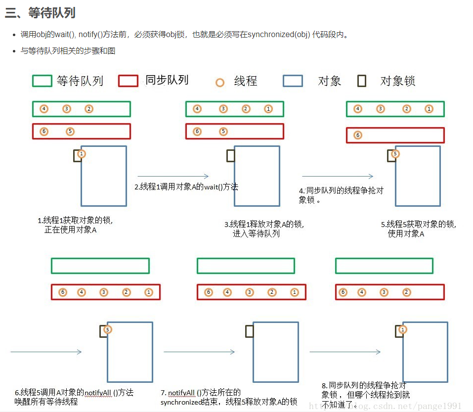

**等待状态可被中断**

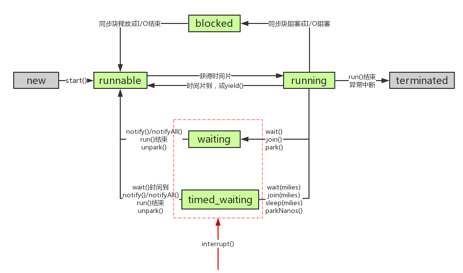

[参考](https://www.cnblogs.com/waterystone/p/4920007.html)

[参考](https://blog.csdn.net/pange1991/article/details/53860651)

### (二) AQS

#### 1 AQS 简单介绍

AQS的全称为（AbstractQueuedSynchronizer），这个类在java.util.concurrent.locks包下面。

**AQS是一个用来构建锁和同步器的框架，使用AQS能简单且高效地构造出应用广泛的大量的同步器**，比如我们提到的ReentrantLock，Semaphore，其他的诸如ReentrantReadWriteLock，SynchronousQueue，FutureTask等等皆是基于AQS的。当然，我们自己也能利用AQS非常轻松容易地构造出符合我们自己需求的同步器。

#### 2 AQS原理

#####  2.1 AQS 原理概览

**AQS核心思想是：**

* 如果被请求的共享资源空闲，则将当前请求资源的线程设置为有效的工作线程，并且将共享资源设置为锁定状态。

* 如果被请求的共享资源被占用，那么就需要一套线程阻塞等待以及被唤醒时锁分配的机制，**这个机制AQS是用CLH队列锁实现的**，即将暂时获取不到锁的线程加入到队列中。

  > CLH(Craig,Landin,and Hagersten)队列是一个虚拟的双向队列（虚拟的双向队列即不存在队列实例，仅存在结点之间的关联关系）。AQS是将每条请求共享资源的线程封装成一个CLH锁队列的一个结点（Node）来实现锁的分配。

看个AQS(AbstractQueuedSynchronizer)原理图：


**AQS使用一个int成员变量来表示同步状态**，通过内置的FIFO队列来完成获取资源线程的排队工作。AQS使用CAS对该同步状态进行原子操作实现对其值的修改。

```java
private volatile int state;//共享变量，使用volatile修饰保证线程可见性
```

**state的访问方式有三种:** 状态信息通过procted类型的getState，setState，compareAndSetState进行操作

```java
//返回同步状态的当前值
protected final int getState() {  
        return state;
}
 // 设置同步状态的值
protected final void setState(int newState) { 
        state = newState;
}
//原子地（CAS操作）将同步状态值设置为给定值update如果当前同步状态的值等于expect（期望值）
protected final boolean compareAndSetState(int expect, int update) {
        return unsafe.compareAndSwapInt(this, stateOffset, expect, update);
}
```

##### 2.2 AQS 对资源的共享方式

**AQS定义两种资源共享方式**

- **Exclusive**（独占）：只有一个线程能执行，如ReentrantLock。又可分为公平锁和非公平锁：
    - 公平锁：按照线程在队列中的排队顺序，先到者先拿到锁
    - 非公平锁：当线程要获取锁时，无视队列顺序直接去抢锁，谁抢到就是谁的
-  **Share**（共享）：多个线程可同时执行，如Semaphore/CountDownLatch、 CyclicBarrier、ReadWriteLock 我们都会在后面讲到。

**ReentrantReadWriteLock 可以看成是组合式**，因为ReentrantReadWriteLock也就是读写锁允许多个线程同时对某一资源进行读。

不同的自定义同步器争用共享资源的方式也不同。**自定义同步器在实现时只需要实现共享资源 state 的获取与释放方式即可**，**至于具体线程等待队列的维护（如获取资源失败入队/唤醒出队等），AQS已经在上层已经帮我们实现好了。**

##### 2.3 AQS底层使用了模板方法模式

同步器的设计是基于模板方法模式的，如果需要自定义同步器一般的方式是这样（模板方法模式很经典的一个应用）：

1. 使用者继承AbstractQueuedSynchronizer并重写指定的方法。（这些重写方法很简单，无非是对于共享资源state的获取和释放）
2. 将AQS组合在自定义同步组件的实现中，并调用其模板方法，而这些模板方法会调用使用者重写的方法。

这和我们以往通过实现接口的方式有很大区别，这是模板方法模式很经典的一个运用，下面简单的给大家介绍一下模板方法模式，模板方法模式是一个很容易理解的设计模式之一。

> 模板方法模式是基于”继承“的，主要是为了在不改变模板结构的前提下在子类中重新定义模板中的内容以实现复用代码。举个很简单的例子假如我们要去一个地方的步骤是：购票`buyTicket()`->安检`securityCheck()`->乘坐某某工具回家`ride()`->到达目的地`arrive()`。我们可能乘坐不同的交通工具回家比如飞机或者火车，所以除了`ride()`方法，其他方法的实现几乎相同。我们可以定义一个包含了这些方法的抽象类，然后用户根据自己的需要继承该抽象类然后修改 `ride()`方法。

**AQS使用了模板方法模式，自定义同步器时需要重写下面几个AQS提供的模板方法：**

```java
isHeldExclusively()//该线程是否正在独占资源。只有用到condition才需要去实现它。
tryAcquire(int)//独占方式。尝试获取资源，成功则返回true，失败则返回false。
tryRelease(int)//独占方式。尝试释放资源，成功则返回true，失败则返回false。
tryAcquireShared(int)//共享方式。尝试获取资源。负数表示失败；0表示成功，但没有剩余可用资源；正数表示成功，且有剩余资源。
tryReleaseShared(int)//共享方式。尝试释放资源，成功则返回true，失败则返回false。
```

默认情况下，每个方法都抛出 `UnsupportedOperationException`。 这些方法的实现必须是内部线程安全的，并且通常应该简短而不是阻塞。**AQS类中的其他方法都是final ，所以无法被其他类使用，只有这几个方法可以被其他类使用。** 

* 以ReentrantLock为例，state初始化为0，表示未锁定状态。A线程lock()时，会调用tryAcquire()独占该锁并将state+1。此后，其他线程再tryAcquire()时就会失败，直到A线程unlock()到state=0（即释放锁）为止，其它线程才有机会获取该锁。当然，释放锁之前，A线程自己是可以重复获取此锁的（state会累加），这就是可重入的概念。但要注意，获取多少次就要释放多么次，这样才能保证state是能回到零态的。

* 再以CountDownLatch以例，任务分为N个子线程去执行，state也初始化为N（注意N要与线程个数一致）。这N个子线程是并行执行的，每个子线程执行完后countDown()一次，state会CAS(Compare and Swap)减1。**等到所有子线程都执行完后(即state=0)，会unpark()主调用线程，然后主调用线程就会从await()函数返回，继续后余动作。** 

一般来说，自定义同步器要么是独占方法，要么是共享方式，他们也只需实现`tryAcquire-tryRelease`、`tryAcquireShared-tryReleaseShared`中的一种即可。**但AQS也支持自定义同步器同时实现独占和共享两种方式**，如`ReentrantReadWriteLock`。

#### 3 AQS源码分析

##### 3.0 结点状态waitStatus

Node结点是对每一个等待获取资源的线程的封装，其包含了需要同步的线程本身及其等待状态，如是否被阻塞、是否等待唤醒、是否已经被取消等。变量waitStatus则表示当前Node结点的等待状态，共有5种取值CANCELLED、SIGNAL、CONDITION、PROPAGATE、0。

- **CANCELLED**(1)：表示当前结点已取消调度。当timeout或被中断（响应中断的情况下），会触发变更为此状态，进入该状态后的结点将不会再变化。
- **SIGNAL**(-1)：表示后继结点在**等待当前结点唤醒**。后继结点入队时，会将前继结点的状态更新为SIGNAL。
- **CONDITION**(-2)：表示结点等待在Condition上，当其他线程调用了Condition的signal()方法后，CONDITION状态的结点将**从等待队列转移到同步队列中**，等待获取同步锁。
- **PROPAGATE**(-3)：共享模式下，**前继结点不仅会唤醒其后继结点，同时也可能会唤醒后继的后继结点。**
- **0**：新结点入队时的默认状态。

注意，**负值表示结点处于有效等待状态，而正值表示结点已被取消。所以源码中很多地方用>0、<0来判断结点的状态是否正常**。

##### 3.1 acquire(int)

此方法是独占模式下线程获取共享资源的顶层入口。**如果获取到资源，线程直接返回，否则进入等待队列，直到获取到资源为止，且整个过程忽略中断的影响**。这也正是**lock()的语义**，当然不仅仅只限于lock()。获取到资源后，线程就可以去执行其临界区代码了。下面是acquire()的源码：

```java
1 public final void acquire(int arg) {
2     if (!tryAcquire(arg) &&
3         acquireQueued(addWaiter(Node.EXCLUSIVE), arg))
4         selfInterrupt();
5 }
```

函数流程如下：

   1. tryAcquire()尝试直接去获取资源，如果成功则直接返回（这里体现了非公平锁，每个线程获取锁时会尝试直接抢占加塞一次，而CLH队列中可能还有别的线程在等待）；

   2. addWaiter()将该线程加入等待队列的尾部，并标记为独占模式；

   3. acquireQueued()使线程阻塞在等待队列中获取资源，一直获取到资源后才返回。如果在整个等待过程中被中断过，则返回true，否则返回false。

   4. 如果线程在等待过程中被中断过，它是不响应的。只是获取资源后才再进行自我中断selfInterrupt()，将中断补上。

      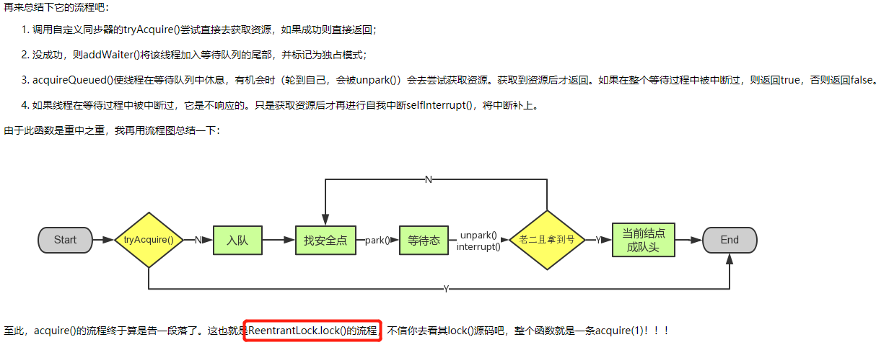

  * **tryAcquire(int)**

    此方法尝试去获取独占资源。如果获取成功，则直接返回true，否则直接返回false。**这也正是tryLock()的语义**，还是那句话，当然不仅仅只限于tryLock()。如下是tryAcquire()的源码：

    ```java
    1     protected boolean tryAcquire(int arg) {
    2         throw new UnsupportedOperationException();
    3     }
    ```

    AQS只是一个框架，具体资源的获取/释放方式交由自定义同步器去实现。AQS这里只定义了一个接口，具体资源的获取交由自定义同步器去实现了（通过state的get/set/CAS）    
    
* **addWaiter(Node)**
 此方法用于将当前线程加入到等待队列的队尾，并返回当前线程所在的结点。

 ```java
 private Node addWaiter(Node mode) {
     //以给定模式构造结点。mode有两种：EXCLUSIVE（独占）和SHARED（共享）
     Node node = new Node(Thread.currentThread(), mode);
 
     //尝试快速方式直接放到队尾。
     Node pred = tail;
     if (pred != null) {
         node.prev = pred;
         if (compareAndSetTail(pred, node)) {
             pred.next = node;
             return node;
         }
     }
 
     //上一步失败则通过enq入队。
     enq(node);
     return node;
 }
 ```
 	**enq(Node)**

此方法用于将node加入队尾。源码如下：

```java
private Node enq(final Node node) {
    //CAS"自旋"，直到成功加入队尾
    for (;;) {
        Node t = tail;
        if (t == null) { // 队列为空，创建一个空的标志结点作为head结点，并将tail也指向它。
            if (compareAndSetHead(new Node()))
                tail = head;
        } else {//正常流程，放入队尾
            node.prev = t;
            if (compareAndSetTail(t, node)) {
                t.next = node;
                return t;
            }
        }
    }
}
```

* **acquireQueued(Node, int)**
  通过tryAcquire()和addWaiter()，该线程获取资源失败，已经被放入等待队列尾部了。**进入等待状态休息，直到其他线程彻底释放资源后唤醒自己，自己再拿到资源，然后就可以去干自己想干的事了**

  1. 结点进入队尾后，检查状态，找到安全休息点；**(shouldParkAfterFailedAcquire(Node, Node))**
  2. 调用park()进入waiting状态，**等待unpark()或interrupt()**唤醒自己；
  3. 被唤醒后，看自己是不是有资格能拿到资源。如果拿到，head指向当前结点，并返回从入队到拿到资源的整个过程中是否被中断过；如果没拿到，继续流程1。

  ```java
  final boolean acquireQueued(final Node node, int arg) {
      boolean failed = true;//标记是否成功拿到资源
      try {
          boolean interrupted = false;//标记等待过程中是否被中断过
  
          //又是一个“自旋”！
          for (;;) {
              final Node p = node.predecessor();//拿到前驱
              //如果前驱是head，即该结点已成老二，那么便有资格去尝试获取资源（可能是老大释放完资源唤醒自己的，当然也可能被interrupt了）。
              if (p == head && tryAcquire(arg)) {
                  setHead(node);//拿到资源后，将head指向该结点。所以head所指的标杆结点，就是当前获取到资源的那个结点或null。
                  p.next = null; // setHead中node.prev已置为null，此处再将head.next置为null，就是为了方便GC回收以前的head结点。也就意味着之前拿完资源的结点出队了！
                  failed = false; // 成功获取资源
                  return interrupted;//返回等待过程中是否被中断过
              }
  
              //如果自己可以休息了，就通过park()进入waiting状态，直到被unpark()。如果不可中断的情况下被中断了，那么会从park()中醒过来，发现拿不到资源，从而继续进入park()等待。
              if (shouldParkAfterFailedAcquire(p, node) &&
                  parkAndCheckInterrupt())
                  interrupted = true;//如果等待过程中被中断过，哪怕只有那么一次，就将interrupted标记为true
          }
      } finally {
          if (failed) // 如果等待过程中没有成功获取资源（如timeout，或者可中断的情况下被中断了），那么取消结点在队列中的等待。
              cancelAcquire(node);
      }
  }
  ```
  **shouldParkAfterFailedAcquire(Node, Node)**
  此方法主要用于检查状态，看看自己是否真的可以去休息了（进入waiting状态), 如果前驱结点的状态不是SIGNAL，那么自己就不能安心去休息，需要去找个安心的休息点，同时可以再尝试下看有没有机会轮到自己拿资源。
  
  ```java
  private static boolean shouldParkAfterFailedAcquire(Node pred, Node node) {
      int ws = pred.waitStatus;//拿到前驱的状态
      if (ws == Node.SIGNAL)
          //如果已经告诉前驱拿完号后通知自己一下，那就可以安心休息了
          return true;
      if (ws > 0) {
          /*
           * 如果前驱放弃了，那就一直往前找，直到找到最近一个正常等待的状态，并排在它的后边。
           * 注意：那些放弃的结点，由于被自己“加塞”到它们前边，它们相当于形成一个无引用链，稍后就会被保安大叔赶走了(GC回收)！
           */
          do {
              node.prev = pred = pred.prev;
          } while (pred.waitStatus > 0);
          pred.next = node;
      } else {
           //如果前驱正常，那就把前驱的状态设置成SIGNAL，告诉它拿完号后通知自己一下。有可能失败，人家说不定刚刚释放完呢！
          compareAndSetWaitStatus(pred, ws, Node.SIGNAL);
      }
      return false;
  }
  ```
  **parkAndCheckInterrupt()**
  如果线程找好安全休息点后，那就可以安心去休息了。此方法就是让线程去休息，真正进入等待状态。
  
  ```java
  1 private final boolean parkAndCheckInterrupt() {
  2     LockSupport.park(this);//调用park()使线程进入waiting状态
  3     return Thread.interrupted();//如果被唤醒，查看自己是不是被中断的。
  4 }
  ```
  
  park()会让当前线程进入waiting状态。在此状态下，有两种途径可以唤醒该线程：**1）被unpark()；2）被interrupt()**。**（需要注意的是，Thread.interrupted()会清除当前线程的中断标记位。)**
  
##### 3.2  release(int)

  此方法是独占模式下线程释放共享资源的顶层入口。它会释放指定量的资源，**如果彻底释放了（即state=0）,它会唤醒等待队列里的其他线程来获取资源**。**这也正是unlock()的语义**，当然不仅仅只限于unlock()。

  ```java
public final boolean release(int arg) {
    if (tryRelease(arg)) {
        Node h = head;//找到头结点
        if (h != null && h.waitStatus != 0)
            unparkSuccessor(h);//唤醒等待队列里的下一个线程
        return true;
    }
    return false;
}
  ```

**它是根据tryRelease()的返回值来判断该线程是否已经完成释放掉资源了**

* **tryRelease(int)**

  ```java
  1 protected boolean tryRelease(int arg) {
  2     throw new UnsupportedOperationException();
  3 }
  ```

  **这个方法是需要独占模式的自定义同步器去实现的**,所以自义定同步器在实现时，如果已经彻底释放资源(state=0)，要返回true，否则返回false。

* **unparkSuccessor(Node)**

  此方法用于唤醒等待队列中下一个线程。

  **用unpark()唤醒等待队列中最前边的那个未放弃线程**

  ```java
  private void unparkSuccessor(Node node) {
      //这里，node一般为当前线程所在的结点。
      int ws = node.waitStatus;
      if (ws < 0)//置零当前线程所在的结点状态，允许失败。
          compareAndSetWaitStatus(node, ws, 0);
  
      Node s = node.next;//找到下一个需要唤醒的结点s
      if (s == null || s.waitStatus > 0) {//如果为空或已取消
          s = null;
          for (Node t = tail; t != null && t != node; t = t.prev) // 从后向前找。
              if (t.waitStatus <= 0)//从这里可以看出，<=0的结点，都是还有效的结点。
                  s = t;
      }
      if (s != null)
          LockSupport.unpark(s.thread);//唤醒
  }
  ```
#####  3.3 acquireShared(int)

此方法是共享模式下线程获取共享资源的顶层入口。它**会获取指定量的资**源，获取成功则直接返回，获取失败则进入等待队列，直到获取到资源为止，整个过程忽略中断。

```java
1 public final void acquireShared(int arg) {
2     if (tryAcquireShared(arg) < 0)
3         doAcquireShared(arg);
4 }
```

这里tryAcquireShared()依然需要自定义同步器去实现。但是AQS已经把其返回值的语义定义好了：负值代表获取失败；0代表获取成功，但没有剩余资源；正数表示获取成功，还有剩余资源，其他线程还可以去获取。所以这里acquireShared()的流程就是：

1. 1. tryAcquireShared()尝试获取资源，成功则直接返回；
   2. 失败则通过doAcquireShared()进入等待队列park()，直到被unpark()/interrupt()并成功获取到资源才返回。整个等待过程也是忽略中断的。

　　其实跟acquire()的流程大同小异，只不过多了个**自己拿到资源后，还会去唤醒后继队友的操作（这才是共享嘛）**。

#####  3.4 releaseShared()

方法是共享模式下线程释放共享资源的顶层入口。它会释放指定量的资源，如果成功释放且允许唤醒等待线程，它会唤醒等待队列里的其他线程来获取资源。下面是releaseShared()的源码：

```java
public final boolean releaseShared(int arg) {
    if (tryReleaseShared(arg)) {//尝试释放资源
        doReleaseShared();//唤醒后继结点
        return true;
    }
    return false;
}
```

**释放掉资源后，唤醒后继。跟独占模式下的release()相似，但有一点稍微需要注意：独占模式下的tryRelease()在完全释放掉资源（state=0）后，才会返回true去唤醒其他线程**，这主要是基于独占下可重入的考量；**而共享模式下的releaseShared()则没有这种要求，共享模式实质就是控制一定量的线程并发执行，那么拥有资源的线程在释放掉部分资源时就可以唤醒后继等待结点。**

* 例如，资源总量是13，A（5）和B（7）分别获取到资源并发运行，C（4）来时只剩1个资源就需要等待。

* A在运行过程中释放掉2个资源量，然后tryReleaseShared(2)返回true唤醒C，C一看只有3个仍不够继续等待；

* 随后B又释放2个，tryReleaseShared(2)返回true唤醒C，C一看有5个够自己用了，然后C就可以跟A和B一起运行。

  [参考](https://www.cnblogs.com/waterystone/p/4920797.html)


#### 4 Semaphore(信号量)-允许多个线程同时访问

**synchronized 和 ReentrantLock 都是一次只允许一个线程访问某个资源，Semaphore(信号量)可以指定多个线程同时访问某个资源。**示例代码如下：

```java
/**
 * 
 * @author Snailclimb
 * @date 2018年9月30日
 * @Description: 需要一次性拿一个许可的情况
 */
public class SemaphoreExample1 {
  // 请求的数量
  private static final int threadCount = 550;

  public static void main(String[] args) throws InterruptedException {
    // 创建一个具有固定线程数量的线程池对象（如果这里线程池的线程数量给太少的话你会发现执行的很慢）
    ExecutorService threadPool = Executors.newFixedThreadPool(300);
    // 一次只能允许执行的线程数量。
    final Semaphore semaphore = new Semaphore(20);

    for (int i = 0; i < threadCount; i++) {
      final int threadnum = i;
      threadPool.execute(() -> {// Lambda 表达式的运用
        try {
          semaphore.acquire();// 获取一个许可，所以可运行线程数量为20/1=20
          test(threadnum);
          semaphore.release();// 释放一个许可
        } catch (InterruptedException e) {
          // TODO Auto-generated catch block
          e.printStackTrace();
        }

      });
    }
    threadPool.shutdown();
    System.out.println("finish");
  }

  public static void test(int threadnum) throws InterruptedException {
    Thread.sleep(1000);// 模拟请求的耗时操作
    System.out.println("threadnum:" + threadnum);
    Thread.sleep(1000);// 模拟请求的耗时操作
  }
}
```

执行 `acquire` 方法阻塞，直到有一个许可证可以获得然后拿走一个许可证；每个 `release` 方法增加一个许可证，这可能会释放一个阻塞的acquire方法。然而，其实并没有实际的许可证这个对象，Semaphore只是维持了一个可获得许可证的数量。 Semaphore经常用于限制获取某种资源的线程数量。

当然一次也可以一次拿取和释放多个许可，不过一般没有必要这样做：

```java
semaphore.acquire(5);// 获取5个许可，所以可运行线程数量为20/5=4
test(threadnum);
semaphore.release(5);// 获取5个许可，所以可运行线程数量为20/5=4
```

除了 `acquire`方法之外，另一个比较常用的与之对应的方法是`tryAcquire`方法，该方法如果获取不到许可就立即返回false。


Semaphore 有两种模式，公平模式和非公平模式。

- **公平模式：** 调用acquire的顺序就是获取许可证的顺序，遵循FIFO；
- **非公平模式：** 抢占式的。

**Semaphore 对应的两个构造方法如下：**

```java
   public Semaphore(int permits) {
        sync = new NonfairSync(permits);
    }

    public Semaphore(int permits, boolean fair) {
        sync = fair ? new FairSync(permits) : new NonfairSync(permits);
    }
```
**这两个构造方法，都必须提供许可的数量，第二个构造方法可以指定是公平模式还是非公平模式，默认非公平模式。** 

#### 5 CountDownLatch （倒计时器）

CountDownLatch是一个同步工具类，它允许一个或多个线程一直等待，直到其他线程的操作执行完后再执行。

##### 5.1 CountDownLatch 的三种典型用法

①某一线程在开始运行前等待n个线程执行完毕。将 CountDownLatch 的计数器初始化为n ：`new CountDownLatch(n) `，每当一个任务线程执行完毕，就将计数器减1 `countdownlatch.countDown()`，当计数器的值变为0时，在`CountDownLatch上 await()` 的线程就会被唤醒。**一个典型应用场景就是启动一个服务时，主线程需要等待多个组件加载完毕，之后再继续执行。**

②实现多个线程开始执行任务的最大并行性。注意是并行性，不是并发，强调的是多个线程在某一时刻同时开始执行。类似于赛跑，将多个线程放到起点，等待发令枪响，然后同时开跑。做法是初始化一个共享的 `CountDownLatch` 对象，将其计数器初始化为 1 ：`new CountDownLatch(1) `，多个线程在开始执行任务前首先 `coundownlatch.await()`，当主线程调用 countDown() 时，计数器变为0，多个线程同时被唤醒。

③死锁检测：一个非常方便的使用场景是，你可以使用n个线程访问共享资源，在每次测试阶段的线程数目是不同的，并尝试产生死锁。

##### 5.2 CountDownLatch 的使用示例

```java
/**
 * 
 * @author SnailClimb
 * @date 2018年10月1日
 * @Description: CountDownLatch 使用方法示例
 */
public class CountDownLatchExample1 {
  // 请求的数量
  private static final int threadCount = 550;

  public static void main(String[] args) throws InterruptedException {
    // 创建一个具有固定线程数量的线程池对象（如果这里线程池的线程数量给太少的话你会发现执行的很慢）
    ExecutorService threadPool = Executors.newFixedThreadPool(300);
    final CountDownLatch countDownLatch = new CountDownLatch(threadCount);
    for (int i = 0; i < threadCount; i++) {
      final int threadnum = i;
      threadPool.execute(() -> {// Lambda 表达式的运用
        try {
          test(threadnum);
        } catch (InterruptedException e) {
          // TODO Auto-generated catch block
          e.printStackTrace();
        } finally {
          countDownLatch.countDown();// 表示一个请求已经被完成
        }

      });
    }
    countDownLatch.await();
    threadPool.shutdown();
    System.out.println("finish");
  }

  public static void test(int threadnum) throws InterruptedException {
    Thread.sleep(1000);// 模拟请求的耗时操作
    System.out.println("threadnum:" + threadnum);
    Thread.sleep(1000);// 模拟请求的耗时操作
  }
}

```
上面的代码中，我们定义了请求的数量为550，当这550个请求被处理完成之后，才会执行`System.out.println("finish");`。

与CountDownLatch的第一次交互是主线程等待其他线程。**主线程必须在启动其他线程后立即调用CountDownLatch.await()方法。这样主线程的操作就会在这个方法上阻塞，直到其他线程完成各自的任务。**

其他N个线程必须引用闭锁对象，因为他们需要通知CountDownLatch对象，他们已经完成了各自的任务。这种通知机制是通过 CountDownLatch.countDown()方法来完成的；每调用一次这个方法，在构造函数中初始化的count值就减1。**所以当N个线程都调 用了这个方法，count的值等于0，然后主线程就能通过await()方法，恢复执行自己的任务。**

##### 5.3 CountDownLatch 的不足

CountDownLatch是一次性的，计数器的值只能在构造方法中初始化一次，之后没有任何机制再次对其设置值，当CountDownLatch使用完毕后，它不能再次被使用。

#### 6 CyclicBarrier(循环栅栏)

CyclicBarrier 和 CountDownLatch 非常类似，它也可以实现线程间的技术等待，但是它的功能比 CountDownLatch 更加复杂和强大。主要应用场景和 CountDownLatch 类似。

CyclicBarrier 的字面意思是可循环使用（Cyclic）的屏障（Barrier）。它要做的事情是**，让一组线程到达一个屏障（也可以叫同步点）时被阻塞，直到最后一个线程到达屏障时，屏障才会开门，所有被屏障拦截的线程才会继续干活。**CyclicBarrier默认的构造方法是 `CyclicBarrier(int parties)`，其参数表示屏障拦截的线程数量，**每个线程调用`await`方法告诉 CyclicBarrier 我已经到达了屏障，然后当前线程被阻塞。**

##### 6.1 CyclicBarrier 的应用场景

CyclicBarrier 可以用于多线程计算数据，最后合并计算结果的应用场景。比如我们用一个Excel保存了用户所有银行流水，每个Sheet保存一个帐户近一年的每笔银行流水，现在需要统计用户的日均银行流水，先用多线程处理每个sheet里的银行流水，都执行完之后，得到每个sheet的日均银行流水，最后，再用barrierAction用这些线程的计算结果，计算出整个Excel的日均银行流水。

##### 6.2 CyclicBarrier 的使用示例

示例1：

```java
/**
 * 
 * @author Snailclimb
 * @date 2018年10月1日
 * @Description: 测试 CyclicBarrier 类中带参数的 await() 方法
 */
public class CyclicBarrierExample2 {
  // 请求的数量
  private static final int threadCount = 550;
  // 需要同步的线程数量
  private static final CyclicBarrier cyclicBarrier = new CyclicBarrier(5);

  public static void main(String[] args) throws InterruptedException {
    // 创建线程池
    ExecutorService threadPool = Executors.newFixedThreadPool(10);

    for (int i = 0; i < threadCount; i++) {
      final int threadNum = i;
      Thread.sleep(1000);
      threadPool.execute(() -> {
        try {
          test(threadNum);
        } catch (InterruptedException e) {
          // TODO Auto-generated catch block
          e.printStackTrace();
        } catch (BrokenBarrierException e) {
          // TODO Auto-generated catch block
          e.printStackTrace();
        }
      });
    }
    threadPool.shutdown();
  }

  public static void test(int threadnum) throws InterruptedException, BrokenBarrierException {
    System.out.println("threadnum:" + threadnum + "is ready");
    try {
      cyclicBarrier.await(2000, TimeUnit.MILLISECONDS);
    } catch (Exception e) {
      System.out.println("-----CyclicBarrierException------");
    }
    System.out.println("threadnum:" + threadnum + "is finish");
  }

}
```

运行结果，如下：

```
threadnum:0is ready
threadnum:1is ready
threadnum:2is ready
threadnum:3is ready
threadnum:4is ready
threadnum:4is finish
threadnum:0is finish
threadnum:1is finish
threadnum:2is finish
threadnum:3is finish
threadnum:5is ready
threadnum:6is ready
threadnum:7is ready
threadnum:8is ready
threadnum:9is ready
threadnum:9is finish
threadnum:5is finish
threadnum:8is finish
threadnum:7is finish
threadnum:6is finish
......
```
可以看到当线程数量也就是请求数量达到我们定义的 5 个的时候， `await`方法之后的方法才被执行。 

另外，CyclicBarrier还提供一个更高级的构造函数`CyclicBarrier(int parties, Runnable barrierAction)`，用于在线程到达屏障时，优先执行`barrierAction`，方便处理更复杂的业务场景。示例代码如下：

```java
/**
 * 
 * @author SnailClimb
 * @date 2018年10月1日
 * @Description: 新建 CyclicBarrier 的时候指定一个 Runnable
 */
public class CyclicBarrierExample3 {
  // 请求的数量
  private static final int threadCount = 550;
  // 需要同步的线程数量
  private static final CyclicBarrier cyclicBarrier = new CyclicBarrier(5, () -> {
    System.out.println("------当线程数达到之后，优先执行------");
  });

  public static void main(String[] args) throws InterruptedException {
    // 创建线程池
    ExecutorService threadPool = Executors.newFixedThreadPool(10);

    for (int i = 0; i < threadCount; i++) {
      final int threadNum = i;
      Thread.sleep(1000);
      threadPool.execute(() -> {
        try {
          test(threadNum);
        } catch (InterruptedException e) {
          // TODO Auto-generated catch block
          e.printStackTrace();
        } catch (BrokenBarrierException e) {
          // TODO Auto-generated catch block
          e.printStackTrace();
        }
      });
    }
    threadPool.shutdown();
  }

  public static void test(int threadnum) throws InterruptedException, BrokenBarrierException {
    System.out.println("threadnum:" + threadnum + "is ready");
    cyclicBarrier.await();
    System.out.println("threadnum:" + threadnum + "is finish");
  }

}
```

运行结果，如下：

```
threadnum:0is ready
threadnum:1is ready
threadnum:2is ready
threadnum:3is ready
threadnum:4is ready
------当线程数达到之后，优先执行------
threadnum:4is finish
threadnum:0is finish
threadnum:2is finish
threadnum:1is finish
threadnum:3is finish
threadnum:5is ready
threadnum:6is ready
threadnum:7is ready
threadnum:8is ready
threadnum:9is ready
------当线程数达到之后，优先执行------
threadnum:9is finish
threadnum:5is finish
threadnum:6is finish
threadnum:8is finish
threadnum:7is finish
......
```
##### 6.3 CyclicBarrier和CountDownLatch的区别

CountDownLatch是计数器，只能使用一次，而CyclicBarrier的计数器提供reset功能，可以多次使用。但是我不那么认为它们之间的区别仅仅就是这么简单的一点。我们来从jdk作者设计的目的来看，javadoc是这么描述它们的：

> CountDownLatch: A synchronization aid that allows one or more threads to wait until a set of operations being performed in other threads completes.(CountDownLatch: 一个或者多个线程，等待其他多个线程完成某件事情之后才能执行；)
> CyclicBarrier : A synchronization aid that allows a set of threads to all wait for each other to reach a common barrier point.(CyclicBarrier : 多个线程互相等待，直到到达同一个同步点，再继续一起执行。)

对于CountDownLatch来说，重点是“一个线程（多个线程）等待”，而其他的N个线程在完成“某件事情”之后，可以终止，也可以等待。而对于CyclicBarrier，重点是多个线程，在任意一个线程没有完成，所有的线程都必须等待。

CountDownLatch是计数器，线程完成一个记录一个，只不过计数不是递增而是递减，而CyclicBarrier更像是一个阀门，需要所有线程都到达，阀门才能打开，然后继续执行。


[参考](https://github.com/JDawnF/JavaGuide/blob/master/Java%E7%9B%B8%E5%85%B3/Multithread/AQS.md#21-aqs-%E5%8E%9F%E7%90%86%E6%A6%82%E8%A7%88)

#### 7  ReentrantLock和synchronized区别


ReentrantLock是Lock的实现类，是一个互斥的同步器，在多线程高竞争条件下，ReentrantLock比synchronized有更加优异的性能表现。

1 用法比较

- Lock使用起来比较灵活，但是必须有释放锁的配合动作
- Lock必须手动获取与释放锁，而synchronized不需要手动释放和开启锁
- Lock只适用于代码块锁，而synchronized可用于修饰方法、代码块等

2 特性比较

- ReentrantLock的优势体现在：
  - 具备尝试非阻塞地获取锁的特性：当前线程尝试获取锁，如果这一时刻锁没有被其他线程获取到，则成功获取并持有锁
  - 能被中断地获取锁的特性：与synchronized不同，获取到锁的线程能够响应中断，当获取到锁的线程被中断时，中断异常将会被抛出，同时锁会被释放
  - 超时获取锁的特性：在指定的时间范围内获取锁；如果截止时间到了仍然无法获取锁，则返回

3 注意事项

- 在使用ReentrantLock类的时，一定要注意三点：

  - 在finally中释放锁，目的是保证在获取锁之后，最终能够被释放

  - 不要将获取锁的过程写在try块内，因为如果在获取锁时发生了异常，异常抛出的同时，也会导致锁无故被释放。

  - ReentrantLock提供了一个newCondition的方法，以便用户在同一锁的情况下可以根据不同的情况执行等待或唤醒的动作。

    [参考](https://juejin.cn/post/6844903695298068487) [参考](https://tech.meituan.com/2019/12/05/aqs-theory-and-apply.html)

#### 8 ReentrantLock 和 ReentrantReadWriteLock

* Lock

  Lock相比于synchronized具有更强大的功能，在jdk1.6之前，锁竞争激烈的情况下使用lock的实现类ReentrantLock甚至比synchronized具有更好的性能，1.6之后oracle对synchronized进行了优化，如今的jdk1.8中两者性能不相伯仲。一个工具类，没有使用机器指令，没有编译器的特殊优化，却具有和jvm层实现的关键字一样甚至更好的效率与更强大的功能。
* ReentrantLock

  可重入锁是Lock接口的一个重要实现类。所谓可重入锁即线程在执行某个方法时已经持有了这个锁，那么线程在执行另一个方法时也持有该锁。
* ReentrantReadWriteLock

  加读锁时其他线程可以进行读操作但不可进行写操作，加写锁时其他线程读写操作都不可进行。

[参考](https://www.cnblogs.com/barrywxx/p/8427142.html)

## 5 讲一下线程安全（往共享变量的访问，sychronized加锁方面讲了讲，八股）

###  (一) 加锁和释放锁的原理

>现象、时机(内置锁this)、深入JVM看字节码(反编译看monitor指令)

深入JVM看字节码，创建如下的代码：

```java
public class SynchronizedDemo2 {
    Object object = new Object();
    public void method1() {
        synchronized (object) {

        }
    }
}
```

反编译得

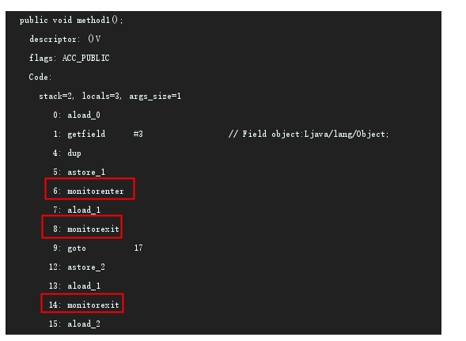

关注红色方框里的`monitorenter`和`monitorexit`即可。

`Monitorenter`和`Monitorexit`指令，会让对象在执行，使其锁计数器加1或者减1。每一个对象在同一时间只与一个monitor(锁)相关联，而一个monitor在同一时间只能被一个线程获得，一个对象在尝试获得与这个对象相关联的Monitor锁的所有权的时候，monitorenter指令会发生如下3中情况之一：

- **monitor计数器为0，意味着目前还没有被获得**，那这个线程就会立刻获得然后把锁计数器+1，一旦+1，别的线程再想获取，就需要等待
- **如果这个monitor已经拿到了这个锁的所有权，又重入了这把锁，那锁计数器就会累加**，变成2，并且随着重入的次数，会一直累加
- **这把锁已经被别的线程获取**了，等待锁释放

`monitorexit指令`：释放对于monitor的所有权，释放过程很简单，就是讲monitor的计数器减1，**如果减完以后，计数器不是0，则代表刚才是重入进来的**，当前线程还继续持有这把锁的所有权，如果计数器变成0，则代表当前线程不再拥有该monitor的所有权，即释放锁。

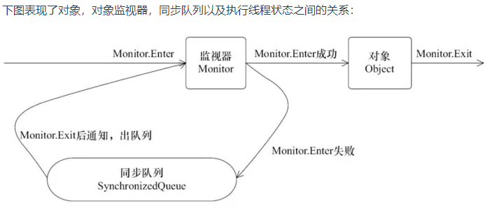

该图可以看出，任意线程对Object的访问，首先要获得Object的监视器，如果获取失败，该线程就进入同步状态，线程状态变为BLOCKED，当Object的监视器占有者释放后，在同步队列中得线程就会有机会重新获取该监视器。

###  (二) 可重入原理：加锁次数计数器

上面的demo中在执行完同步代码块之后紧接着再会去执行一个静态同步方法，而这个方法锁的对象依然就这个类对象，那么这个正在执行的线程还需要获取该锁吗? **答案是不必的，从上图中就可以看出来，执行静态同步方法的时候就只有一条monitorexit指令**，并没有monitorenter获取锁的指令。**这就是锁的重入性，即在同一锁程中，线程不需要再次获取同一把锁。**

Synchronized先天具有重入性。每个对象拥有一个计数器，当线程获取该对象锁后，计数器就会加一，释放锁后就会将计数器减一。

### (三)  保证可见性的原理：内存模型和happens-before规则

Synchronized的happens-before规则，即监视器锁规则：对同一个监视器的解锁，happens-before于对该监视器的加锁。

```java
public class MonitorDemo {
    private int a = 0;

    public synchronized void writer() {     // 1
        a++;                                // 2
    }                                       // 3

    public synchronized void reader() {    // 4
        int i = a;                         // 5
    }                                      // 6
}
```

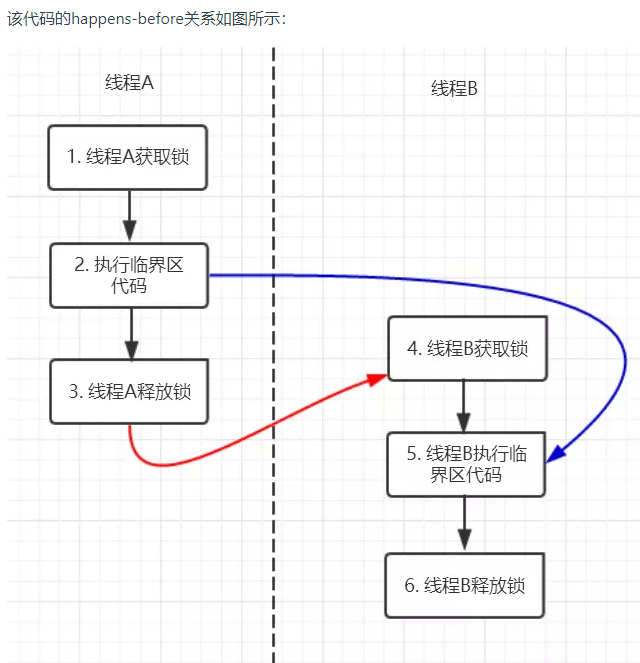

* 在图中每一个箭头连接的两个节点就代表之间的happens-before关系

* 黑色的是通过**程序顺序规则**推导出来

* 红色的为**监视器锁规则**推导而出：线程A释放锁happens-before线程B加锁

* 蓝色的则是通过**程序顺序规则和监视器锁规则**推测出来happens-befor关系

  * 如果A happens-before B，则A的执行结果对B可见

  * 并且A的执行顺序先于B。线程A先对共享变量A进行加一，由2 happens-before 5关系可知线程A的执行结果对线程B可见即线程B所读取到的a的值为1

    [参考](https://www.pdai.tech/md/java/thread/java-thread-x-key-synchronized.html#%e5%86%8d%e6%b7%b1%e5%85%a5%e7%90%86%e8%a7%a3)

## 5 ThreadLocal和应用场景 原理 jdk1.7+1.8  优缺点

####  ThreadLocal解决什么问题?

由于 ThreadLocal 支持范型，如 ThreadLocal< StringBuilder >，为表述方便，后文用 ***变量\*** 代表 ThreadLocal 本身，而用 ***实例\*** 代表具体类型（如 StringBuidler ）的实例。

ThreadLoal 变量，它的基本原理是，同一个 ThreadLocal 所包含的对象（对ThreadLocal< String >而言即为 String 类型变量），在不同的 Thread 中有不同的副本（实际是不同的实例）。这里有几点需要注意

- 因为每个 Thread 内有自己的实例副本，且该副本只能由当前 Thread 使用。这是也是 ThreadLocal 命名的由来
- 既然每个 Thread 有自己的实例副本，且其它 Thread 不可访问，那就不存在多线程间共享的问题

**那 ThreadLocal 到底解决了什么问题，又适用于什么样的场景？**

>ThreadLocal 提供了线程本地的实例。它与普通变量的区别在于，每个使用该变量的线程都会初始化一个完全独立的实例副本。ThreadLocal 变量通常被`private static`修饰。当一个线程结束时，它所使用的所有 ThreadLocal 相对的实例副本都可被回收。

* 每个线程需要有自己单独的实例
* 实例需要在多个方法中共享，但不希望被多线程共享

**ThreadLocal 适用于每个线程需要自己独立的实例且该实例需要在多个方法中被使用，也即变量在线程间隔离而在方法或类间共享的场景。**

#### ThreadLocal用法

ThreadLocal本身支持范型。该例使用了 StringBuilder 类型的 ThreadLocal 变量。

* 可通过 ThreadLocal 的 get() 方法读取 StringBuidler 实例，
* 也可通过 set(T t) 方法设置 StringBuilder。
  - 每个线程通过 ThreadLocal 的 get() 方法拿到的是**不同的 StringBuilder 实例**
  - 每个线程所访问到的是**同一个 ThreadLocal 变量**
  - 虽然从代码上都是对 Counter 类的静态 counter 字段进行 get() 得到 StringBuilder 实例并追加字符串，但是这并不会将所有线程追加的字符串都放进同一个 StringBuilder 中，而是**每个线程将字符串追加进各自的 StringBuidler 实例内**
  - 使用 set(T t) 方法后，ThreadLocal 变量所指向的 **StringBuilder 实例被替换**

```java
public class ThreadLocalDemo {

  public static void main(String[] args) throws InterruptedException {

    int threads = 3;
    CountDownLatch countDownLatch = new CountDownLatch(threads);
    InnerClass innerClass = new InnerClass();
    for(int i = 1; i <= threads; i++) {
      new Thread(() -> {
        for(int j = 0; j < 4; j++) {
          innerClass.add(String.valueOf(j));
          innerClass.print();
        }
        innerClass.set("hello world");
        countDownLatch.countDown();
      }, "thread - " + i).start();
    }
    countDownLatch.await();

  }

  private static class InnerClass {

    public void add(String newStr) {
      StringBuilder str = Counter.counter.get();
      Counter.counter.set(str.append(newStr));
    }

    public void print() {
      System.out.printf("Thread name:%s , ThreadLocal hashcode:%s, Instance hashcode:%s, Value:%s\n",
      Thread.currentThread().getName(),
      Counter.counter.hashCode(),
      Counter.counter.get().hashCode(),
      Counter.counter.get().toString());
    }

    public void set(String words) {
      Counter.counter.set(new StringBuilder(words));
      System.out.printf("Set, Thread name:%s , ThreadLocal hashcode:%s,  Instance hashcode:%s, Value:%s\n",
      Thread.currentThread().getName(),
      Counter.counter.hashCode(),
      Counter.counter.get().hashCode(),
      Counter.counter.get().toString());
    }
  }

  private static class Counter {

    private static ThreadLocal<StringBuilder> counter = new ThreadLocal<StringBuilder>() {
      @Override
      protected StringBuilder initialValue() {
        return new StringBuilder();
      }
    };

  }

}
```

####  ThreadLocal原理

#####  (一)  ThreadLocal维护线程与实例的映射

既然每个访问 ThreadLocal 变量的线程都有自己的一个“本地”实例副本。一个可能的方案是 ThreadLocal 维护一个 Map，**键是 Thread，值是它在该 Thread 内的实例**。线程通过该 ThreadLocal 的 get() 方案获取实例时，只需要以线程为键，从 Map 中找出对应的实例即可。

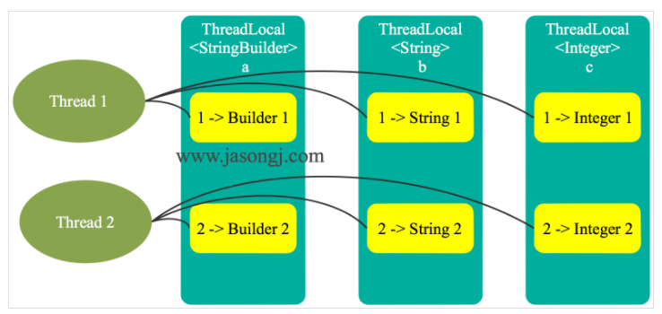

该方案可满足上文提到的每个线程内一个独立备份的要求。每个新线程访问该 ThreadLocal 时，需要向 Map 中添加一个映射，而每个线程结束时，应该清除该映射。这里就有两个问题：

- **增加线程与减少线程均需要写 Map**，故需保证该 Map 线程安全。虽然用ConcurrentHashMap和几种实现线程安全 Map 的方式，但它或多或少都需要锁来保证线程的安全性
- **线程结束时，需要保证它所访问的所有 ThreadLocal 中对应的映射均删除，否则可能会引起内存泄漏。**

**其中锁的问题，是 JDK 未采用该方案的一个原因。**

#####  （二）Thread维护ThreadLocal与实例的映射

上述方案中，出现锁的问题，原因在于多线程访问同一个 Map**。如果该 Map 由 Thread 维护，从而使得每个 Thread 只访问自己的 Map**，那就不存在多线程写的问题，也就不需要锁。

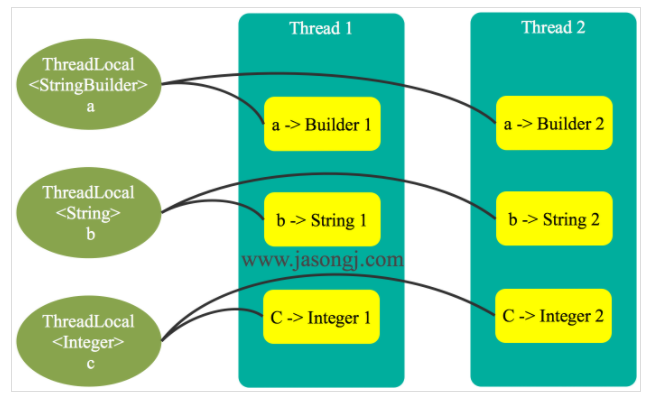

但是由于每个线程访问某 ThreadLocal 变量后，都会在自己的 Map 内维护该 ThreadLocal 变量与具体实例的映射，**如果不删除这些引用（映射），则这些 ThreadLocal 不能被回收，可能会造成内存泄漏(使用键弱引用解决)**

#####  （三）ThreadLocal 在 JDK 8 中的实现

Map 由 ThreadLocal 类的静态内部类 ThreadLocalMap 提供。该类的实例维护某个 ThreadLocal 与具体实例的映射。与 HashMap 不同的是

* ThreadLocalMap 的每个 Entry 都是一个对 **键** 的**弱引用**，这一点从`super(k)`可看出。
* 另外，每个 Entry 都包含了一个对 **值** 的**强引用**。

```java
static class Entry extends WeakReference<ThreadLocal<?>> {
  /** The value associated with this ThreadLocal. */
  Object value;

  Entry(ThreadLocal<?> k, Object v) {
    super(k);
    value = v;
  }
}
```

* **使用弱引用的原因**在于，当没有强引用指向 ThreadLocal 变量时，它可被回收，从而避免上文所述 ThreadLocal 不能被回收而造成的内存泄漏的问题。

* **新的内存泄露问题(强引用造成的JDK1.7得内存泄漏问题)：**ThreadLocalMap 维护 ThreadLocal 变量与具体实例的映射，当 ThreadLocal 变量被回收后，该映射的键变为 null，该 Entry 无法被移除。**从而使得实例被该 Entry 引用而无法被回收造成内存泄漏。**

  >Entry虽然是弱引用，但它是 ThreadLocal 类型的弱引用（也即上文所述它是对 **键** 的弱引用），而非具体实例的的弱引用，所以无法避免具体实例相关的内存泄漏。

##### （四）1.8主要方法

​	**读取实例**

```java
public T get() {
  Thread t = Thread.currentThread();
  ThreadLocalMap map = getMap(t);
  if (map != null) {
    ThreadLocalMap.Entry e = map.getEntry(this);
    if (e != null) {
      @SuppressWarnings("unchecked")
      T result = (T)e.value;
      return result;
    }
  }
  return setInitialValue();
}
```

读取实例时，线程首先通过**getMap(t)**方法获取自身的 ThreadLocalMap。从如下该方法的定义可见，该 ThreadLocalMap 的实例是 Thread 类的一个字段，即由 Thread 维护 ThreadLocal 对象与具体实例的映射，

```java
ThreadLocalMap getMap(Thread t) {
  return t.threadLocals;
}
```

获取到 ThreadLocalMap 后，通过`map.getEntry(this)`方法获取该 ThreadLocal 在当前线程的 ThreadLocalMap 中对应的 Entry。该方法中的 **this 即当前访问的 ThreadLocal 对象。**

如果获取到的 Entry 不为 null，从 Entry 中取出值即为所需访问的本线程对应的实例。如果获取到的 Entry 为 null，则**通过`setInitialValue()`**方法设置该 ThreadLocal 变量在该线程中**对应的具体实例的初始值**。

**设置初始值**

```java
private T setInitialValue() {
  T value = initialValue();
  Thread t = Thread.currentThread();
  ThreadLocalMap map = getMap(t);
  if (map != null)
    map.set(this, value);
  else
    createMap(t, value);
  return value;
}
```

* 首先，通过`initialValue()`方法获取初始值。

* 然后拿到该线程对应的 ThreadLocalMap 对象
  * 若该对象不为 null，则直接将该 ThreadLocal 对象与对应实例初始值的映射添加进该线程的 ThreadLocalMap中。
  * 若为 null，则先创建该 ThreadLocalMap 对象再将映射添加其中。

**设置实例**

```java
public void set(T value) {
  Thread t = Thread.currentThread();
  ThreadLocalMap map = getMap(t);
  if (map != null)
    map.set(this, value);
  else
    createMap(t, value);
}
```

* 该方法先获取该线程的 ThreadLocalMap 对象
* 然后直接将 ThreadLocal 对象（即代码中的 this）与目标实例的映射添加进 ThreadLocalMap 中。
  * 当然，如果映射已经存在，就直接覆盖。
  * 另外，如果获取到的 ThreadLocalMap 为 null，则先创建该 ThreadLocalMap 对象。

**防止内存泄露（JDK1.8解决）**

>对于已经不再被使用且已被回收的 ThreadLocal 对象，它在每个线程内对应的实例由于被线程的 ThreadLocalMap 的 Entry 强引用，无法被回收，可能会造成内存泄漏。

* ThreadLocalMap 的 set 方法中，通过 **replaceStaleEntry 方法将所有键为 null 的 Entry 的值设置为 null**，从而使得该值可被回收。
* 另外，会在 rehash 方法中通过 expungeStaleEntry 方法将**键和值为 null 的 Entry 设置为 null** 从而使得该 Entry 可被回收。通过这种方式，ThreadLocal 可防止内存泄漏。

```java
private void set(ThreadLocal<?> key, Object value) {
  Entry[] tab = table;
  int len = tab.length;
  int i = key.threadLocalHashCode & (len-1);

  for (Entry e = tab[i]; e != null; e = tab[i = nextIndex(i, len)]) {
    ThreadLocal<?> k = e.get();
    if (k == key) {
      e.value = value;
      return;
    }
    if (k == null) {
      replaceStaleEntry(key, value, i);
      return;
    }
  }
  tab[i] = new Entry(key, value);
  int sz = ++size;
  if (!cleanSomeSlots(i, sz) && sz >= threshold)
    rehash();
}
```

[参考](http://www.jasongj.com/java/threadlocal/)

# 算法
## [剑指 Offer 62. 圆圈中最后剩下的数字](https://leetcode-cn.com/problems/yuan-quan-zhong-zui-hou-sheng-xia-de-shu-zi-lcof/)

### 递归公式的推导

[参考](https://leetcode-cn.com/problems/yuan-quan-zhong-zui-hou-sheng-xia-de-shu-zi-lcof/solution/huan-ge-jiao-du-ju-li-jie-jue-yue-se-fu-huan-by-as/)


```java
class Solution {
    public int lastRemaining(int n, int m) {
        if(n==1)
            return 0;
            
            return (lastRemaining(n-1,m)+m)%n;
            
    }
}
```


##  [141. 环形链表](https://leetcode-cn.com/problems/linked-list-cycle/)

>给定一个链表，判断链表中是否有环。
>
>如果链表中有某个节点，可以通过连续跟踪 next 指针再次到达，则链表中存在环。 为了表示给定链表中的环，我们使用整数 pos 来表示链表尾连接到链表中的位置（索引从 0 开始）。 如果 pos 是 -1，则在该链表中没有环。注意：pos 不作为参数进行传递，仅仅是为了标识链表的实际情况。
>
>如果链表中存在环，则返回 true 。 否则，返回 false 。


快慢指针，只要进了环，每次差一步，**绝对能相遇**

```java
public class Solution {
    public boolean hasCycle(ListNode head) {
        if (head == null) {
            return false;
        }
        ListNode slow = head, fast = head;
        boolean flag = false;
        while (slow.next != null && fast.next != null) {
            slow = slow.next;
            if (fast.next.next != null) {
                fast = fast.next.next;
            } else {
                break;
            }
            if (fast == slow) {
                flag = true;
                break;
            }
        }
        return flag;
    }
}
```

