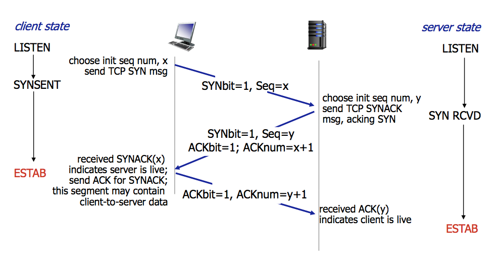
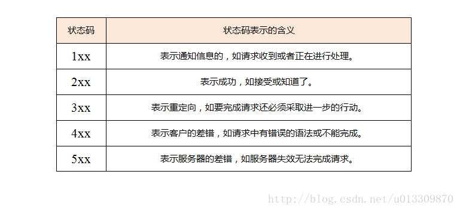

# 计算机网络
## TCP的三次握手

 

**第一次握手**

客户端向服务端发送连接请求报文段。该报文段中包含自身的数据通讯初始序号。**请求发送后，客户端便进入 SYN-SENT 状态。**

**第二次握手**

服务端收到连接请求报文段后，如果同意连接，则会发送一个应答，该应答中也会包含自身的数据通讯初始序号**，发送完成后便进入 SYN-RECEIVED 状态。**

**第三次握手**

当客户端收到连接同意的应答后，还要向服务端发送一个确认报文。**客户端发完这个报文段后便进入 ESTABLISHED 状态**，**服务端收到这个应答后也进入 ESTABLISHED 状态，此时连接建立成功。**

[参考](https://hit-alibaba.github.io/interview/basic/network/TCP.html)
[b站视频，讲得很通俗易懂](https://www.bilibili.com/video/BV1bi4y1x7m5)

## 四次挥手，2MSL  (为什么TCP4次挥手时要等待为2MSL？)

**第一次握手**

若客户端 A 认为数据发送完成，则它需要向服务端 B 发送连接释放请求。

**第二次握手**

B 收到连接释放请求后，会告诉应用层要释放 TCP 链接。然后会发送 ACK 包，并进入 CLOSE_WAIT 状态，**此时表明 A 到 B 的连接已经释放**，不再接收 A 发的数据了。但是因为 TCP 连接是双向的，所以 B 仍旧可以发送数据给 A。

**第三次握手**

B 如果此时还有没发完的数据会继续发送，完毕后会向 A 发送连接释放请求，然后 B 便进入 LAST-ACK 状态。

**第四次握手**

A 收到释放请求后，向 B 发送确认应答，此时 A 进入 TIME-WAIT 状态。该状态会持续 2MSL（最大段生存期，指报文段在网络中生存的时间，超时会被抛弃） 时间，若该时间段内没有 B 的重发请求的话，就进入 CLOSED 状态。**当 B 收到确认应答后，也便进入 CLOSED 状态**。


TCP四次挥手：

主动断开的一侧为A，被动断开的一侧为B。

第一个消息：A发FIN

第二个消息：B回复ACK

第三个消息：B发出FIN

**第四个消息：A发出ACK，用于确认收到B的FIN**

当B接收到此消息，即认为双方达成了同步：双方都知道连接可以释放了，此时B可以安全地释放此TCP连接所占用的内存资源、端口号。所以**被动关闭的B无需任何wait time，直接释放资源。**

但，A并不知道B是否接到自己的ACK，A是这么想的：

1）如果B没有收到自己的ACK，会超时重传FIN。那么A再次接到重传的FIN，会再次发送ACK

2）如果B收到自己的ACK，也不会再发任何消息

无论是1还是2，A都需要等待，要取这两种情况等待时间的最大值，**以应对最坏的情况发生**，这个最坏情况是：

去向ACK消息最大存活时间（MSL) + 来向FIN消息的最大存活时间(MSL)。

这恰恰就是**2MSL( Maximum Segment Life)。**

等待2MSL时间，A就可以放心地释放TCP占用的资源、端口号，**此时可以使用该端口号连接任何服务器。**

**为何一定要等2MSL？**
**如果不等，释放的端口可能会重连刚断开的服务器端口，这样依然存活在网络里的老的TCP报文可能与新TCP连接报文冲突，造成数据冲突，为避免此种情况，需要耐心等待网络老的TCP连接的活跃报文全部死翘翘，2MSL时间可以满足这个需求（尽管非常保守）！**

[参考](https://www.zhihu.com/question/67013338)

## TCP,UDP的区别

**用户数据报协议 UDP（User Datagram Protocol）**
是无连接的，尽最大可能交付，没有拥塞控制，面向报文（对于应用程序传下来的报文不合并也不拆分，只是添加 UDP 首部），支持一对一、一对多、多对一和多对多的交互通信。

**传输控制协议 TCP（Transmission Control Protocol）**
是面向连接的，提供可靠交付，有流量控制，拥塞控制，提供全双工通信，面向字节流（把应用层传下来的报文看成字节流，把字节流组织成大小不等的数据块），每一条 TCP 连接只能是点对点的（一对一）。

[参考](https://zhuanlan.zhihu.com/p/108822858)


## HTTP工作原理(属于应用层,传输层协议是TCP)

HTTP协议定义Web客户端如何从Web服务器请求Web页面，以及服务器如何把Web页面传送给客户端。HTTP协议采用了请求/响应模型。客户端向服务器发送一个请求报文，请求报文包含请求的方法、URL、协议版本、请求头部和请求数据。服务器以一个状态行作为响应，响应的内容包括协议的版本、成功或者错误代码、服务器信息、响应头部和响应数据。

以下是 HTTP 请求/响应的步骤：

###### 1、客户端连接到Web服务器

一个HTTP客户端，通常是浏览器，与Web服务器的HTTP端口（默认为80）**建立一个TCP套接字**连接。例如，[http://www.oakcms.cn](https://link.jianshu.com?t=http://www.oakcms.cn)。

###### 2、发送HTTP请求

通过TCP套接字，客户端向Web服务器发送一个文本的请求报文，一个请求报文由请求行、请求头部、空行和请求数据4部分组成。

###### 3、服务器接受请求并返回HTTP响应

Web服务器解析请求，定位请求资源。服务器将资源复本写到TCP套接字，由客户端读取。一个响应由状态行、响应头部、空行和响应数据4部分组成。

###### 4、释放连接[TCP连接](https://www.jianshu.com/p/ef892323e68f)

若connection 模式为close，则服务器主动关闭[TCP连接](https://www.jianshu.com/p/ef892323e68f)，客户端被动关闭连接，释放[TCP连接](https://www.jianshu.com/p/ef892323e68f);若connection 模式为keepalive，则该连接会保持一段时间，在该时间内可以继续接收请求;

###### 5、客户端浏览器解析HTML内容

客户端浏览器首先解析状态行，查看表明请求是否成功的状态代码。然后解析每一个响应头，响应头告知以下为若干字节的HTML文档和文档的字符集。客户端浏览器读取响应数据HTML，根据HTML的语法对其进行格式化，并在浏览器窗口中显示。
## HTTP状态码

**HTTP状态码（HTTP Status Code）**是用以表示网页服务器HTTP响应状态的**3位数字代码**。每一个请求报文发出后，都能收到一个响应报文。响应报文的第一行就是状态行。状态行包含三项内容，HTTP的版本、状态码、以及解释状态码的简单短语。状态码共分为5大类33种。如：

 

下面是在状态行中常见的状态码：
* **100 Continue**
客户端应当继续发送请求。这个临时响应是用来通知客户端它的部分请求已经被服务器接收，且仍未被拒绝。客户端应当继续发送请求的剩余部分，或者如果请求已经完成，忽略这个响应。服务器必须在请求完成后向客户端发送一个最终响应。
* **101 Switching Protocols**
服务器已经理解了客户端的请求，并将通过Upgrade 消息头通知客户端采用不同的协议来完成这个请求。在发送完这个响应最后的空行后，服务器将会切换到在Upgrade 消息头中定义的那些协议。
* **200 OK**
请求已成功，请求所希望的响应头或数据体将随此响应返回。
* **201 Created**
请求已经被实现，而且有一个新的资源已经依据请求的需要而建立，且其 URI 已经随Location 头信息返回。假如需要的资源无法及时建立的话，应当返回 ‘202 Accepted’。
* **202 Accepted**
服务器已接受请求，但尚未处理。正如它可能被拒绝一样，最终该请求可能会也可能不会被执行。在异步操作的场合下，没有比发送这个状态码更方便的做法了。
* **300 Multiple Choices**
被请求的资源有一系列可供选择的回馈信息，每个都有自己特定的地址和浏览器驱动的商议信息。用户或浏览器能够自行选择一个首选的地址进行重定向。
* **301 Moved Permanently**
被请求的资源已永久移动到新位置，并且将来任何对此资源的引用都应该使用本响应返回的若干个 URI 之一。如果可能，拥有链接编辑功能的客户端应当自动把请求的地址修改为从服务器反馈回来的地址。除非额外指定，否则这个响应也是可缓存的。
* **400 Bad Request**
1、语义有误，当前请求无法被服务器理解。除非进行修改，否则客户端不应该重复提交这个请求。
2、请求参数有误。
* **404 Not Found**
请求失败，请求所希望得到的资源未被在服务器上发现。没有信息能够告诉用户这个状况到底是暂时的还是永久的。假如服务器知道情况的话，应当使用410状态码来告知旧资源因为某些内部的配置机制问题，已经永久的不可用，而且没有任何可以跳转的地址。404这个状态码被广泛应用于当服务器不想揭示到底为何请求被拒绝或者没有其他适合的响应可用的情况下。出现这个错误的最有可能的原因是服务器端没有这个页面。

[参考](https://hanking.blog.csdn.net/article/details/77822665?utm_medium=distribute.pc_relevant.none-task-blog-OPENSEARCH-1.control&depth_1-utm_source=distribute.pc_relevant.none-task-blog-OPENSEARCH-1.control)


## **计网中的四元组？**

TCP套接字由四元组标识。

**四元组：源IP地址、目的IP地址、源端口、目的端口**

五元组：源IP地址、目的IP地址、协议号、源端口、目的端口

七元组：源IP地址、目的IP地址、协议号、源端口、目的端口，服务类型以及接口索引

协议号:IP是网络层协议，IP头中的协议号用来说明IP报文中承载的是哪种协议,协议号标识上层是什么协议（一般是传输层协议，比如6 TCP，17 UDP；但也可能是网络层协议，比如1  ICMP(互联网控制消息协议,ping可以说是ICMP的最著名的应用)；也可能是应用层协议，比如89 OSPF(开放式最短路径优先，一种路由协议)）。

## session和cookie区别

### **一、Session的概念**

Session 是存放在服务器端的，类似于Session结构来存放用户数据。

* 当浏览器 第一次发送请求时，**服务器自动生成了一个Session和一个Session ID用来唯一标识这个Session**，并将其（**Session ID**）通过响应发送到浏览器。
* 当浏览器第二次发送请求，会将**前一次服务器响应中的Session ID放在请求中一并发送到服务器**上，服务器从请求中提取出Session ID，并和保存的所有Session ID进行对比，找到这个用户对应的Session。

一般情况下，服务器会在一定时间内（默认30分钟）保存这个 Session，过了时间限制，就会销毁这个Session。在销毁之前，程序员可以将用户的一些数据以Key和Value的形式暂时存放在这个 Session中。

### 二 Cookie

- 通俗讲，是访问某些网站后在本地存储的一些网站相关信息，下次访问时减少一些步骤。更准确的说法是：Cookies是服务器在本地机器上存储的小段文本并随**每一个请求发送至同一服务器**，是在客户端保持状态的方案。

- **使用Cookie来保存Session ID**，“记住我的登录状态”功能的实现正式基于这种方式的。服务器通过设置Cookie的方式将Session ID发送到浏览器。如果我们不设置这个过期时间，那么这个Cookie将不存放在硬盘上，当浏览器关闭的时候，Cookie就消失了，这个Session ID就丢失了。如果我们设置这个时间为若干天之后，那么这个Cookie会保存在客户端硬盘中，即使浏览器关闭，这个值仍然存在，下次访问相应网站时，同 样会发送到服务器上。

### 三 区别
- 存储数据量方面：session 能够存储任意的 java 对象，cookie 只能存储 String 类型的对象
- 一个在客户端一个在服务端。因Cookie在客户端所以可以编辑伪造，不是十分安全。
- Session过多时会消耗服务器资源，大型网站会有专门Session服务器，Cookie存在客户端没问题。
- 域的支持范围不一样，比方说a.com的Cookie在a.com下都能用，而`www.a.com`的Session在`api.a.com`下都不能用，解决这个问题的办法是JSONP或者跨域资源共享。

[参考](https://blog.csdn.net/liyifan687/article/details/80077928?utm_medium=distribute.pc_relevant.none-task-blog-BlogCommendFromMachineLearnPai2-2.control&depth_1-utm_source=distribute.pc_relevant.none-task-blog-BlogCommendFromMachineLearnPai2-2.control)

[参考](https://blog.csdn.net/duan1078774504/article/details/51912868)


## nginx的5种负载均衡算法

Nginx是一款轻量级的Web服务器、反向代理服务器，由于它的内存占用少，启动极快，高并发能力强，在互联网项目中广泛应用。负载均衡是将流量负载分摊到不同的服务单元，保证服务器的高可用，保证响应足够快。

**五种负载均衡算法：**

**1、轮询（默认）**

每个请求**按时间顺序**逐一分配到不同的后端服务器，如果后端服务器down掉，能自动剔除。

```nginx
upstream backserver { 
server 192.168.0.14; 
server 192.168.0.15; 
} 
```

**2、指定权重: weight **

指定轮询几率，**weight和访问比率成正比**，用于后端服务器性能不均的情况。

```nginx
upstream backserver { 
server 192.168.0.14 weight=8; 
server 192.168.0.15 weight=10; 
} 
```

**3、IP绑定：ip_hash**

每个请求**按访问ip的hash结果分配**，这样**每个访客固定访问一个后端服务器**，可以解决session的问题。

```nginx
upstream backserver { 
ip_hash; 
server 192.168.0.14:88; 
server 192.168.0.15:80; 
} 
```

**4、fair（第三方）**

按**后端服务器的响应时间**来分配请求，**响应时间短的优先分配**。Nginx本身不支持fair，如果需要这种调度算法，则必须安装upstream_fair模块。

```nginx
upstream backserver { 
server server1; 
server server2; 
fair; 
} 
```

**5、url_hash（第三方）**

按**访问url的hash**结果来分配请求，使**每个url定向到同一个后端服务器**，后端服务器为缓存时比较有效。

```nginx
upstream backserver { 
server squid1:3128; 
server squid2:3128; 
hash $request_uri; 
hash_method crc32; 
} 
```


在需要使用负载均衡的server中增加

```nginx
proxy_pass http://backserver/; 
upstream backserver{ 
ip_hash; #按访问ip的hash结果分配
server 127.0.0.1:9090 down; #down 表示当前的server暂时不参与负载 
server 127.0.0.1:8080 weight=2; #weight 默认为1.weight越大，负载的权重就越大
server 127.0.0.1:6060; 
server 127.0.0.1:7070 backup; #backup 预留的备份机器,其它所有的非backup机器down或者忙的时候，才会请求backup机器
} 
```

[参考](https://zhuanlan.zhihu.com/p/89356016)


## get和post请求的区别（好久没问这个问题了，只说出了两种方式作用和参数的区别） 

GET和POST都是HTTP协议中的两种发送请求的方法，最直观的区别就是`GET`把参数包含在`URL`中，`POST`通过`request body`传递参数。

由于HTTP的底层是TCP/IP。所以GET和POST的底层也是TCP/IP。GET和POST能做的事情是一样的。如果给GET加上request body，或者给POST带上url参数，技术上是完全行的通的。**GET和POST本质上就是TCP链接，并无差别。但是由于HTTP的规定和浏览器/服务器的限制，导致他们在应用过程中体现出一些不同。**

但是两者之间最重大的区别就是：**GET产生一个TCP数据包；POST产生两个TCP数据包。**

具体点说来就是：

对于GET方式的请求，浏览器会把http header和data一并发送出去，服务器响应200（返回数据）；

而对于POST，浏览器先发送header，服务器响应100 continue，浏览器再发送data，服务器响应200 ok（返回数据）。


这样看起来，因为POST需要两步，时间上消耗的要多一点，所以GET比POST更有效。那么可不可以用GET替换POST来优化网站性能？但这是一个坑！跳入需谨慎。为什么？

1. GET与POST都有自己的语义，不能随便混用。

2. **如果网络环境好的话，发一次包的时间和发两次包的时间差别基本可以无视。如果网络环境差的话，两次包的TCP在验证数据包完整性上，有非常大的优点。**

3. 并不是所有浏览器都会在POST中发送两次包，Firefox就只发送一次。


另外，w3schools上面的参考答案也是可以酌情说一些的

- GET在浏览器回退时是无害的，而POST会再次提交请求。
- GET产生的URL地址可以被收藏为书签，而POST不可以。
- GET请求会被浏览器主动cache，而POST不会，除非手动设置。
- GET请求只能进行url编码，而POST支持多种编码方式。
- GET请求参数会被完整保留在浏览器历史记录里，而POST中的参数不会被保留。
- GET请求在URL中传送的参数是有长度限制的，而POST么有。
- 对参数的数据类型，GET只接受ASCII字符，而POST没有限制。
- GET比POST更不安全，因为参数直接暴露在URL上，所以不能用来传递敏感信息。
- **GET参数通过URL传递，POST放在Request body中**。


以表格的形式：

|                  |                             GET                              |                             POST                             |
| :--------------: | :----------------------------------------------------------: | :----------------------------------------------------------: |
|  后退按钮/刷新   |                             无害                             |   数据会被重新提交（浏览器应该告知用户数据会被重新提交）。   |
|       书签       |                         可收藏为书签                         |                        不可收藏为书签                        |
|       缓存       |                           能被缓存                           |                           不能缓存                           |
|     编码类型     |     `application/x-www-form-urlencoded` 只能进行url编码      | `application/x-www-form-urlencoded` 或 `multipart/form-data`。为二进制数据使用多重编码。 |
|       历史       |                   参数保留在浏览器历史中。                   |                 参数不会保存在浏览器历史中。                 |
| 对数据长度的限制 | 是的。当发送数据时，GET 方法向 URL 添加数据；URL 的长度是受限制的（URL 的最大长度是 2048 个字符）。 |                           无限制。                           |
| 对数据类型的限制 |                     只允许 ASCII 字符。                      |                 没有限制。也允许二进制数据。                 |
|      安全性      | 与 POST 相比，GET 的安全性较差，因为所发送的数据是 URL 的一部分。在发送密码或其他敏感信息时绝不要使用 GET ！ | POST 比 GET 更安全，因为参数不会被保存在浏览器历史或 web 服务器日志中。 |
|      可见性      |              数据在 URL 中对所有人都是可见的。               |                   数据不会显示在 URL 中。                    |

[参考1](https://zhuanlan.zhihu.com/p/29445271)

[参考2](https://segmentfault.com/a/1190000018799171)